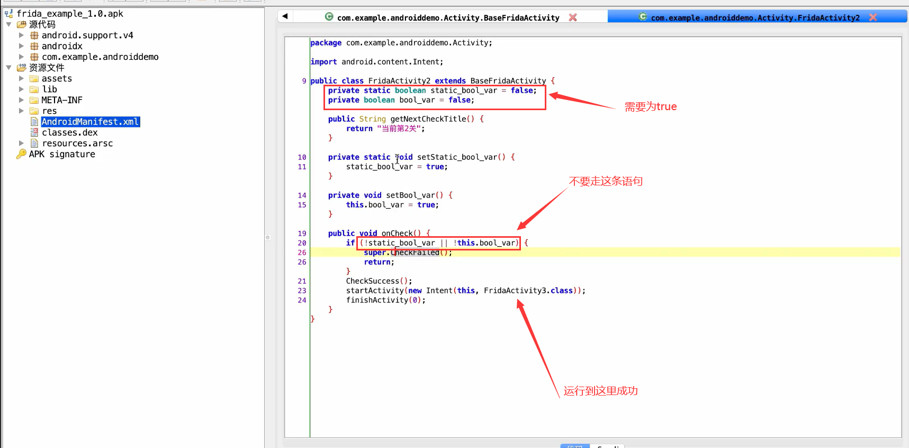
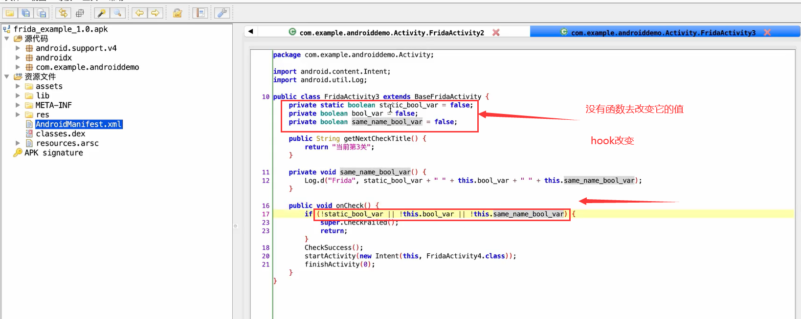

[TOC]

# 执行

```
frida -U com.example.androiddemo(包名) -l hook.js(脚本文件名)
frida -U -f com.xxxx.xxxxx -l hook.js --no-paus
```

# hook类里的方法

## 两个相同的函数名 参数不同


让LogingActivity.a(obj, obj)=obj2即可

即下面那个a函数的返回值=obj2

=> 编写hook脚本，查看a函数的返回值

```javascript
function hook_java() {
    Java.perform(function () {
        								//包名类名
        var LoginActivity = Java.use("com.xxx....Activity.LoginActivity");
        // 上面的变量.函数名.implementation    返回值的类型对应上
        LoginActivity.a.implementation = function(str, str2) { 
            var result = this.a(str, str2);
            console.log("LoginActivity.a->",str, str2, result);
            return result;
        }
    });
}
function main() {
    hook_java();
}
setImmediate(main);
```

因为有两个a函数，要写成如下

```javascript
function hook_java() {
    Java.perform(function () {
        								//包名类名
        var LoginActivity = Java.use("com.xxx....Activity.LoginActivity");
        // 上面的变量.函数名.implementation    返回值的类型对应上
        //多了 overload('java.lang.String', 'java.lang.String')
        //会在报错的时候显示出来怎么修改
        LoginActivity.a.overload('java.lang.String', 'java.lang.String').implementation = function(str, str2) { 
            var result = this.a(str, str2);
            console.log("LoginActivity.a->",str, str2, result);
            return result;
        }
    });
}
function main() {
    hook_java();
}
setImmediate(main);
```

## hook函数 返回篡改的值


```javascript
function hook_java() {
    java.perform(function () {
        var FridaActivity1 = Java.use("com.example.androiddemo.Activity.FridaActivity1");
        FridaActivity1.a.implementation = function(barr) {
            console.log("FridaActivity1.a ->")
            return "jadx反编译出的源码指定的那段字符串";
        }
    });
}
function main() {
    hook_java();
}
setImmediate(main);
```

# 主动调用函数

## 调用静态函数

主动调用 setStatic_bool_var 和 setBool_var 这两个函数，把那两个变量设置为true



```javascript
function call_FridaActivity2() {
    Java.perform(function() {
        var FridaActivity2 = Java.use("com.example.androiddemo.Activity.FridaActivity2");
        FridaActivity2.setStatic_bool_var(); //调用静态函数
        //非静态  调用非静态静态函数
        Java.choose("com.example.androiddemo.Activity.FridaActivity2", {
            onMatch: function(instance) {
                instance.setBool_var();
            },
            onComplete: function(){
                
            }
        });
    });
}
```

## hook改变变量的值

### 静态、非静态、变量名和函数名重合



```javascript
function call_FridaActivity3() {
    Java.perform(function() {
        var FridaActivity3 = Java.use("com.example.androiddemo.Activity.FridaActivity3");
        //类名.变量名.value
        FridaActivity3.static_bool_var.value = true; //静态
        
        console.log(FridaActivity3.static_bool_var.value);
        
        //非静态变量
        Java.choose("com.example.androiddemo.Activity.FridaActivity3", {
            onMatch: function(instance) {
                //设置非静态成员变量的值
                instance.bool_var.value = true;
                //设置有相同函数名的成员变量的值 在变量名前加一个下划线
                instance._same_name_bool_var.value = true;
                
                console.log(instance.bool_var.value)
                console.log(instance._same_name_bool_var.value)
            },
            onComplete: function(){

            }
        });
    });
}
```

# hook类中类

### hook内部类 枚举函数


```javascript
function hook_InnerClasses() {
    Java.perform(function() {
        //                           中间用$符号连接
        var InnerClasses = Java.use("com.example.androiddemo.Activity.FridaActivity4$InnerClasses");
        console.log(InnerClasses);
        // <com.example.androiddemo.Activity.FridaActivity4$InnerClasses>
        
        //hook 内部类的函数
        InnerClasses.check1.implementation = function(){
            return true;
        };
        InnerClasses.check2.implementation = function(){
            return true;
        };
        InnerClasses.check3.implementation = function(){
            return true;
        };
        InnerClasses.check4.implementation = function(){
            return true;
        };
        InnerClasses.check5.implementation = function(){
            return true;
        };
        InnerClasses.check6.implementation = function(){
            return true;
        };
    });
}
```

### hook多个函数

```javascript
function hook_mul_function(){
    Java.perform(function(){
        var class_name = "com.example.androiddemo.Activity.FridaActivity4$InnerClasses"
        var InnerClasses = Java.use(class_name);
        //console.log(InnerClasses.class.getDeclareMethods());
        //xxx.class.getDeclareMethods()
        var all_methods = InnerClasses.class.getDeclareMethods();
        for (var i=0; i < all_methods.length, i++){
            console.log(all_methods[i]);
        }
    });
}
```


```javascript
function hook_mul_function(){
    Java.perform(function(){
        var class_name = "com.example.androiddemo.Activity.FridaActivity4$InnerClasses";
        var InnerClasses = Java.use(class_name);
        var all_methods = InnerClasses.class.getDeclareMethods();
        for (var i=0; i < all_methods.length; i++){
            var method = all_methods[i];
            var methodStr = method.toString();
            var subString = methodStr.substr(methodStr.indexOf(class_name) + class_name.length + 1);
            var methodname = subString.substr(0, subString.indexOf("("));
            console.log(methodname);
            
            InnerClasses[methodname].impplementation = function(){
                console.log("hook_mul_function->", this);
                return true;
            }
        }
    });
}
```

便于理解           indexOf() 方法可返回某个指定的字符串值在字符串中首次出现的位置


# hook动态dex


load接口  返回动态dex


```javascript
function hook_dyn_dex(){
    Java.perform(function(){
        Java.enumerateClassLoaders({
            onMatch: function(loader){
                console.log(loader);
            }, onComplete: function(){
                
            }
        });
    });
}
```


要找到接口实现的名字才能hook


```javascript
function hook_dyn_dex(){
    Java.perform(function(){
        var FridaActivity5 = Java.use("com.example.androiddemo.Activity.FridaActivity5");
        //主动调用
        Java.choose("com.example.androiddemo.Activity.FridaActivity5", {
            onMatch: function(instance){
                // [object object]
                //console.log(instance.getDynamicDexCheck());
                console.log(instance.getDynamicDexCheck().$className); //显示类名
            }, onComplete: function(){}
        })
    });
}
```


### 找到类名了，尝试去hook它

```javascript
function hook_dyn_dex(){
    Java.perform(function(){
        var FridaActivity5 = Java.use("com.example.androiddemo.Activity.FridaActivity5");
        //主动调用
        Java.choose("com.example.androiddemo.Activity.FridaActivity5", {
            onMatch: function(instance){
                // [object object]
                //console.log(instance.getDynamicDexCheck());
                console.log(instance.getDynamicDexCheck().$className); //显示类名
            }, onComplete: function(){}
        });
        //                          上面的输出
        var DynamicCheck = Java.use("com.example.androiddemo.Dynamic.DynamicCheck");
        console.log(DynamicCheck);
    });
}
```


```javascript
function hook_dyn_dex(){
    Java.perform(function(){
        var FridaActivity5 = Java.use("com.example.androiddemo.Activity.FridaActivity5");
        Java.choose("com.example.androiddemo.Activity.FridaActivity5", {
            onMatch: function(instance){
                console.log(instance.getDynamicDexCheck().$className); //显示类名
            }, onComplete: function(){}
        });
        
        Java.enumerateClassLoaders({
            onMatch: function(loader){
                try {
                    if (loader.findClass("com.example.androiddemo.Dynamic.DynamicCheck")){
                    	console.log(loader);
                	} 
                } catch(error){}
                
            }, onComplete: function(){}
        });
        
        //上面两个找到了，这个出错了
        var DynamicCheck = Java.use("com.example.androiddemo.Dynamic.DynamicCheck");
        console.log(DynamicCheck);
    });
}
```


前两个找到了，最后一个出错了

```javascript
function hook_dyn_dex(){
    Java.perform(function(){
        var FridaActivity5 = Java.use("com.example.androiddemo.Activity.FridaActivity5");
        Java.choose("com.example.androiddemo.Activity.FridaActivity5", {
            onMatch: function(instance){
                console.log(instance.getDynamicDexCheck().$className); //显示类名
            }, onComplete: function(){}
        });
        // hook 动态加载的 dex
        Java.enumerateClassLoaders({
            onMatch: function(loader){
                try {
                    if (loader.findClass("com.example.androiddemo.Dynamic.DynamicCheck")){
                    	console.log(loader);
                        //我不知道为什么这样改可以
                        Java.classFactory.loader = loader; //切换 classloader
                	} 
                } catch (error) {
                    
                }
                
            }, onComplete: function(){}
        });
        
        var DynamicCheck = Java.use("com.example.androiddemo.Dynamic.DynamicCheck");
        console.log(DynamicCheck);
        // hook check 函数让它返回true
        DynamicCheck.check.implementation = function(){
            console.log("DynamicCheck.check -> true");
            return true;
        }
    });
}
```

# 两种方法


## 法一  枚举函数

```javascript
function hook_FridaActivity6(){
    Java.perform(function(){
        var Frida6closs0 = Java.use("com.example.androiddemo.Activity.Frida6.Frida6class0");
        Frida6closs0.check.implementation = function(){
            return true;
        };
        var Frida6closs1 = Java.use("com.example.androiddemo.Activity.Frida6.Frida6class1");
        Frida6closs0.check.implementation = function(){
            return true;
        };
        var Frida6closs2 = Java.use("com.example.androiddemo.Activity.Frida6.Frida6class2");
        Frida6closs0.check.implementation = function(){
            return true;
        };
    })
}
```

## 法二  hook多个class

```javascript
function hook_mul_class() {
    Java.perform(function(){
        Java.enumerateLoadedClasses({
            onMatch: function (name, handle) {
                //以com.example.androiddemo.Activity.Frida6为前缀才打印
                if (name.indexOf("com.example.androiddemo.Activity.Frida6") >= 0){
                    console.log(name);
                }
                
            }, onComplete: function(){}
        });
    });
}
```


```javascript
function hook_mul_class() {
    Java.perform(function(){
        Java.enumerateLoadedClasses({
            onMatch: function (name, handle) {
                //以com.example.androiddemo.Activity.Frida6为前缀才打印
                if (name.indexOf("com.example.androiddemo.Activity.Frida6") >= 0){
                    console.log(name);
                    var classtmp = Java.use(name); //获取java类
                    classtmp.check.implementation = function(){
                        console.log("frida 6 check -> true")
                        return true;
                    }
                }
                
            }, onComplete: function(){}
        });
    });
}
```
