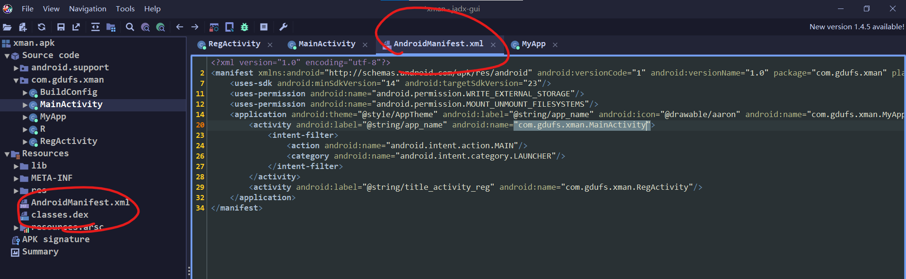
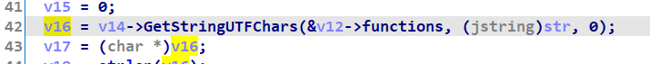
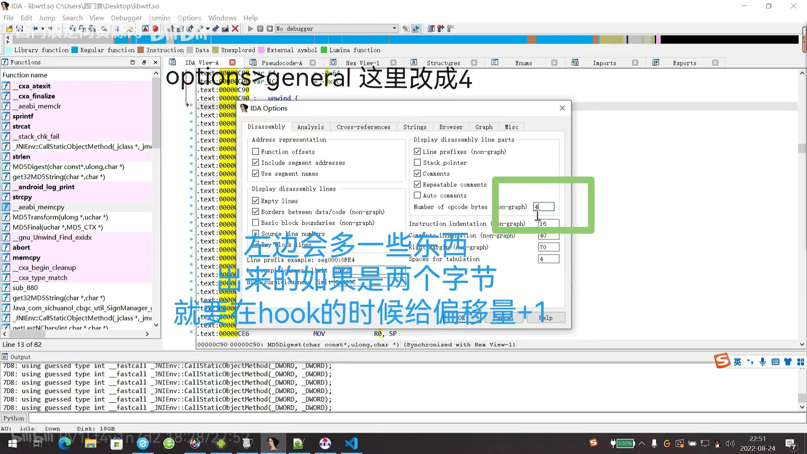

# 基本模板

```javascript
Java.perform(function () {
    // 函数地址                                 文件名              导出函数
    var addr_func = Module.findExportByName("libJNIEncrypt.so", "AES_128_ECB_PKCS5Padding_Encrypt");
    Interceptor.attach(addr_func, {
        onEnter: function(args){
            console.log("-------------执行函数-------------");
            console.log("参数1->", args[0].readUtf8String())  // 指针变成字符串
            console.log("参数2->", args[1].readUtf8String());
        },
        onLeave: function(retValue){  //返回值retValue
            console.log("-------------返回-------------");
            console.log(retValue.readUtf8String());
        }
    })
});
```


# 获取包名

## 法一 mt管理器 提取安装包

## 法二 查看AndroidManifest.xml

第一行 package="com.gdufs.xman"



要hook saveSN

先hook java层试试

### char* 类型转字符串输出

`retval` 的类型：`char *`



```javascript
console.log("retval ->", ptr(retval).readCString());
```

## 打印调用栈

官网 https://frida.re/docs/javascript-api/#thread

```javascript
const f = Module.getExportByName('libcommonCrypto.dylib',
    'CCCryptorCreate');
Interceptor.attach(f, {
  onEnter(args) {
    console.log('CCCryptorCreate called from:\n' +
        Thread.backtrace(this.context, Backtracer.ACCURATE)
        .map(DebugSymbol.fromAddress).join('\n') + '\n');
  }
});

```


### 判断偏移量



### 改写文件

#### frida api

```javascript
function write_reg_dat() {
    var file = new File("/sdcard/reg.dat", "w");
    file.write("EoPAoY62@ElRD");
    // 调用flush()函数可以强制将缓冲区中的数据立即写入磁盘，确保数据被及时保存
    file.flush();
    file.close();
}
```

#### 定义nativefunction

```javascript
function write_reg_dat2() {
    //把C函数定义为NativeFunction来写文件
    var addr_fopen = Module.findExportByName("libc.so", "fopen");
    var addr_fputs = Module.findExportByName("libc.so", "fputs");
    var addr_fclose = Module.findExportByName("libc.so", "fclose");

    console.log("addr_fopen:", addr_fopen, "addr_fputs:", addr_fputs, "addr_fclose:", addr_fclose);
    var fopen = new NativeFunction(addr_fopen, "pointer", ["pointer", "pointer"]);
    var fputs = new NativeFunction(addr_fputs, "int", ["pointer", "pointer"]);
    var fclose = new NativeFunction(addr_fclose, "int", ["pointer"]);

    var filename = Memory.allocUtf8String("/sdcard/reg.dat");
    var open_mode = Memory.allocUtf8String("w+");
    var file = fopen(filename, open_mode);
    console.log("fopen file:", file);

    var buffer = Memory.allocUtf8String("EoPAoY62@ElRD");
    var ret = fputs(buffer, file);
    console.log("fputs ret:", ret);

    fclose(file);
}
```

