# day41 Frida检测

有些app为了防止frida的调试，在内部使用多种方式进行防范。

# 1.检测原理

## 1.1 进程名检测

当你的手机上启动了frida-server，在当前app的进程中就有相应的痕迹。

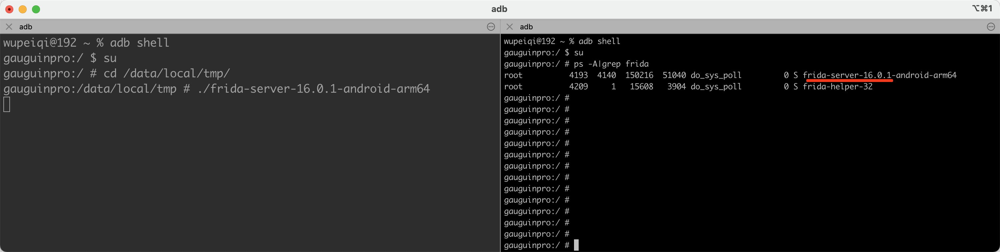

```java
public boolean checkRunningProcesses() {
  boolean returnValue = false;
  // Get currently running application processes
  List<RunningServiceInfo> list = manager.getRunningServices(300);
  if(list != null){
    String tempName;
    for(int i=0;i<list.size();++i){
      tempName = list.get(i).process;
      if(tempName.contains("frida-server")) {
        returnValue = true;
      }
    }
  }
  return returnValue;
}
```

**如何绕过？**

修改下文件名的名称即可，例如：`frida-server-16.0.1-android-arm64` 改成 `fdd`

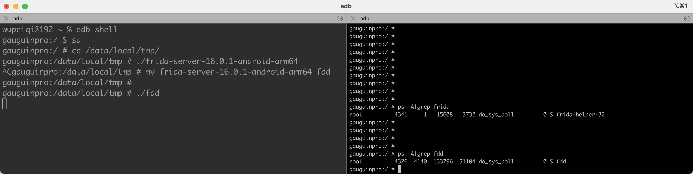

## 1.2 端口监测

frida默认使用的端口是 27042，有app就会去监测是否开放了此端口。

```c
boolean is_frida_server_listening() {
    struct sockaddr_in sa;
    memset(&sa, 0, sizeof(sa));
    sa.sin_family = AF_INET;
    sa.sin_port = htons(27042);
    inet_aton("127.0.0.1", &(sa.sin_addr));
    int sock = socket(AF_INET , SOCK_STREAM , 0);
    if (connect(sock , (struct sockaddr*)&sa , sizeof sa) != -1) {
      /* Frida server detected. Do something… */
    }
}
```

**如何绕过？**

让frida-server在运行时，更换下端口即可。【**注意**：建议使用 frida-server-14.2.18 】

- 在手段端运行

  ```
  ./fdd -l 0.0.0.0:8877
  ```

- 在电脑上

  ```
  端口转发
  	adb forward tcp:8877 tcp:8877
  	
  脚本运行：
      frida -H 127.0.0.1:8877 -l  jd.js   -f
  	frida -H 127.0.0.1:8877 -l  jd.js  -f com.che168.autotradercloud --no-pause
  ```

  ```python
  import frida
  import sys
  
  str_host = "127.0.0.1:8877"
  manager = frida.get_device_manager()
  rdev = manager.add_remote_device(str_host)
  session = rdev.attach("com.che168.autotradercloud")
  
  scr = """
  Java.perform(function () {
      console.log("加载");
  });
  """
  script = session.create_script(scr)
  
  
  def on_message(message, data):
      print(message, data)
  
  
  script.on("message", on_message)
  script.load()
  sys.stdin.read()
  ```

  ```python
  import frida
  import sys
  
  str_host = "127.0.0.1:8877"
  manager = frida.get_device_manager()
  rdev = manager.add_remote_device(str_host)
  # rdev = frida.get_remote_device()
  pid = rdev.spawn(["com.che168.autotradercloud"])
  session = rdev.attach(pid)
  
  scr = """
      Java.perform(function () {
  
      });
  """
  script = session.create_script(scr)
  
  
  def on_message(message, data):
      print(message, data)
  
  
  script.on("message", on_message)
  script.load()
  rdev.resume(pid)
  sys.stdin.read()
  ```


## 1.3 D-Bus协议通信

frida-server使用D-Bus网络协议通信，有些app就会遍历内部所有端口，向端口发送消息，如果端口回复了`REJECT`则表示此端口就是 frida-server，也证明了你在使用frida进行调试。

```c
for(i = 0 ; i <= 65535 ; i++) {
    sock = socket(AF_INET , SOCK_STREAM , 0);
    sa.sin_port = htons(i);
    if (connect(sock , (struct sockaddr*)&sa , sizeof sa) != -1) {
        __android_log_print(ANDROID_LOG_VERBOSE, APPNAME,  "FRIDA DETECTION [1]: Open Port: %d", i);
        memset(res, 0 , 7);
        // send a D-Bus AUTH message. Expected answer is “REJECT"
        send(sock, "\x00", 1, NULL);
        send(sock, "AUTH\r\n", 6, NULL);
        usleep(100);
        if (ret = recv(sock, res, 6, MSG_DONTWAIT) != -1) {
            // 判断是否返回 REJECT 返回了就说明是frida
            if (strcmp(res, "REJECT") == 0) {
               /* Frida server detected. Do something… */
            }
        }
    }
    close(sock);
}
```

**如何绕过呢？**

可以Hook C语言中用于  strstr 和  strcmp 方法，如果出现 `REJECT` 则返回

```javascript
function replace_str() {
    var pt_strstr = Module.findExportByName("libc.so", 'strstr');
    var pt_strcmp = Module.findExportByName("libc.so", 'strcmp');


    Interceptor.attach(pt_strstr, {
        onEnter: function (args) {
            var str1 = args[0].readCString();
            var str2 = args[1].readCString();
            if (str2.indexOf("REJECT") !== -1) {
                //console.log("strcmp-->", str1, str2);
                this.hook = true;
            }
        }, onLeave: function (retval) {
            if (this.hook) {
                retval.replace(0);
            }
        }
    });


    Interceptor.attach(pt_strcmp, {
        onEnter: function (args) {
            var str1 = args[0].readCString();
            var str2 = args[1].readCString();
            if (str2.indexOf("REJECT") !== -1) {
                //console.log("strcmp-->", str1, str2);
                this.hook = true;
            }
        }, onLeave: function (retval) {
            if (this.hook) {
                retval.replace(0);
            }
        }
    })

}

replace_str();
```

## 1.4 maps文件

当APP在手机上运行时，在  `/proc/进程ID/...` 目录下会创建很多跟app运行相关的文件。

先启动起来APP，然后查看他的进程ID：

```python
import frida
import requests

# 获取设备信息
rdev = frida.get_remote_device()

# 获取在前台运行的APP
front_app = rdev.get_frontmost_application()
print(front_app)

# Application(identifier="com.che168.autotradercloud", name="车智赢+", pid=24606, parameters={})
```

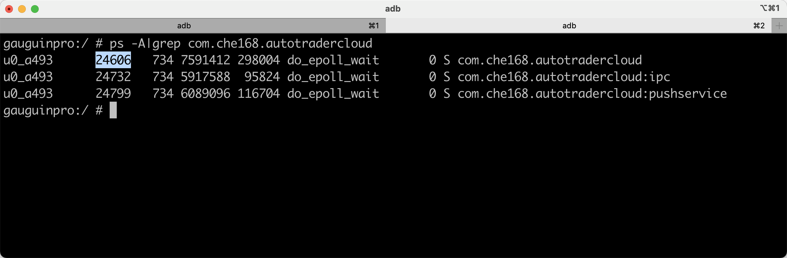

然后就可以通过adb进入目录查看生成相应的文件：

```
ps -A|grep com.che168.autotradercloud
cd /proc/24606/
```

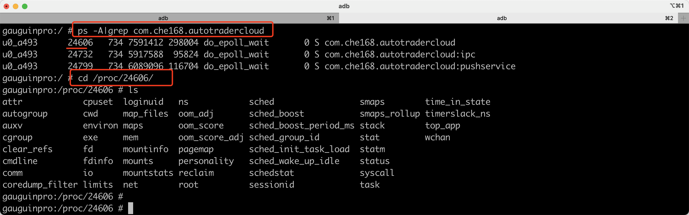

这个maps文件中存储的是APP运行时加载的依赖：

```
cat maps
cat maps |grep native-lib
```

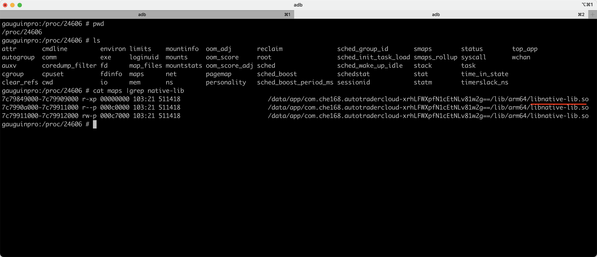

当启动frida后，在maps文件中就会存在 `frida-agent-64.so`、`frida-agent-32.so`  文件。

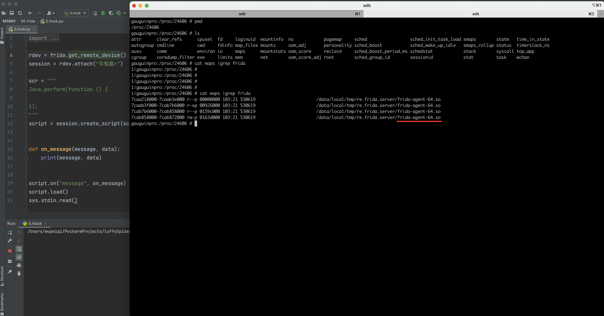

所以，在一些APP中就会去读取maps文件的内容，看看是否有frida来监测是否有被frida调试。

```c
char line[512];
FILE* fp;
fp = fopen("/proc/self/maps", "r");
if (fp) {
    while (fgets(line, 512, fp)) {
        if (strstr(line, "frida")) {
            /* Evil library is loaded. Do something… */
        }
    }
    fclose(fp);
    } else {
       /* Error opening /proc/self/maps. If this happens, something is off. */
    }
}
```

**如何绕过呢？**

Hook C语言中的 strstr    strcmp 来进行判断  `frida-agent-64.so` 或 `re.frida.server`

```javascript
function replace_str_maps() {
    var pt_strstr = Module.findExportByName("libc.so", 'strstr');
    var pt_strcmp = Module.findExportByName("libc.so", 'strcmp');


    Interceptor.attach(pt_strstr, {
        onEnter: function (args) {
            var str1 = args[0].readCString();
            var str2 = args[1].readCString();
            if (str2.indexOf("REJECT") !== -1  || str2.indexOf("frida") !== -1) {
                this.hook = true;
            }
        }, onLeave: function (retval) {
            if (this.hook) {
                retval.replace(0);  // 返回值替换成0 false
            }
        }
    });


    Interceptor.attach(pt_strcmp, {
        onEnter: function (args) {
            var str1 = args[0].readCString();
            var str2 = args[1].readCString();
            if (str2.indexOf("REJECT") !== -1  || str2.indexOf("frida") !== -1) {
                this.hook = true;
            }
        }, onLeave: function (retval) {
            if (this.hook) {
                retval.replace(0);
            }
        }
    })

}

replace_str();
```

## 1.5 task目录

```
>>> cat maps| grep frida
```

1. 运行 `cat maps` 命令，将文件名为 “maps” 的文件内容输出到标准输出（屏幕）上。
2. 然后将输出结果通过管道符号 `|` 传递给 `grep frida` 命令。
3. `grep frida` 命令会在传递过来的文本中查找包含 “frida” 字符串的行，并将这些行输出到标准输出。

因此，这个命令的作用是在文件 “maps” 中查找包含字符串 “frida” 的行并将其输出到屏幕上。使用这个命令通常是为了快速筛选和查找指定内容。

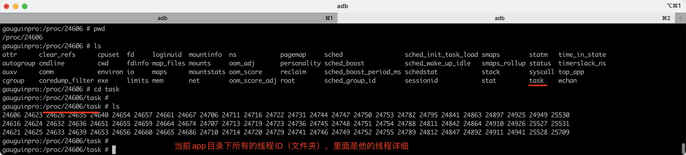

可以在运行frida和未运行frida时，进行对比，看看frida的启动创建了哪些线程。

- 未运行frida
  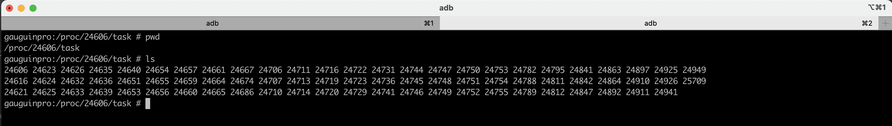
- 运行frida
  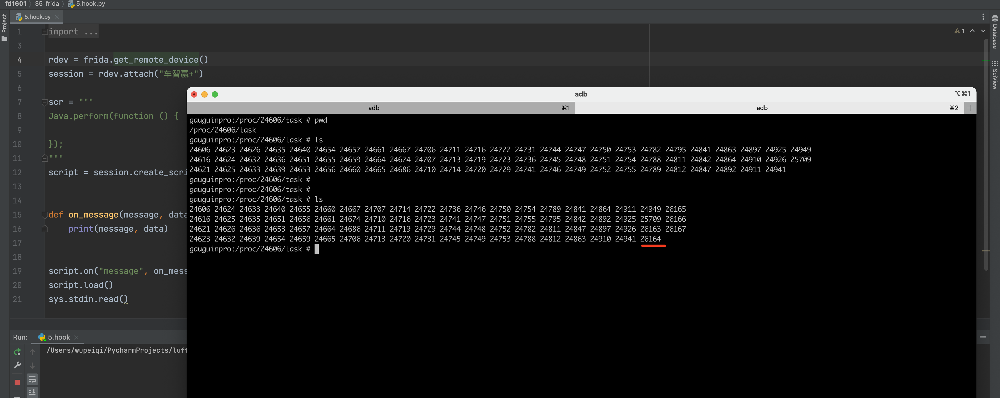

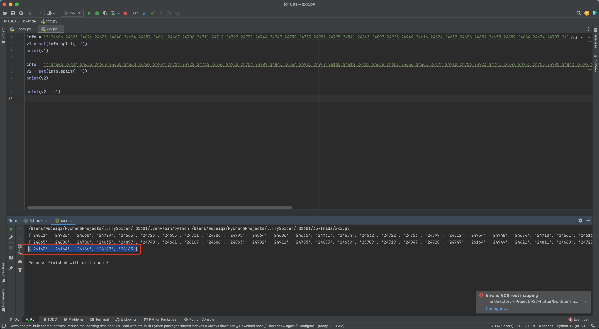

对上述的线程ID进行比较，发现由于frida的运行新增了的线程ID：

```
{'26163', '26164', '26166', '26167', '26165'}
```

在某些app中就会去读取 `/proc/stask/线程ID/status` 文件，如果是运行frida产生的，则进行反调试。

例如：`gmain/gdbus/gum-js-loop/pool-frida`等

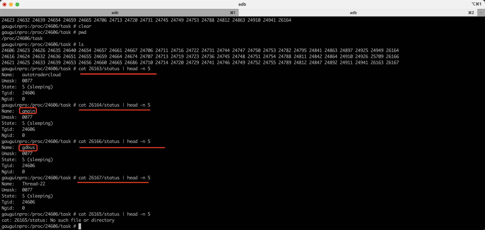

如何绕过？

Hook C语言中的 strstr    strcmp 来进行判断 `gmain` 、`gdbus`等字符串。

```javascript
function replace_str() {
    var pt_strstr = Module.findExportByName("libc.so", 'strstr');
    var pt_strcmp = Module.findExportByName("libc.so", 'strcmp');


    Interceptor.attach(pt_strstr, {
        onEnter: function (args) {
            var str1 = args[0].readCString();

            var str2 = args[1].readCString();
            if (str2.indexOf("tmp") !== -1 ||
                str2.indexOf("frida") !== -1 || 
                str2.indexOf("gum-js-loop") !== -1 || 
                str2.indexOf("gmain") !== -1 ||
                str2.indexOf("gdbus") !== -1 ||
                str2.indexOf("pool-frida") !== -1||
                str2.indexOf("linjector") !== -1) {
                //console.log("strcmp-->", str1, str2);
                this.hook = true;
            }
        }, onLeave: function (retval) {
            if (this.hook) {
                retval.replace(0);
            }
        }
    });


    Interceptor.attach(pt_strcmp, {
        onEnter: function (args) {
            var str1 = args[0].readCString();
            var str2 = args[1].readCString();
            if (str2.indexOf("tmp") !== -1 || 
                str2.indexOf("frida") !== -1 || 
                str2.indexOf("gum-js-loop") !== -1 || 
                str2.indexOf("gmain") !== -1 || 
                str2.indexOf("gdbus") !== -1 ||
                str2.indexOf("pool-frida") !== -1|| 
                str2.indexOf("linjector") !== -1) {
                //console.log("strcmp-->", str1, str2);
                this.hook = true;
            }
        }, onLeave: function (retval) {
            if (this.hook) {
                retval.replace(0);
            }
        }
    })

}

replace_str();

```

## 1.6 fd目录

记录app都打开的了哪些文件。

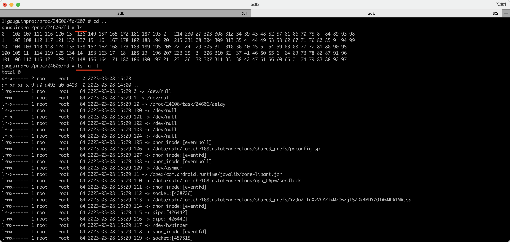

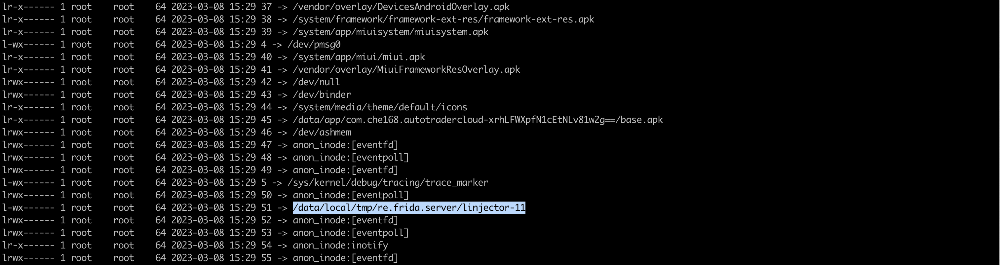

## 1.7 frida-server启动

当frida-server启动时，在 `/data/local/tmp/`目录下会生成一个文件夹并且会生成一下带有frida的特征。

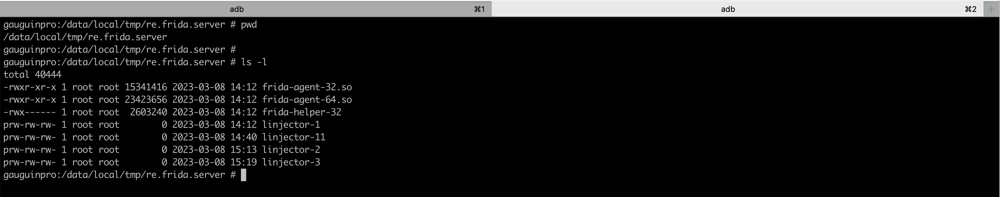

**如何绕过？**

使用将 `hluda-server`，在运行frida之后就不会出现frida等字眼了。


当使用了 `hluda-server`后，由于 `/data/local/tmp/` 目录下文件夹和文件的名称改变了，所以在使用了`hluda-server`后相当于

解决了：

- fd目录问题， `/data/local/tmp/re.frida.server/linjector`
- maps文件问题，`/data/local/tmp/re.frida.server/frida-agent-64.so`

未解决：

- task目录问题，Hook： `gmain` 、`gdbus`等
- D-Bus协议问题，Hook：`REJECT`
- 端口问题，切换端口
- 进程名问题，更换文件名

# 2.实战案例

## 2.1 frida版本

在逆向时，请务必使用  `hluda-server-14.2.18` + `python3.8` 来对常见frida的特征进行隐藏。

**注意：其他高版本不好使。**

```
pip install frida==14.2.18
pip install frida-tools==9.2.5
```

安装过程中如果需要用到下载egg相关文件，请点击：

https://pypi.doubanio.com/simple/frida/

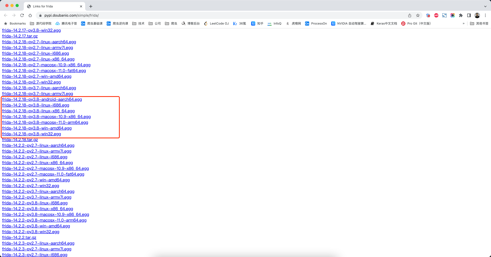

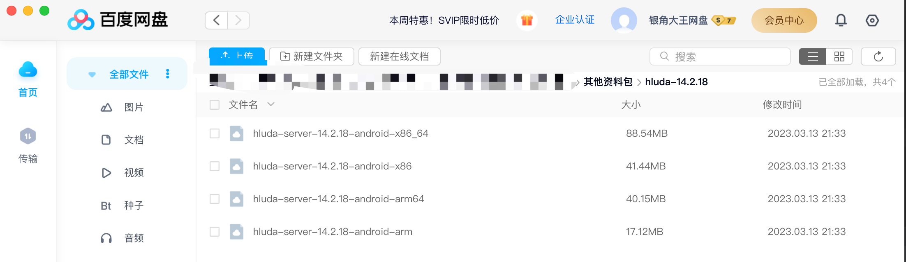

## 2.2 第一类：识货、得物、唯品会、豆瓣

代表APP有：识货、得物、唯品会、豆瓣

### 1.加载so

```javascript
var dlopen = Module.findExportByName(null, "dlopen");
var android_dlopen_ext = Module.findExportByName(null, "android_dlopen_ext");

Interceptor.attach(dlopen, {
    onEnter: function (args) {
        var path_ptr = args[0];
        var path = ptr(path_ptr).readCString();
        console.log("[dlopen:]", path);
    },
    onLeave: function (retval) {

    }
});

Interceptor.attach(android_dlopen_ext, {
    onEnter: function (args) {
        var path_ptr = args[0];
        var path = ptr(path_ptr).readCString();
        console.log("[dlopen_ext:]", path);
    },
    onLeave: function (retval) {

    }
});


// frida -U -f com.hupu.shihuo -l load_so.js --no-pause  14.2.18版
// frida -U -f com.douban.frodo -l hook.js    16b
```

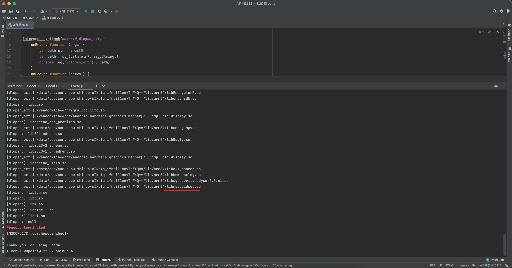

### 2.删除so【搞定】

先尝试删除可能的so文件，看看app是否可正常运行。

有些app的监测是在一个单独的so文件中，但删除后业务功能不受任何影响。例如：识货、得物、唯品会、雷速体育。

### 3.尝试Hook关键词【可选】

```javascript
function replace_str() {
    var pt_strstr = Module.findExportByName("libc.so", 'strstr');
    var pt_strcmp = Module.findExportByName("libc.so", 'strcmp');

    Interceptor.attach(pt_strstr, {
        onEnter: function (args) {
            var str1 = args[0].readCString();
            var str2 = args[1].readCString();
            if (
                str2.indexOf("REJECT") !== -1 ||
                str2.indexOf("tmp") !== -1 ||
                str2.indexOf("frida") !== -1 ||
                str2.indexOf("gum-js-loop") !== -1 ||
                str2.indexOf("gmain") !== -1 ||
                str2.indexOf("linjector") !== -1
            ) {
                console.log("strstr-->", str1, str2);
                this.hook = true;
            }
        }, onLeave: function (retval) {
            if (this.hook) {
                retval.replace(0);
            }
        }
    });

    Interceptor.attach(pt_strcmp, {
        onEnter: function (args) {
            var str1 = args[0].readCString();
            var str2 = args[1].readCString();
            if (
                str2.indexOf("REJECT") !== -1 ||
                str2.indexOf("tmp") !== -1 ||
                str2.indexOf("frida") !== -1 ||
                str2.indexOf("gum-js-loop") !== -1 ||
                str2.indexOf("gmain") !== -1 ||
                str2.indexOf("linjector") !== -1
            ) {
                //console.log("strcmp-->", str1, str2);
                this.hook = true;
            }
        }, onLeave: function (retval) {
            if (this.hook) {
                retval.replace(0);
            }
        }
    })
}

replace_str();

// frida -U  -l 5.绕过.js -f com.hupu.shihuo --no-pause
// frida -U  -l 5.绕过.js -f com.shizhuang.duapp --no-pause
// frida -U  -l 5.绕过.js -f com.achievo.vipshop --no-pause
// frida -U  -l 5.绕过.js -f com.leisu.sports --no-pause
```

## 2.3 第二类：e充电

代表APP有：e充电（含ROOT监测）

### 1.加载so

```javascript
var dlopen = Module.findExportByName(null, "dlopen");
var android_dlopen_ext = Module.findExportByName(null, "android_dlopen_ext");

Interceptor.attach(dlopen, {
    onEnter: function (args) {
        var path_ptr = args[0];
        var path = ptr(path_ptr).readCString();
        console.log("[dlopen:]", path);
    },
    onLeave: function (retval) {

    }
});

Interceptor.attach(android_dlopen_ext, {
    onEnter: function (args) {
        var path_ptr = args[0];
        var path = ptr(path_ptr).readCString();
        console.log("[dlopen_ext:]", path);
    },
    onLeave: function (retval) {

    }
});


// frida -U -f  com.sgcc.evs.echarge -l 3.加载so.js --no-pause
```

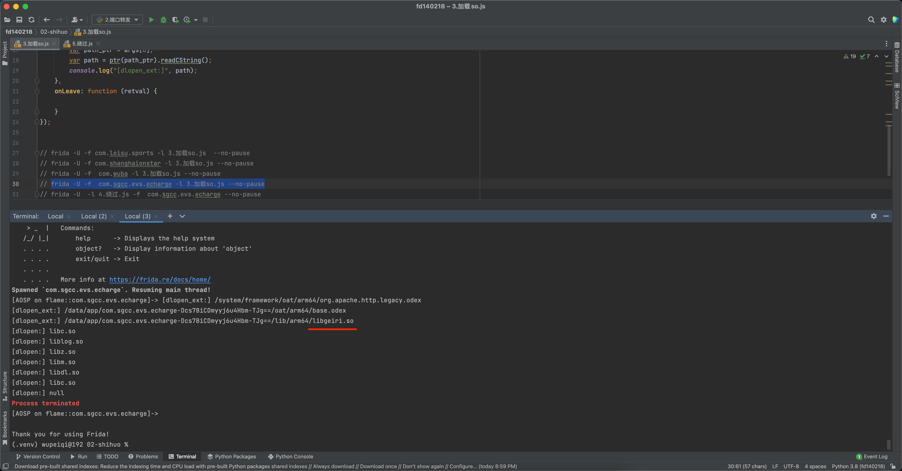

### 2.删除so【报错】

删除so文件后，无法运行。

### 3.尝试Hook关键词【搞定】

```javascript
function replace_str() {
    var pt_strstr = Module.findExportByName("libc.so", 'strstr');
    var pt_strcmp = Module.findExportByName("libc.so", 'strcmp');

    Interceptor.attach(pt_strstr, {
        onEnter: function (args) {
            var str1 = args[0].readCString();
            var str2 = args[1].readCString();
            if (
                str2.indexOf("REJECT") !== -1 ||
                str2.indexOf("tmp") !== -1 ||
                str2.indexOf("frida") !== -1 ||
                str2.indexOf("gum-js-loop") !== -1 ||
                str2.indexOf("gmain") !== -1 ||
                str2.indexOf("linjector") !== -1
            ) {
                console.log("strstr-->", str1, str2);
                this.hook = true;
            }
        }, onLeave: function (retval) {
            if (this.hook) {
                retval.replace(0);
            }
        }
    });

    Interceptor.attach(pt_strcmp, {
        onEnter: function (args) {
            var str1 = args[0].readCString();
            var str2 = args[1].readCString();
            if (
                str2.indexOf("REJECT") !== -1 ||
                str2.indexOf("tmp") !== -1 ||
                str2.indexOf("frida") !== -1 ||
                str2.indexOf("gum-js-loop") !== -1 ||
                str2.indexOf("gmain") !== -1 ||
                str2.indexOf("linjector") !== -1
            ) {
                //console.log("strcmp-->", str1, str2);
                this.hook = true;
            }
        }, onLeave: function (retval) {
            if (this.hook) {
                retval.replace(0);
            }
        }
    })

}

replace_str();

// frida -U  -l 5.绕过.js -f com.sgcc.evs.echarge --no-pause
```

## 2.4 第三类：安吉星、ibox、贵旅优品

代表APP有：安吉星（含ROOT监测）、ibox（含ROOT监测）、贵旅优品（含ROOT监测）

### 1.加载so

```javascript
// 通过模块名查找dlopen函数的地址
var dlopen = Module.findExportByName(null, "dlopen");
// 通过模块名查找android_dlopen_ext函数的地址
var android_dlopen_ext = Module.findExportByName(null, "android_dlopen_ext");
// 当被拦截的函数被调用时，此回调函数将被执行
Interceptor.attach(dlopen, {
    // 从参数中读取要打开的.so文件路径
    onEnter: function (args) {
        var path_ptr = args[0];
        var path = ptr(path_ptr).readCString();
        console.log("[dlopen:]", path);
    },
    onLeave: function (retval) {
    }
});

Interceptor.attach(android_dlopen_ext, {
    onEnter: function (args) {
        var path_ptr = args[0];
        var path = ptr(path_ptr).readCString();
        console.log("[dlopen_ext:]", path);
    },
    onLeave: function (retval) {
    }
});


// frida -U -f com.shanghaionstar -l load_so.js --no-pause
```

通过上述Frida代码，可以方便地监测应用程序加载的动态链接库，并对其进行进一步分析和防御。需要注意的是，此代码仅适用于Android平台，其他平台的实现方式可能会有所不同


### 2.pthread_create【搞定】

```javascript
function hook_pthread_create() {
    var pt_create_func = Module.findExportByName("libc.so", 'pthread_create');

    Interceptor.attach(pt_create_func, {
        onEnter: function (args) {
            // 是那个so文件调用我，创建线程
            var so_name = Process.findModuleByAddress(args[2]).name;
            if (so_name.indexOf("libDexHelper.so") != -1) {
                try {
                    Interceptor.replace(args[2], new NativeCallback(function () {
                        console.log('replace success');
                        return null;
                    }, 'void', ["void"]));
                } catch (e) {

                }

            }
        }, onLeave: function (retval) {
        }
    })
}

hook_pthread_create();

// frida -U  -l pthread_create.js -f  com.shanghaionstar --no-pause
```

```javascript
function hook_pthread_create() {
    var pt_create_func = Module.findExportByName("libc.so", 'pthread_create');

    Interceptor.attach(pt_create_func, {
        onEnter: function (args) {
            // 是那个so文件调用我，创建线程
            var so_name = Process.findModuleByAddress(args[2]).name;
            if (so_name.indexOf("libDexHelper.so") != -1) {
                try {
                    Interceptor.replace(args[2], new NativeCallback(function () {
                        console.log('replace success');
                        return null;
                    }, 'void', ["void"]));
                } catch (e) {

                }

            }
        }, onLeave: function (retval) {
        }
    })
}

hook_pthread_create();

// frida -U  -l pthread_create.js -f com.box.art  --no-pause
```

```javascript
function hook_pthread_create() {
    var pt_create_func = Module.findExportByName("libc.so", 'pthread_create');

    Interceptor.attach(pt_create_func, {
        onEnter: function (args) {
            // 是那个so文件调用我，创建线程
            var so_name = Process.findModuleByAddress(args[2]).name;

            if (so_name.indexOf("libexec.so") != -1) {
                try {
                    Interceptor.replace(args[2], new NativeCallback(function () {
                        console.log('replace success');
                        return null;
                    }, 'void', ["void"]));
                } catch (e) {

                }

            }
        }, onLeave: function (retval) {
        }
    })
}

hook_pthread_create();

// frida -U  -l pthread_create.js -f  com.gzlex.hui.guoziwei.travel  --no-pause
```
