# jailbreak

WinRa1n 2.0 is a good tool :)

or use 爱斯助手 the usb ones method

## frida

frida https://frida.re/docs/ios/#with-jailbreak

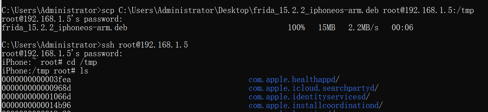

you don't have to connect with computer via usb cab


windows can't connect with ios via usb... it seems like that it's drive should be changed...

but we can solve this problem by wireless remote connect

**0x00 备注**

  我们经常用旧的手机来做越狱和调试, 这个usb连接真的是差强人意, 老是关键时刻掉线

**0x01 iPhone ssh运行:**

```bash
frida-server -l 0.0.0.0
```

**0x02 MacOS 中运行 :**

```bash
frida-ps -H 192.168.111.120
```

0x03 执行frida操作

```bash
frida-trace -H 192.168.1.3:1337 -i "open*"
```

记得加上-H IP:Port

```bash
# listen on 127.0.0.1:27042 (the default)
$ frida-server

# listen on all interfaces
$ frida-server -l 0.0.0.0

# listen on a specific interface
$ frida-server -l 192.168.1.3

# listen on a specific interface and port
$ frida-server -l 192.168.1.3:1337

# connect to specific IP
$ frida-trace -H 192.168.1.3 -i "open*"

# connect to specific IP/port
$ frida-trace -H 192.168.1.3:1337 -i "open*"
```

cyz1nappleID

## install shit

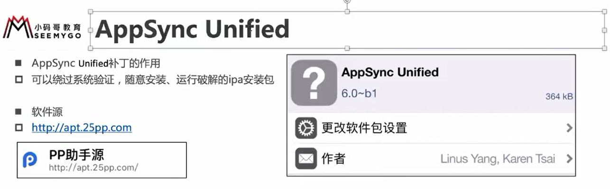

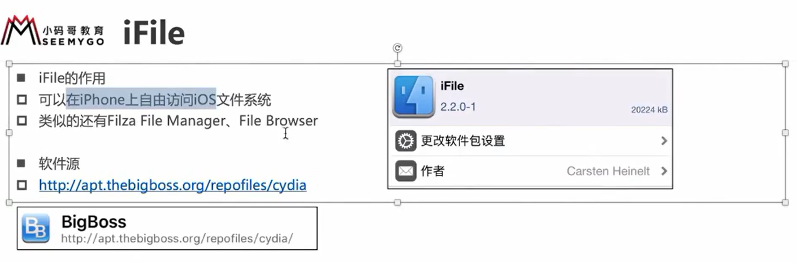

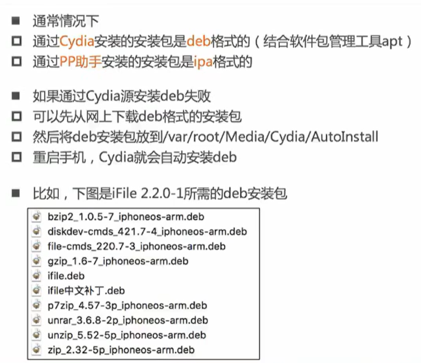

# connect iphone by ssh

ssh is similar to adb, it connects window with ios

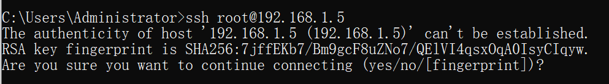

if type yes, next time even if it's the same ip address but a difference SHA256, it will raise middle attack (?)

default password `alpine`

other user

`ssh mobile@192.168.1.5(iphone ip address)`

## change password 

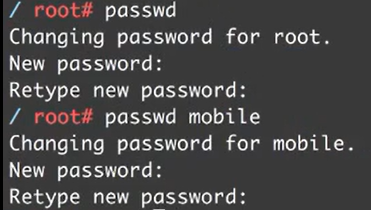

## server ip changed it shows `man-in-middle attack`

delete rsa key in PC

`vim know_hosts`

move the cursor to the fine row, type`dd` to delete this row

push`Esc` and type `:wq`

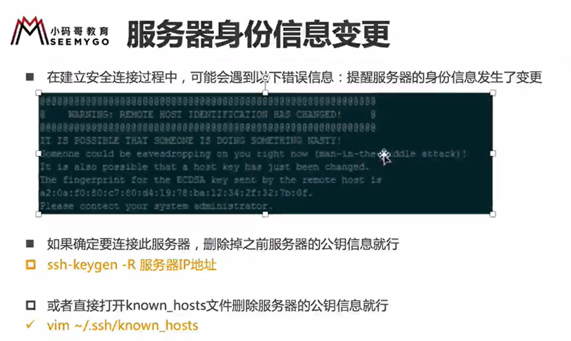

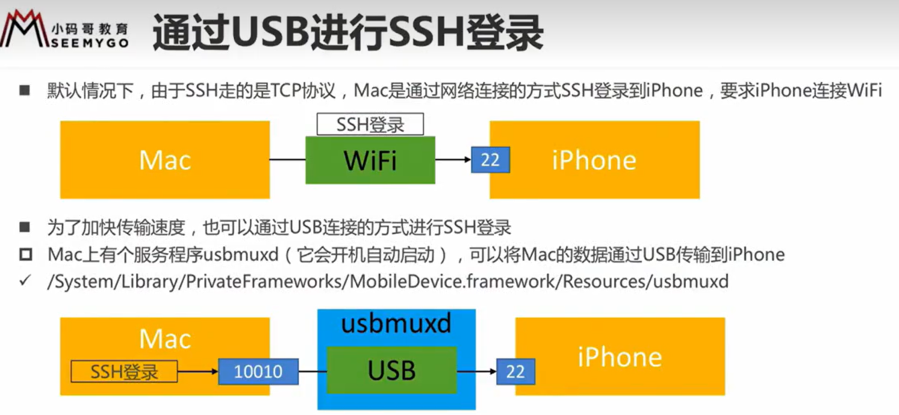

# Share VPN

they should be LAN

ur vpn android device

v2yan: change socks5 and http port as the same number, allow coonections from the LAN

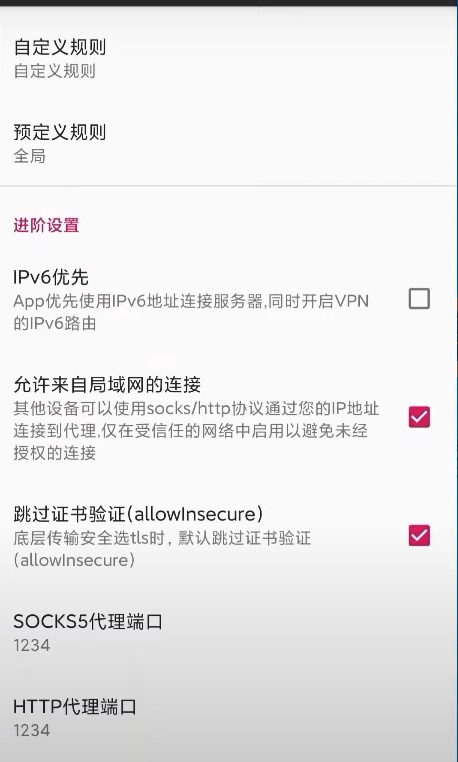

ur vpn not found window device

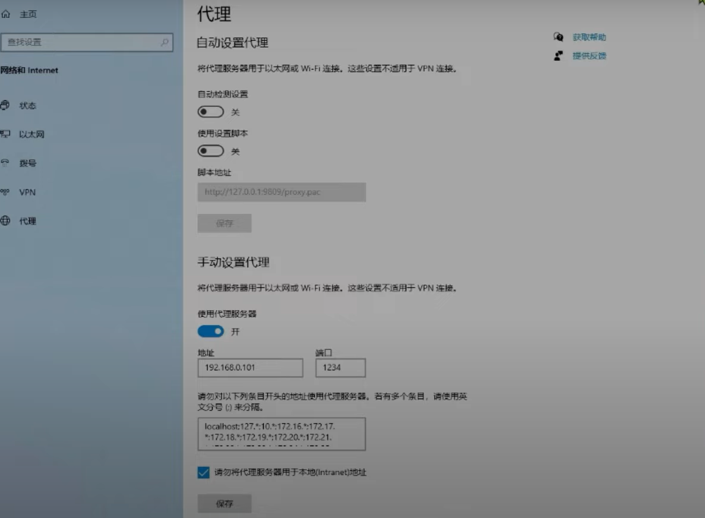

ios

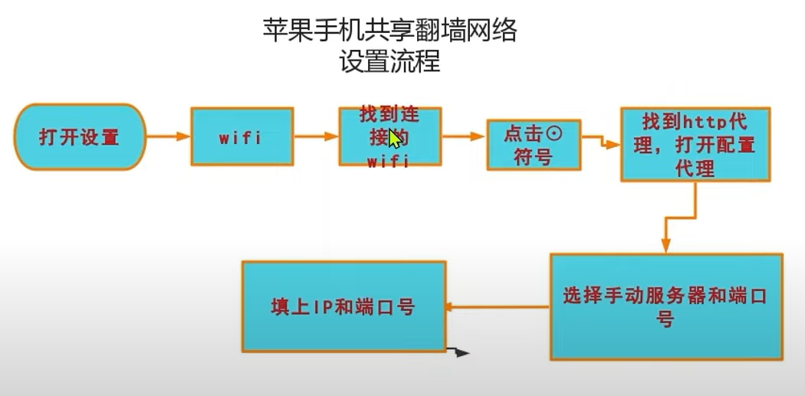

this is clash. also change http and socks port and allow LAN

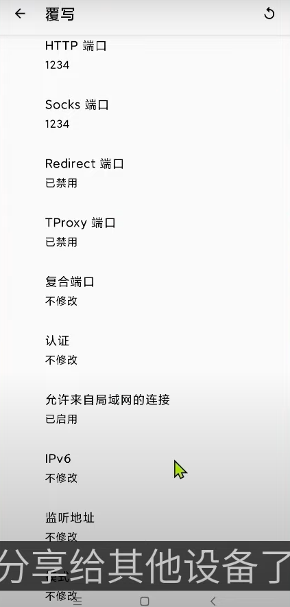

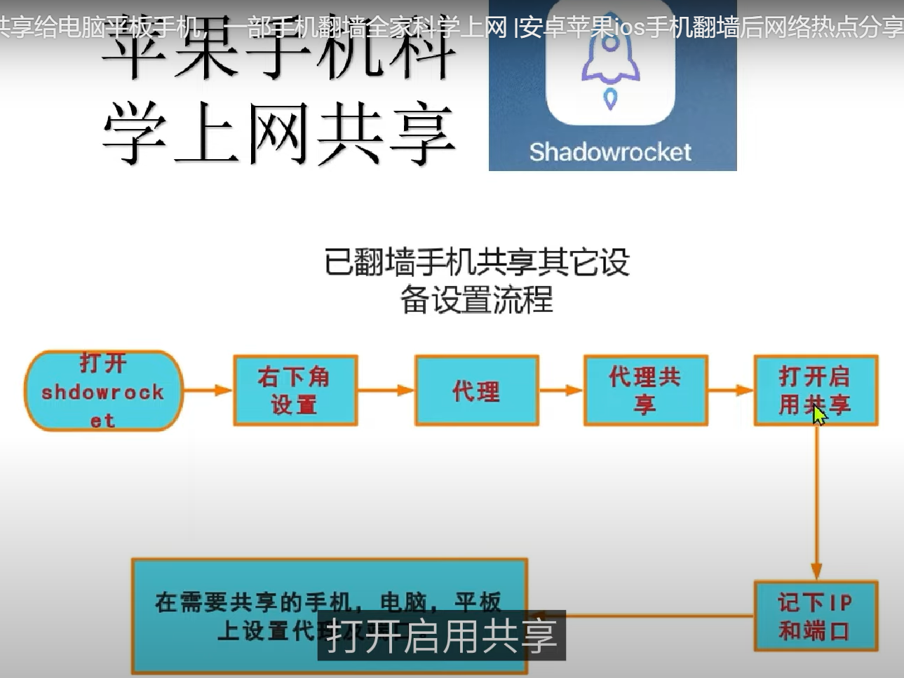

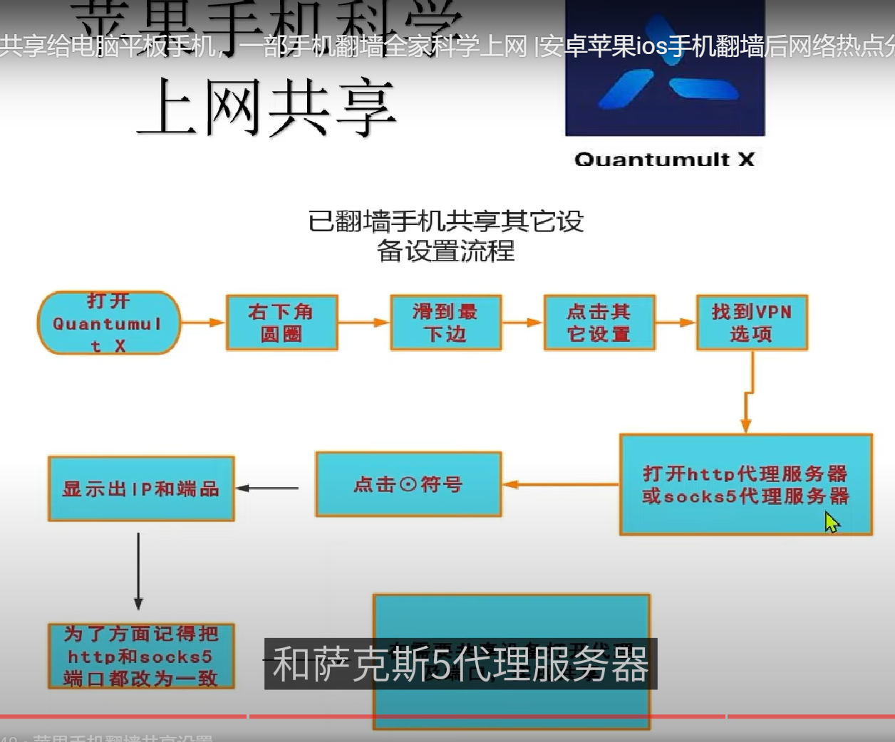