all the links are down below

https://docs.qq.com/sheet/DTWxLdElla0JrWFdp?tab=BB08J2

# Basic Knowledge

- search a specific word`xxx` do not get similar word ->`\bxxx\b`
- transform a dictionary to a `a=123&b=&c=456&province=%E9%9D&name=` like thing

```python
from urllib.parse import urlencode
data = {
    #...
    'province': '中文' # btw, this is urlencode编码, %xx -> Chinese character
}
ret = urlencode(data)
```

- use Charles to compare ur python request with the actual request send by chrome. Before that, u need to do somethin:

```python
proxy = {
    'http:': 'http://192.168.x.x:8888',
    'https': 'http://192.168.x.x:8888'
}
req = requests.post(url, data=data, headers=headers, proxies=proxy, verify=False)
```

- deal with infinite debug

```javascript
//大部分是可以的，除了 瑞数
Function.prototype._constructor = Function.prototype.constructor
Function.prototype.constructor = function(){
    if(arguments[0] === 'debugger' ){
        return function(){}
    }else{
        return Function.prototype._constructor.apply(this, arguments)
    }
}

```

- use Clash for window to send requests

```python
import requests

url = "https://www.google.com.sg/"
headers = {
    'user-agent': 'Mozilla/5.0 (Windows NT 10.0; Win64; x64) AppleWebKit/537.36 (KHTML, like Gecko) Chrome/109.0.0.0 Safari/537.36'
}
proxy = {
    "http": "http://127.0.0.1:7890",
    "https":"http://127.0.0.1:7890"
}

resp = requests.get(url, headers=headers, proxies=proxy)
print(resp.text)
```

- basic shit

```javascript
document= {};
window= global;
```


页面数据搜不到的三个原因：
1.数据加密
2.字体反爬（大众点评、58同城[镜面映射？]、猫眼[css偏移，动态映射]）
3.unicode编码

页面数据搜不到
首先试着搜搜英文或数字，如果搜到就是unicode编码
搜不到
在元素界面定位到数据的类，找到上级类选择器class='xxxx'
还搜不到
动态数据
数据加密->清空数据，切换数据，抓到数据接口
搜索decrypt(用于未被混淆的js)
建议能扣js就用扣js的方式

webpack打包？

前端看到test是正则
补环境
var windows = {};
var document = {};

页面加载和渲染时间长，因为渲染工具自动加载HTML文档所需资源，但并不需要。
可设置禁止渲染工具加载图片或其他类型文件
Splash 图片禁用:htps://splashreadthedocs.io/en/latest/scripting-ref.html#splash-images-enabled
Splash HTML5 媒体禁用:https:/splash.readthedocs.io/en/latest/scripting-ref.html#splash-html5-mediaenabled
Splash 浏览器插件禁用: htps://splash.readthedocs.io/en/latest/scripting-refhtml#splash-plugins-enabled
Selenium 图片和其他资源禁用: http://chromedriver.chromium.org/capabilities
Pyppeteer JavaScript 禁用: ttps://miyakogi.github.io/pyppeteer/reference.html#pyppeteer.page.PagesetJavaScriptEnabled
禁止渲染工具请求媒体资源后，网页加载速度会变得更快
渲染工具还允许用户在页面中执行自定义的 JavaScript 代码，具体用法与规则请参考以下文档。
Puppeteer :https://miyakogi.github.io/pyppeteer/reference.html#pyppeteer.page.Page.evaluateOnNewDocument
Splash: https://splashreadthedocs.io/en/latest/scripting-ref.html#splash-runjis
Splash: https://splashreadthedocs.io/en/latest/scripting-ref.html#splash-evalis
Selenium: https://www.seleniumhq.org/docs/09_selenium_idejsp#javascript-and-selenese-parameters


- download videos by ffmpeg command via m3u8 address. this example seems from tencent lamo

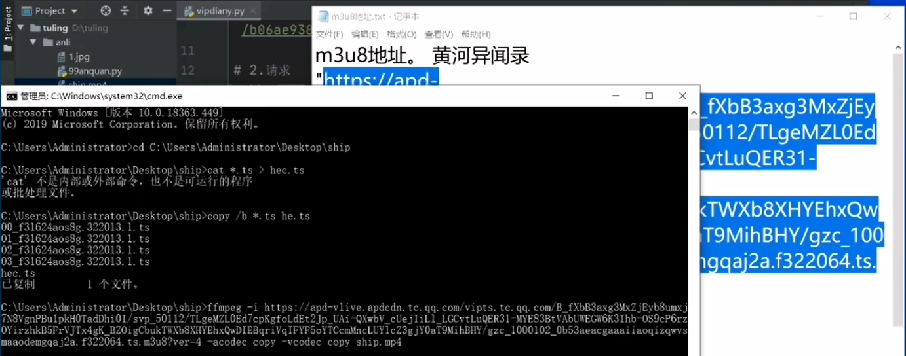

```
ffmpeg -i 'm3u8 address' -acodec copy -vcodes copy xxx.mp4
```


## Analysis tips

### `sent`

the value of  `sent` comes from the privious `return`

say a js snippet is as below. it's asynchronous so we can't debug it

```javascript
case 23:
	return h.show(),
    //...,
	r.next = 24,
    C();
//...
case 24:
	x = r.sent,
    //...
//...
```

since they all end as `,` in case23, so it's return value is `C()`

so `r.sent` is the return value of `C()`. Go check out the function `C()`!

### locate cookie 

if a cookie is generated by js, hook them.

in `Event Listener Breakpoints`, tag `Script`,  that means it will have a breakpoint every time a script is loaded.

when it stop at the first script, execute the hook cookie script. pay attention to the parameter `v`. when you find what you need, go check out Call Stack, see the function below `set`

```javascript
(function () {
    var temp = "";
    Object.defineProperty(document, "cookie", {
        get: function () {
            debugger;
            return temp
        },
        set: function (v) {
            debugger;
            temp = v;
            return v
        }
    })
}())
```

there is another way, just use extension!

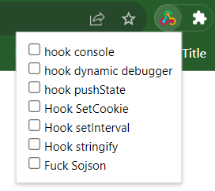

if you find the place, untag the hook thing, then ctrl shift r refresh, then you get the correct breakpoint!


# Convert to python

pass

# Complement the environment

- http://39.105.154.231:3000/play/66190 


## 百度翻译

- http://39.105.154.231:3000/play/66192 


## 拼多多

- https://mobile.pinduoduo.com/

http://39.105.154.231:3000/play/66191  

say the 11th line has a breakpoint

```javascript
case 0:
    return n = It({
        platform: "H5",
        page_sn: 10002,
        page_id: "index_list.html",
        engine_version: "3.0"
    }, t),
        e.next = 4,
        $e.a.getAntiContent();
case 4:
	(r = e.sent) && (n.anti_content = r);
```

copy `$e.a.getAntiContent();`

paste it in Console, add some keywords as below:

`$e.a.getAntiContent().then(function(args){console.log(args)})`

then push Enter key.

`Promise` shown below.

release the breakpoint.

u will find out some shit appear.

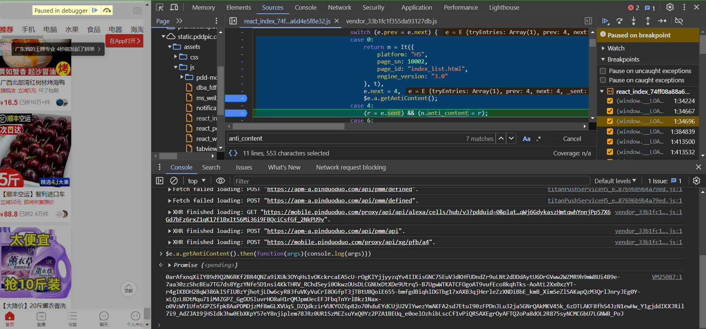

enter `$e.a.getAntiContent();`

```javascript
b.getAntiContent = o()(l.a.mark((function e() {
    var t, n;
    return l.a.wrap((function(e) {
        for (; ; )
            switch (e.prev = e.next) {
                case 0:
                    if (t = null,
                        !(n = b.getInstance())) {
                        e.next = 11;
                        break
                    }
                    return e.prev = 3,
                        e.next = 6,
                        n.getRiskControlInfoAsync();
                case 6:
                    t = e.sent,
                        e.next = 11;
                    break;
                case 9:
                    e.prev = 9,
                        e.t0 = e.catch(3);
                case 11:
                    return e.abrupt("return", t);
                case 12:
                case "end":
                    return e.stop()
            }
    }
//...
```

line 23 is the real return, so see where is t comes from

reverse to line 14, find the correct place!

# Complement the code

8期吧？

## :triangular_flag_on_post:http://39.105.154.231:3000/play/68359 

## 有道翻译  https://fanyi.youdao.com/index.html#/ 

- decrypt the response text 

the original code be like

B gets the return value of all these shit

```javascript
B = (e,t)=>Object(a["d"])("https://dict.youdao.com/webtranslate", Object(n["a"])(Object(n["a"])({}, e), E(t)), {
                headers: {
                    "Content-Type": "application/x-www-form-urlencoded"
                }
            })
```

- just ignore `Object`

```javascript
B = function (e,t) {
    a.d("https://dict.youdao.com/webtranslate", n.a(n.a({}, e), E(t)), {
        headers: {
            "Content-Type": "application/x-www-form-urlencoded"
        }
    })
}
```

- `n.a(n.a({}, e)` can be seen as merging two objects `n.a({}, e)` -> `e` => `n.a(e, E(t))`
- to figure out who the fuck calls B, check out Call Stack on right panel

- codes that related to the response data

```javascript
// native ajax
XMLHTTPRequest.onreadystatechange = function() {
    if xml.readyState == 4 {
        // deal with response text
    }
}

// advanced(?) ajax
$.ajax({
    success: function() {
        // response data
    }
})

// axios
axios.get(url, function(){
    // response data
})
```

- `new Promise(function(resolve, rejec){})`

in order to figure out how they deal with response shit, we need to find out who used the function `l`, which means `send` in original axios logic.

we know `B` gets the return value of these function, so find out code like `B().then()`

```javascript
        function l(e, t, o) {
            return new Promise((n,i)=>{
                // axios.post
                a["a"].post(e, t, o).then(e=>{
                    n(e.data) // after response...
                }
                ).catch(e=>{
                    i(e)
                }
                )
            }
            )
        }
```

- if u wonder whether a value is all the same, copy it and search it. see if u can find out.
- pay attention to `_` and `-`, replace them with `/` a nd `+`

```
Z21kD9ZK1ke6ugku2ccWuz4Ip5f4PLCoxWstZf_6UUyBoy8dpWc3NOXFRrnPMya74JgUpIL-6 IEqnM
```

## 易车 https://car.yiche.com/siyucivic/peizhi

- md5 in node js

```javascript
var crypto = require("crypto");
function my_md5(e) {
    return crypto.createHash("md5").update(e).digest("hex");
}
```

- `JSON.stringify()` in js is difference to `json.dumps()` in python. in js, it's json result doesn't contain any blank.

  this is a problem raised by `json.dumps()`. its result contains blanks.

  ```python
  dic = {"cityId": "201", "serialId": "2406"}
  params = {
      "cid": "508",
      "param": json.dumps(dic) # incorrect
  }
  ```

  if its a get request, once the params is url-enceded, the blanks will be enceded too, which is difference to the no blanks one.

*fix this problem:* **`json.dumps(dic, separators=(',', ':'))`**

## 易久批 https://www.yijiupi.com/#/login 

it seems that its api has been disappeared

- if you search a word that is not easy to locate, search another word in the same payload, that would be helpful
- REMEMBER THIS KNOWLEDGE! **`abrupt`**

trigger a return thing, after r is already. some bowsers may not support `await` or `async`. its basically alternatives.

```javascript
r = "us/user/loginByCode",
t.abrupt("return", a)({
	url: r,
	method: "post"
	// ...
}).then(function(t){
	return Promise.resolve(t.data) // success
}).then(function(t){
    return Promise.reject(t.data) // fail
})
```

- if you notice a function that always return some random shit, that would be generated by `Math.random()`, dig into it and pay attention to `Math` thing if it's been obscured or junk code. copy it's random return value can fit the demand.
- in **junk code**, there are loads of shit you need to analysis, but you don't need to reverse every command sometimes. copy a code to console and execute it by passing simple variable like "123456" will help a lot. copy the result and search in https://1024tools.com/hash to see if you can find a specific algorithm, if you find, you will save a lot of time :)
- sha1 in node js

```javascript
var crypto = require("crypto");
function my_md5(e) {
    return crypto.createHash("sha1").update(e).digest("hex");
}
```

- this snippet didn't use if block but it has the same effect

```javascript
//...
, s = La(u)
, l = 'POST' + t['url'] + s;
// if it equal to 'get', then excult code after &&
(t['method'] == 'get') && (l = ['GET' + t['url']]);
```

- you copy a function name and paste it in console to execute, the result is like `init{words: Array(5, sigBytes: 20)}`. just add `toString()` behind the function can make it print out great stuff.
- payload is json

**remember  to add` Content-Type`: application/json** in headers

```python
data = {
    # from R
}
requests.post(url, data=json.dumps(data, separators=(',',':')), headers=headers)
```


## :triangular_flag_on_post:http://39.105.154.231:3000/play/68361

## 一品威客 https://www.epwk.com/login.html

- elements in this object show as a form of `(...)`.cuz they are generated by `get` function. check out the get thing down below and find the generation process.

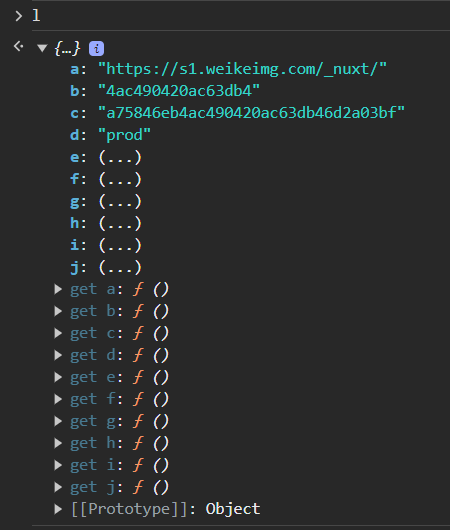

- AES in node js

```javascript
v = function(data) {
    return function(data) {
        return o.a.AES.encrypt(data, l.key, {
            iv: l.iv,
            mode: o.a.mode.CBC,
            padding: o.a.pad.Pkcs7
        }).toString()
    }(data)
}
```

solve method:

`npm install crypto-js`

- '0' isn't equal to `\x00`

```javascript
l = {
    key: o.a.enc.Utf8.parse("fX@VyCQVvpdj8RCa"),
    iv: o.a.enc.Utf8.parse(function(t) {
        for (var e = "", i = 0; i < t.length - 1; i += 2) {
            var n = parseInt(t[i] + "" + t[i + 1], 16);
            e += String.fromCharCode(n)
        }
        return e
    }("00000000000000000000000000000000"))
}
```

pay attention to this shit!!! 	ITS A FUCKING BIG PROBLEM

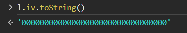

if u wanna see its real look:

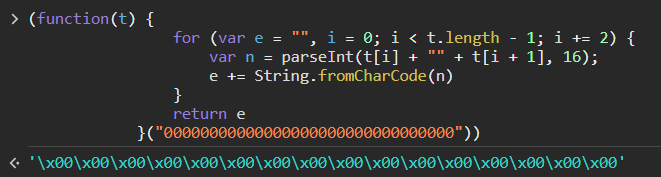

## 观鸟 

https://www.birdreport.cn/home/search/report.html?search=eyJ0YXhvbmlkIjoiIiwic3RhcnRUaW1lIjoiIiwiZW5kVGltZSI6IiIsInByb3ZpbmNlIjoi6Z2S5rW355yBIiwiY2l0eSI6IiIsImRpc3RyaWN0IjoiIiwicG9pbnRuYW1lIjoiIiwidXNlcm5hbWUiOiIiLCJzZXJpYWxfaWQiOiIiLCJjdGltZSI6IiIsInRheG9ubmFtZSI6IiIsInN0YXRlIjoiIiwibW9kZSI6IjAiLCJvdXRzaWRlX3R5cGUiOjB9

- when u see an eval shit

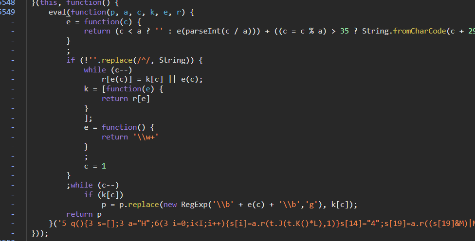

cut the shit in eval, swap them with`()`, run in console, and get the result.

then u need to formalize them.

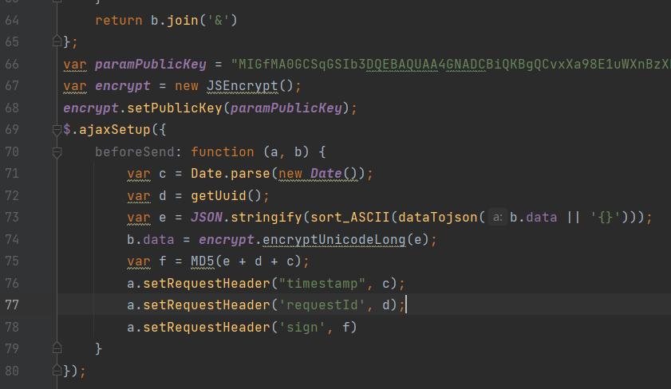

here are two methods:

1. copy and paste them in pycharm `Code`->`Reformat File`
2. in Developer tool, `Sources`->`>>`->`Snippets`->`+ New snippet`->just paste them and click `{}` button


- set breakpoints in eval

u c `$.ajaxSetup` right? go to Initiator, click in ajax

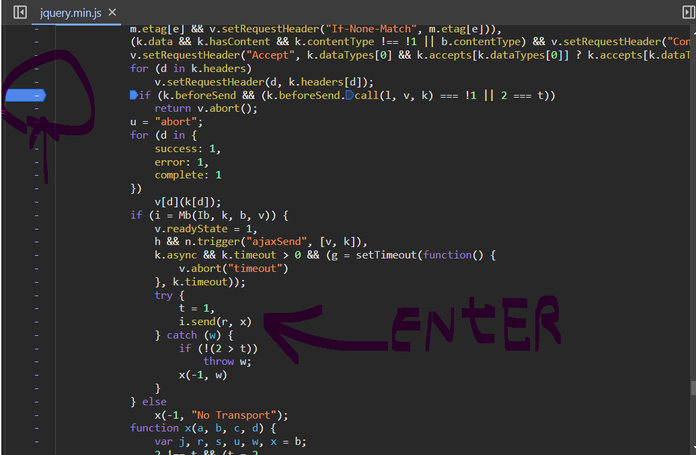

set a breakpoint on the `beforeSend` line. and u can get the snippet the same as before.

since `$.ajaxSetup` is an operation that every jquery request should execute, similar to an interceptor


- the module u import doesn't contain a specific function.

1. copy what u need from js file 
2. paste them in source code in the module, below xxx.prototype.xxx


- print what iv or key look like

```javascript
f.prototype.decode = function(a) {
    var b = CryptoJS.enc.Utf8.parse(this.key);
    var c = CryptoJS.enc.Utf8.parse(this.iv);
    var d = CryptoJS.AES.decrypt(a, b, {
        iv: c,
        mode: CryptoJS.mode.CBC,
        padding: CryptoJS.pad.Pkcs7
    });
    return d.toString(CryptoJS.enc.Utf8)
}
```

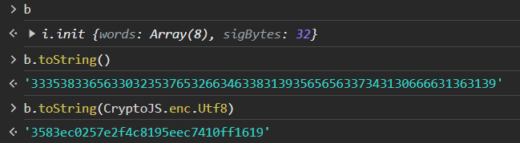


## 七麦 https://www.qimai.cn/rank/

- if you notice every requests contain a specific param, may be they used interceptor. go to Initiator, see `Promise`, it def is `interceptors`, just search it.
- if you can't even find out `interceptors` by searching, it's possible that they obscured the original code.

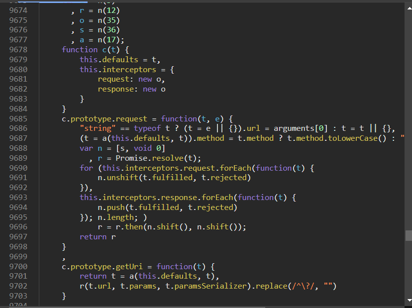

function `c` is `axios` source code.

fine im done with that too much to record.

just see the video. began from 03:00:00.


- node js doesn't include `window`

```javascript
window = this;
// if that didn't work:
window = global; // glob
```


## :triangular_flag_on_post:http://39.105.154.231:3000/play/68360 

## 问财 https://www.iwencai.com/unifiedwap/result?w=20230517%E8%B7%8C%E5%81%9C

- rpc   start from 01:58:00

say u have a function `rt.update()`, u wanna call it in global. 

```javascript
window.idiot = rt.update();
```

usage:`idiot()`

chrome: execute js, chrome return result, send them to web through ws

python websocket server: communicate with js; communicate with user

web: communicate with spider; send command to ws; ws return command to chrome; 

:clipboard: remember to release the breakpoint after `window.idiot = rt.update();`

```python
```


## :triangular_flag_on_post:http://39.105.154.231:3000/play/68362 

## 拼多多 https://www.pinduoduo.com/home/girlclothes

- it's annoying to meet async in so many requests. it's enough to drive u crazy

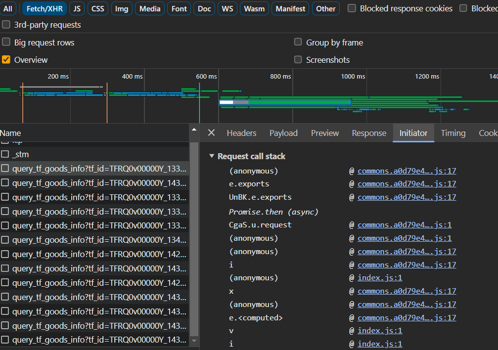

but u can try to find a single request like this. it only contain a single api, here async turn into a single thread

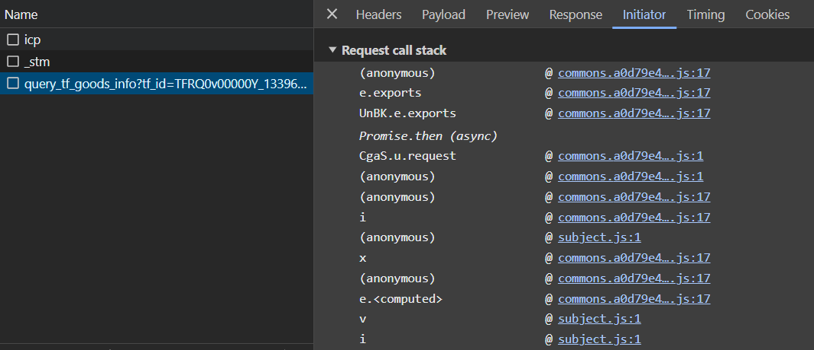


- a very important logic. it return `l.a` 's value and then t.t1 receive it. like `t.t1 = l.a()`

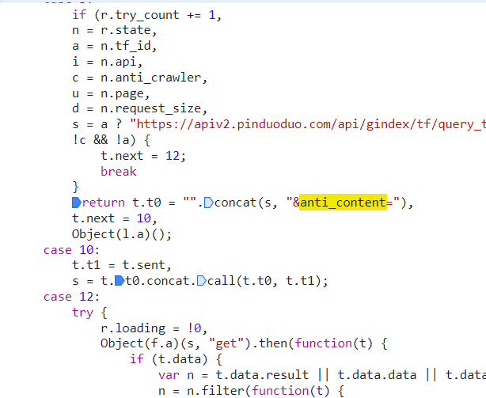

`l.a()` is the place. 

`window.shit = l.a`

`shit().then(function(ret){console.log("--", ret)})`

release the breakpoint and u can get the result :)

- if you notice a function contains `exports` . that means whenever u wanna use this function, u should new it first.

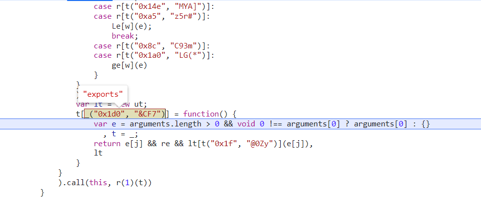


## 瑞数4代

 http://www.fangdi.com.cn/old_house/old_house_list.html?district=27d3af3bd45acf5e&area=&location=&listingNo=&region=&blockName=&verifyNo=&time=&houseType=&check_input=esnz&RecordCount=14539&PageCount=1454&SortType=&SortField=

- cant find out some shit, use breakpoint

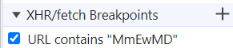


- document.cookie != cookie u c in application

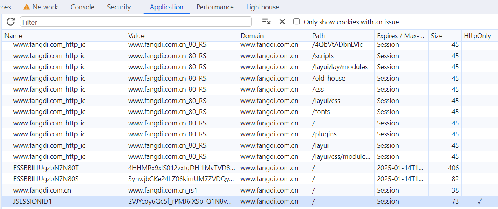

`HttpOnly` is the mother fuck, right click it `Edit HttpOnly` untag it will be ok


9期

## :triangular_flag_on_post: https://appl2m4pcpu3553.pc.xiaoe-tech.com/live_pc/l_6497ff33e4b0b2d1c4287d0d:

## 建设库 

started from 3:18:30

invalid :(

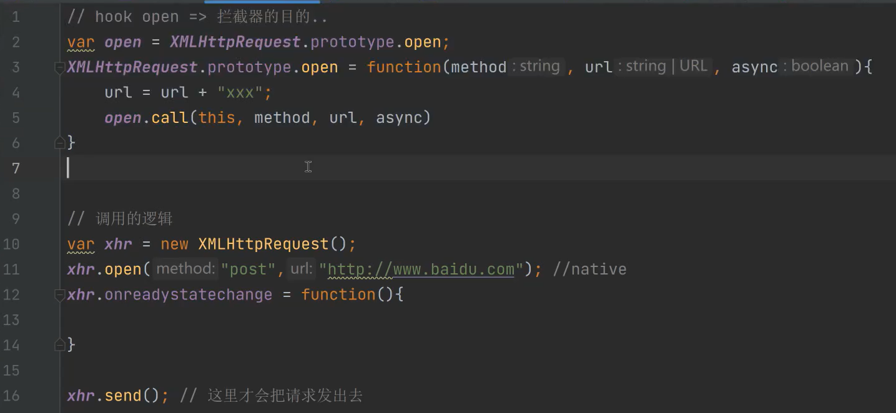

- how to confirm they used this kind of method:  the following is a normal situation

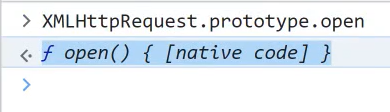

however, a sus situation be like:

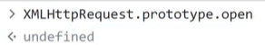

it proof that `XMLHttpRequest.prototype.open` has been changed.

- urlencode, make shit in url contains % whatever...

`encodeURIComponent("ur shit")`

# :rainbow_flag: 6期--:chicken::eye: https://www.geetest.com/demo/

## :shaved_ice: http://39.105.154.231:3000/play/57712

- u wanna see wtf is `\uxx` . do remember to contain "" when u choice and slide upon them.

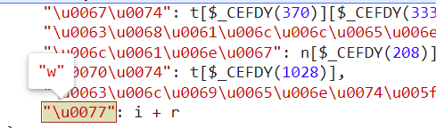

- see `concat` as `push`. they have the same function
- from this snippet, we can know `$_CEFCV` = `$_Ci` = `$_CEFDY` = `$_CEFEQ`

```javascript
var $_CEFCV = tLnKP.$_Ci
, $_CEFBQ = ['$_CEFFN'].concat($_CEFCV) // ['$_CEFFN', $_CEFCV]
, $_CEFDY = $_CEFBQ[1]; // $_CEFCV
$_CEFBQ.shift(); // throw away '$_CEFFN'
var $_CEFEQ = $_CEFBQ[0]; // $_CEFCV
```

- don't just dig into this shit. try to guess what's that, and what they do. `stringify` is kind of like json will do. compare it's original value with after its fucked by the function.

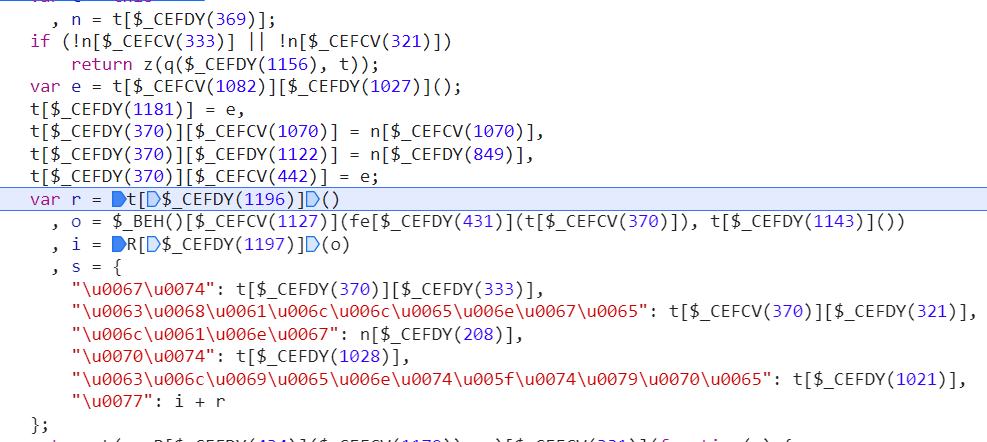

the original value:

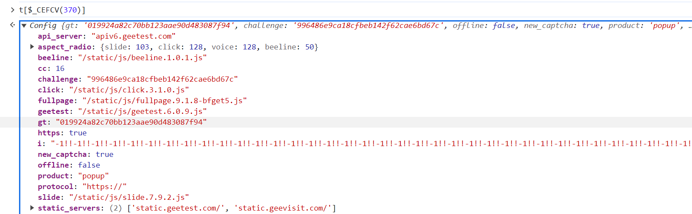

after the function worked:

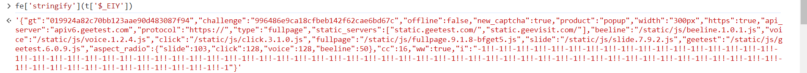

we can c it seemed to be jsonfy

try `fe[$_CEFDY(431)](t[$_CEFCV(370)]) === JSON.stringify(t[$_CEFCV(370)])` and we got `true` !

- we now library `node-jsencrypt`. it receive base64 string, but now we only have shit like `00C1E3934D1614465B33053E7F48EE4EC87B14B95EF88947713D25EECBFF7E74C7977D02D...`

```javascript
var xxx = new JSEncrypt()
xxx.setPublicKey("base64 thing ...");
xxx.encrypt();
```

```javascript
function $_CCHk(e) {
    var t = new G()["encrypt"](this["$_CCIm"](e));
    while (!t || 256 !== t['length'])
        t = new G()["encrypt"](this['$_CCIm'](!0));
    return t;
}


function G() { // RSA
    var idiot = '00C1E3934D1614465B33053E7F48EE4EC87B14B95EF88947713D25EECBFF7E74C7977D02DC1D9451F79DD5D1C10C29ACB6A9B4D6FB7D0A0279B6719E1772565F09AF627715919221AEF91899CAE08C0D686D748B20A3603BE2318CA6BC2B59706592A9219D0BF05C9F65023A21D2330807252AE0066D59CEEFA5F2748EA80BAB81';
    this['n'] = null,
    this['e'] = 0,
    this['d'] = null,
    this['p'] = null,
    this['q'] = null,
    this['dmp1'] = null,
    this['dmq1'] = null,
    this['coeff'] = null;
    this['setPublic'](idiot, '10001');
}

```

how to deal with that ? check out its source code!

- if a node modules contains more than one export, when it's used, use {} to contain what u want. `var {RSAKey} = require("node-jsencrypt")`

```javascript
module.exports = {
    "JSEncrypt": JSEncryptExports.JSEncrypt,
    'RSAKey' : JSEncryptExports.RSAKey,
};
```

- ```javascript
  function $_CCHk(e) {
      var rsa = new RSAKey();
      rsa.setPublic('00C1E3934D1614465B33053E7F48EE4EC87B14B95EF88947713D25EECBFF7E74C7977D02DC1D9451F79DD5D1C10C29ACB6A9B4D6FB7D0A0279B6719E1772565F09AF627715919221AEF91899CAE08C0D686D748B20A3603BE2318CA6BC2B59706592A9219D0BF05C9F65023A21D2330807252AE0066D59CEEFA5F2748EA80BAB81');
      var t = rsa["encrypt"](this["$_CCIm"](e));
      while (!t || 256 !== t['length'])
          t = rsa["encrypt"](this['$_CCIm'](!0));
      return t;
  }
  ```

- 

solution: just add this snippet. change `this` into a global shit. `this["$_EHw"]` -> `shit["_EHw"]`

```javascript
var shit = {
    $_EHw: {

    }
}
```

- rsa in python(another method, not recommand)

  ```python
  import rsa
  rsakey = rsa.key.PublicKey(two nums)
  rsa.encrypt("xxx", rsakey)
  ```

- `toString` didn't work

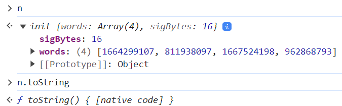

- u don't have to cut all codes, guess what they will be will save u a lot of time.

```javascript
function encrypt1(e, t, n) { // guess: aes CryptoJS
    t = u["parse"](t); // CryptoJS.enc.utf8.parse(t)
    iv = u["parse"]('0000000000000000'); // CryptoJS.enc.utf8.parse('0000000000000000')

    // n && n["iv"] || ((n = n || {})["iv"] = u["parse"]('0000000000000000'));
    var r = m['encrypt'](c, e, t, n), o = r['ciphertext']['words'];  // CryptoJS.AES.encrypt
    var i = r['ciphertext']['sigBytes'];
    var s = [], a = 0;
    for (; a < i; a++) {
        var _ = o[a >>> 2] >>> 24 - a % 4 * 8 & 255;
        s['push'](_);
    }
    return s;
}
```

 to verify ur guess:

```javascript
var CryptoJS = require("crypto-js")

var key = "bd565e12f66150c7";
var iv  = "0000000000000000";
key = CryptoJS.enc.Utf8.parse(key);
iv = CryptoJS.enc.Utf8.parse(iv);

var data = ''
var r = CryptoJS.AES.encrypt(data, key, {
    iv: iv,
    mode: CryptoJS.mode.CBC
});
console.log(r.ciphertext)  // 密文
```

- you literally set breakpoints but they didn't stop at what you imagined. wth was happening?

cuz :chicken::eye: used a dynamic method to load javascript scripts. like `document.head.appendChild(<script src="http:www.baidu.com"></script>)`. it automatically send a request to the src address.

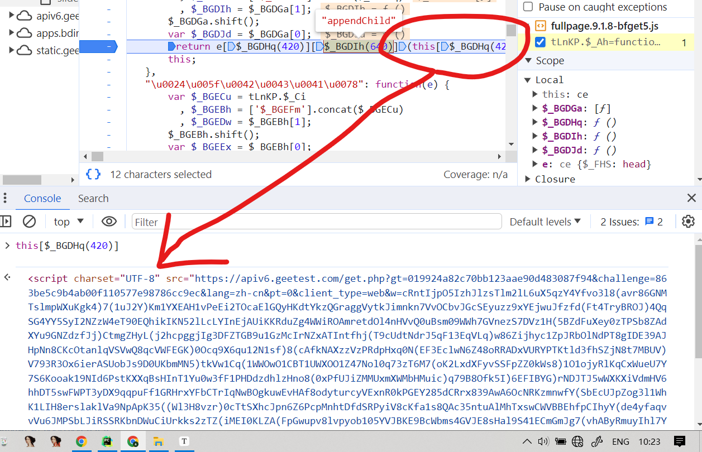

- when u feel a shit is hard to search. remember if it gets a value from a shit, u just need to search this shit.

  here must be a snippet like `this["xx(1160)"] = "xxx"` first it need to receive a value and then it's value can be grabbed by someone. so search `1160` to find what u want.

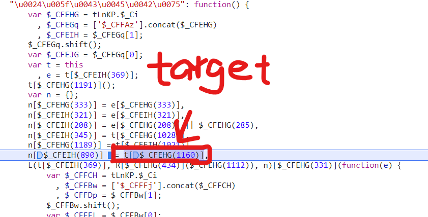


- if you see `new xxx(e).abc(f)`. the function`abc()` may be in `xxx`'s prototype. in ur code, u can write as below:

```javascript
// first set a function for xxx
function xxx(e) {
    // type xxx in console
}

xxx.prototype = {
    "abc": function(e) {
        // type xxx(e).abc( in console
        return x;
    }
}
```

- image is messy. they may use canvas to draw it in a correct sequence. tick`Canvas` in event listener, refresh the picture.

- `getImageData` in js is different with `crop` in python.

`getImageData(left, upper, width, height)`

`crop(left, upper, right, lower)`

there's relationship is: `right= left + width` `lower= upper + height`

- if a value in Elements panel can be seen when they are changing, set a break point to locate the snippet

 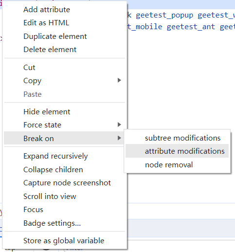


- pycharm don't have code tips when using library cv2. check out video http://39.105.154.231:3000/play/58935 03:11:20
- 03:33:30 once the program come to a certain snippet, log out the content: right click that line, choose `Add logpoint...` 


# :flags: 9期点选 http://39.105.154.231:3000/play/79425

网页定位到某个js文件中的位置，想要断点调试，但由于每次js的网址都会更新（返回内容虽然一样），导致断点无法执行，这种情况下怎么办？

解决方案：找到返回此js地址的页面，将返回值其替换为固定的值，具体步骤：

- 安装抓包工具Charles，让Charles代理网页的请求

- 在Charles中配置，当请求网址时，返回我们指定的HTML数据（网页上加载js地址就是固定的了）


# Practice websites

https://shimo.im/sheets/KrkEVdwxWnSbQMAJ/MODOC

| 各种hash算法验证网站 | https://1024tools.com/hash                                   |                                             |                                                              |
| -------------------- | ------------------------------------------------------------ | ------------------------------------------: | ------------------------------------------------------------ |
| hmac系列验证网站     | [https://1024tools.com/hmac](https://1024tools.com/hash)     |                                             |                                                              |
| AES, DES验证网站     | https://the-x.cn/cryptography/Aes.aspx                       |                                             |                                                              |
| 各种加密解密插件     | https://ctool.dev/                                           |                                             |                                                              |
| 开源地址             | https://github.com/baiy/Ctool                                |                                             |                                                              |
|                      |                                                              |                                             |                                                              |
|                      |                                                              |                                             |                                                              |
| MD5                  | https://www.hengyirong.com/user/login/                       |                                请求头x-sign | 同一个账号请求次数过多会弹验证码. 可以更换账号继续调试       |
|                      | https://mp.weixin.qq.com/                                    |                                        密码 | 逆向该参数即可.                                              |
|                      | http://www.xinshangmeng.com/xsm2/?Version=2019060900         |                                  参数j_mcmm | 不用登陆. 搞明白这个参数怎么生成的即可                       |
|                      | https://www.mytokencap.com/                                  |                                    数据爬取 | 抓取各个B的价格                                              |
|                      | https://www.epwk.com/login.html                              |                              请求头signture | 逆向signture   最後的AES坑。。。。                           |
|                      | https://car.yiche.com/siyucivic/peizhi/                      |                                 请求头x系列 |                                                              |
|                      | https://m.hltmsp.com/passport/login                          | nonce_str、time_stamp、sign三个参数生成原理 |                                                              |
|                      | http://mmpz.ttzhuijuba.com/?r=/l&cids=1&site=classify&sort=0 |                                      sign值 |                                                              |
|                      | https://www.zhitongcaijing.com/immediately.html              |                                     token值 | sha1                                                         |
|                      | https://www.ximalaya.com/channel/11/                         |                                   xm-sign值 |                                                              |
|                      |                                                              |                                             |                                                              |
| 非对称加密           | https://oauth.d.cn/auth/goLogin.html                         |                                    登陆密码 | 登陆时会提示有验证码                                         |
|                      | https://www.to8to.com/new_login.php                          |                                        登陆 | 账号密码                                                     |
|                      | https://www.fcbox.com/pages/user/login.html                  |                                    登陆密码 | 账号密码                                                     |
|                      | https://www.kongfz.com/                                      |                      cookie的randomcodesign | 抓取书籍名称和价格                                           |
|                      | https://login.10086.cn/login.html?channelID=12034&backUrl=http%3A%2F%2Fwww.10086.cn%2Findex%2Fsd%2Findex_531_531.html# |                                        账密 |                                                              |
|                      |                                                              |                                             |                                                              |
|                      |                                                              |                                             |                                                              |
| 对称加密             | https://www.cbaleague.com/data/#/teamMain?teamId=29136       |                          解密服务器返回数据 |                                                              |
|                      | [https://www.kanzhun.com/search?cityCode=34&industryCodes=&pageNum=1&query=%E6%93%8D%E4%BD%9C%E5%91%98&type=4](https://www.kanzhun.com/search?cityCode=34&industryCodes=&pageNum=1&query=操作员&type=4) |                             请求参数 b和kiv | 注意, 你看到的' ' 不一定是空字符串.                          |
|                      | https://www.weibotop.cn/2.0/                                 |                                  解密返回值 |                                                              |
|                      | https://www.jisilu.cn/login/                                 |                                账号密码加密 |                                                              |
|                      | http://www.birdreport.cn/home/search/report.html?search=eyJ0YXhvbmlkIjoiIiwic3RhcnRUaW1lIjoiIiwiZW5kVGltZSI6IiIsInByb3ZpbmNlIjoi6Z2S5rW355yBIiwiY2l0eSI6IiIsImRpc3RyaWN0IjoiIiwicG9pbnRuYW1lIjoiIiwidXNlcm5hbWUiOiIiLCJzZXJpYWxfaWQiOiIiLCJjdGltZSI6IiIsInRheG9ubmFtZSI6IiIsInN0YXRlIjoiIiwibW9kZSI6IjAiLCJvdXRzaWRlX3R5cGUiOjB9 |                        参数加密, 返回值解密 |                                                              |
|                      | https://www.swguancha.com/                                   |                                返回数据解密 |                                                              |
|                      | https://www.endata.com.cn/BoxOffice/BO/Year/index.html       |                           返回数据解密, DES |                                                              |
|                      | https://www.comein.cn/home/index?index=                      |                           返回数据解密, AES | https://server.comein.cn/comein/index.php 搞定它的返回值解密 |
|                      |                                                              |                                             |                                                              |
| 简单滑动验证         | https://beijing.tuitui99.com/denglu.html                     |                                    登陆流程 | 请求过程十分曲折~ 请自行想办法走通整个流程~                  |
|                      |                                                              |                                             |                                                              |
|                      |                                                              |                                             |                                                              |
|                      |                                                              |                                             |                                                              |
|                      |                                                              |                                             |                                                              |
| 难度系数高一些       | https://nid.naver.com/nidlogin.login                         |                                    登陆参数 | bvsd参数                                                     |
|                      | https://www.qimai.cn/rank                                    |                            analysis参数逆向 | 练练....                                                     |
|                      | https://www.yijiupi.com/#/login?auto=true                    | 请求头x-sign, x-sign-nonce,x-sign-timestamp | 在适当的位置. 可以去试值...     https://1024tools.com/hash, https://1024tools.com/hmac |
|                      | https://m.yhd.com/                                           |                      log参数, Sgm-Token参数 | 不用考虑请求的目的性. 只需要逆向出两个参数即可.              |
|                      | https://m.cnhnb.com/hangqing/                                |                         请求头x-client-sign | 在适当的位置. 可以去试值...     https://1024tools.com/hash, https://1024tools.com/hmac |
|                      | https://cn.fawmx.com/home/register                           |                                账号密码加密 | 这里面有环境检测, 但是请想一想, 浏览器环境并不会因为你运行js而发生改变...思考哈.... |
|                      | https://passport.yhd.com/                                    |                  登陆账号密码, captchaToken | 爽爽的OB混淆                                                 |
|                      |                                                              |                                             |                                                              |
| 复杂验证码           | https://www.geetest.com/demo/                                |                                极验三代 w值 | 极验最烦人的一个参数, 第一个w搜 "\u0077" , 第二个w搜 var n = {};,  第三个参数在slide里搜"\u0077" |
|                      | https://www.ishumei.com/trial/captcha.html                   |                                完成滑块验证 |                                                              |
|                      | https://gt4.geetest.com/demov4/index-zh.html                 |                                极验四代 w值 |                                                              |
|                      | https://www.2980.com/login/                                  |                                    登陆流程 | AES+浏览器指纹.                                              |
|                      |                                                              |                                             |                                                              |
| rs4代                | http://www.fangdi.com.cn/old_house/old_house_list.html?district=27d3af3bd45acf5e&area=&location=&listingNo=&region=&blockName=&verifyNo=&time=&houseType=&check_input=esnz&RecordCount=14539&PageCount=1454&SortType=&SortField= |                                      rs4代. | 能抓到房子的信息                                             |
| 拼多多               | https://www.pinduoduo.com/home/girlclothes/                  |                                anti_content | anti_content                                                 |
|                      |                                                              |                                             |                                                              |
|                      |                                                              |                                             |                                                              |
| sojson-反调试        | https://web.mypitaya.com/login                               |                                   md5和sign | 不用管验证码                                                 |

