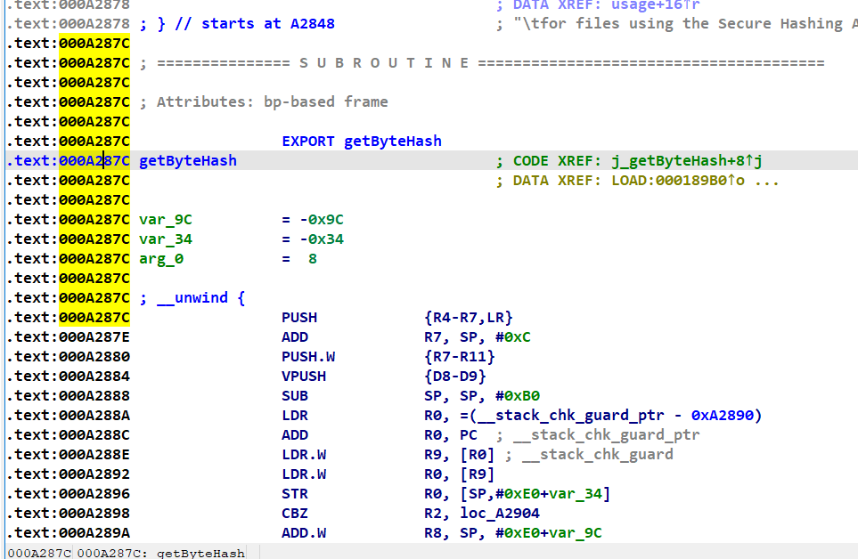

# 环境搭建 

【Ubuntu开发环境——快速搭建Python+Java环境】 https://www.bilibili.com/video/BV14P411X7Bz/

virtual box 共享文件

进入ideaprojects目录，打开终端，

创建共享文件夹

```
mk dir unidbgProject
```

创建完成后，输入  

```
sudo mount -t vboxsf unidbg-0.9.6(vb设置的共享文件夹名字) ./unidbgProject
```

输入密码 `admin`

# Basic Template

```java
package com.nb.demo;

import com.github.unidbg.AndroidEmulator;
import com.github.unidbg.Module;
import com.github.unidbg.linux.android.AndroidEmulatorBuilder;
import com.github.unidbg.linux.android.AndroidResolver;
import com.github.unidbg.linux.android.dvm.*;
import com.github.unidbg.linux.android.dvm.jni.ProxyClassFactory;
import com.github.unidbg.memory.Memory;
import java.io.File;


public class che extends AbstractJni {
    public static AndroidEmulator emulator;
    public static Memory memory;
    public static VM vm;
    public static DalvikModule dm;
    public static Module module;

    che() {
        // 1.创建设备（32位或64位模拟器）， 具体看so文件在哪个目录。 在armeabi-v7a就选择32位this name don't have to change
        emulator = AndroidEmulatorBuilder.for32Bit().setProcessName("com.che168.autotradercloud").build();
        // 2.获取内存对象（可以操作内存）
        memory = emulator.getMemory();
        // 3.设置安卓sdk版本（只支持19、23）
        memory.setLibraryResolver(new AndroidResolver(23));
        // 4.创建虚拟机（运行安卓代码需要虚拟机，就想运行py代码需要python解释器一样）
        vm = emulator.createDalvikVM(new File("unidbg-android/apks/che/atc241.apk"));
        vm.setJni(this);
        //vm.setVerbose(true); //是否展示调用过程的细节
        // 5.加载so文件
        DalvikModule dm = vm.loadLibrary(new File("unidbg-android/apks/che/libnative-lib.so"), false);
        //dm.callJNI_OnLoad(emulator);
        // 6.dm代表so文件，dm.getModule()得到module对象，基于module对象可以访问so中的成员。
        module = dm.getModule();

    }

    public static void main(String[] args) {
        che obj = new che();
        obj.sign();
    }

    public void sign() {
        // 找到java中native所在的类，并加载
        DvmClass CheckSignUtil = vm.resolveClass("com/autohome/ahkit/jni/CheckSignUtil");
        // 方法的符号表示
        String method = "get3desKey(Landroid/content/Context;)Ljava/lang/String;";
        // 执行类中的静态成员
        StringObject obj = CheckSignUtil.callStaticJniMethodObject(
                emulator,
                method,
            //...args
                vm.resolveClass("android/content/Context").newObject(null)
        );
        String keyString = obj.getValue();
        System.out.println(keyString);
    }
}
```

# additional environment

## example

what u have to do is just check out the "java.lang.xxx" line and the first line down below. Saying:

```
[12:55:54 142] WARN [...] ...
java.lang.xxx..: java/util/Set->iterator()Ljava/util/Iterator;
	at com.github.xx..callObjectMethod(AbstractJni.java:818)
```

pay attention to `java/util/Set->iterator()Ljava/util/Iterator;` and `callObjectMethod`.

Giving the word `callObjectMethod`, typing `callObjectMethod` in ur class, and it comes out automatically fill up like:

```java
@Override
public DvmObject<?> callObjectMethod(Base vm, DvmObject<?> dvmObject, String signature, VarArg varArg) {
    return super.callObjectMethod(vm, dvmObject, signature, varArg);
}
```

and then add `if` code in it according to the ouput `java/util/Set->iterator()Ljava/util/Iterator;`

```java
@Override
public DvmObject<?> callObjectMethod(Base vm, DvmObject<?> dvmObject, String signature, VarArg varArg) {
    if (signature.equals("java/util/Set->iterator()Ljava/util/Iterator;")) {
        Set set = (Set) dvmObject.getValue();
        Iterator iterator = set.iterator();
        return vm.resolveClass("java/util/Iterator").newObject(iterator); 
    }
    return super.callObjectMethod(vm, dvmObject, signature, varArg);
}
```

transform type `dvmObject.getValue();` according to `java/util/Set`

```java
Set set = (Set) dvmObject.getValue();
```

execute the method according to `iterator()`

```java
set.iterator()
```

see the return type `Ljava/util/Iterator` use it to recive the return stuff

```java
Iterator iterator = set.iterator()
```

use them to finish the return line

```java
return vm.resolveClass("java/util/Iterator").newObject(iterator);
```

## they have import value

### VarArg

they signature is `"java/util/Map->get(Ljava/lang/Object;)Ljava/lang/Object;"`

```java
@Override
public DvmObject<?> callObjectMethod(BaseVM vm, DvmObject<?> dvmObject, String signature, VarArg varArg) {
    if (signature.equals("java/util/Map->get(Ljava/lang/Object;)Ljava/lang/Object;")) {
	    Map map = (Map) dvmObject.getValue();
        Object obj = varArg.getObjectArg(0).getValue();
        System.out.println(obj.getClass());
        Object res = map.get(obj);
        return ProxyDvmObject.createObject(vm, res);
        // or can be like:
        // String string = (String) map.get(obj);
        // return new StringObject(vm, string);
    }
    return super.callObjectMethod(vm, dvmObject, signature, varArg);
}
```

even now we can see it's return type is an Object, but we can still get it's real type by:

```java
Object obj = varArg.getObjectArg(0).getValue();
System.out.println(obj.getClass());
```

### VaList

```java
String a0 = (String) vaList.getObjectArg(0).getValue();
String a1 = (String) vaList.getObjectArg(1).getValue();
```


## if the return type is `Object`: 

`return ProxyDvmObject.createObject(vm, object);`

like `java/util/Map$Entry->getValue()Ljava/lang/Object;`

```java
if (signature.equls("java/util/Map$Entry->getValue()Ljava/lang/Object;")) {
    Map.Entry entry = (Map.Entry) dvmObject.getValue();
    Object object = entry.getValue();
    return ProxyDvmObject.createObject(vm, object);
}
```

## the return type isn't included in java

### return this class as null (recommend)

be like `android/app/ActivityThread->currentActivityThread()Landroid/app/ActivityThread;`

just return null

```java
return vm.resolveClass("android/app/ActivityThread").newObject("");
```

`android/content/Context->checkSelfPermission(Ljava/lang/String;)I`

according to android development, we can see this `checkSelfPermission`

```java
int v1 = this.checkSelfPermission("android.permission.READ_PRECISE_PHONE_STATE");

TelephonyManager tm = (TelephonyManager) this.getSystemService(TELEPHONY_SERVICE);
/*
 * SIM的状态信息：
 *  SIM_STATE_UNKNOWN             未知状态 0
 *  SIM_STATE_ABSENT                 没插卡 1
 *  SIM_STATE_PIN_REQUIRED     锁定状态，需要用户的PIN码解锁 2
 *  SIM_STATE_PUK_REQUIRED    锁定状态，需要用户的PUK码解锁 3
 *  SIM_STATE_NETWORK_LOCKED   锁定状态，需要网络的PIN码解锁 4
 *  SIM_STATE_READY            就绪状态 5
 */
int v2 = tm.getSimState();
int v3 = tm.getNetworkType();
String v4 = tm.getSimOperatorName();
Log.e("---->", v4);

// Android10以上禁止获取IMEI，因为需要 READ_PRIVILEGED_PHONE_STATE 权限，而该权限只能是系统应用才可以获取到。
// String v5 = tm.getImei();
// String v6 = tm.getDeviceId();


String android_id = Settings.System.getString(this.getContentResolver(), Settings.Secure.ANDROID_ID);
Log.e("---->", android_id);
```

so

```java
return vm.resolveClass("android/telephony/TelephonyManager").newObject(null);
```

meet `log` contained `com/tencent/mars/xlog/PLog->i(Ljava/lang/String;Ljava/lang/String;)V`

```java
//check out the output so we can confirm it's literally a log thing
return; // that's ok
```

### hook to get value

signature -> `android/telephony/TelephonyManager->getSimState()I`

```javascript
Java.perform(function () {
    var TelephonyManager = Java.use("android.telephony.TelephonyManager");
    TelephonyManager.getSimState.overload().implementation = function () {
        var res = this.getSimState();
        console.log("value=",res);
        return res;
    }
});

// frida -U -f  com.xunmeng.pinduoduo  -l hook_value.js
```

signature -> `android/content/pm/PackageInfo->versionCode:I`

```javascript
Java.perform(function() {
  // 获取PackageInfo类的引用
  var PackageInfo = Java.use('android.content.pm.PackageInfo');
  // Hook getVersionCode 方法
  PackageInfo.getVersionCode.implementation = function() {
    // 调用原始方法获取版本号
    var versionCode = this.getVersionCode();

    // 修改版本号，这里可以根据需要进行自定义修改
    // var modifiedVersionCode = 100;

    // 打印版本号信息
    console.log('[*] Original VersionCode: ' + versionCode);
    // console.log('[*] Modified VersionCode: ' + modifiedVersionCode);
    return versionCode;
  };
});
```

```java
        if (signature.equals("android/content/pm/PackageInfo->versionCode:I")) {
            //return 6730157;
            return (int) vm.getVersionCode();
        }
```

**static string**

signature -> 

`com/xingin/shield/http/ContextHolder->sAppId:I`

`com/xingin/shield/http/ContextHolder->sDeviceId:Ljava/lang/String;`

```javascript
Java.perform(function () {
    var ContextHolder = Java.use('com.xingin.shield.http.ContextHolder');
    console.log('sAppId=',ContextHolder.sAppId.value);
    console.log('sDeviceId=',ContextHolder.sDeviceId.value);
})

// frida -UF -l  5.vlaue.js
```

### android class

`android/content/Context->getSharedPreferences(Ljava/lang/String;I)Landroid/content/SharedPreferences;`

first we should know: in android development, here is how we read the sharedpreferences content ->

```java
SharedPreferences sp = getSharedPreferences("sp_city", MODE_PRIVATE);  // XML文件名字
String token = sp.getString("token",""); // 字段名
```

so return a null object is ok cuz it will call getString method and we can get the first varg

```java
if (signature.equals("android/content/Context->getSharedPreferences(Ljava/lang/String;I)Landroid/content/SharedPreferences;")) {
    String xmlName = (String) vaList.getObjectArg(0).getValue();
    System.out.println(xmlName); // "s"
    return vm.resolveClass("android/content/SharedPreferences").newObject(null);
}
```

here it comes -> `android/content/SharedPreferences->getString(Ljava/lang/String;Ljava/lang/String;)Ljava/lang/String;`

```java
if (signature.equals("android/content/SharedPreferences->getString(Ljava/lang/String;Ljava/lang/String;)Ljava/lang/String;")) {
    String key = (String) vaList.getObjectArg(0).getValue();
    String defaultValue = (String) vaList.getObjectArg(1).getValue();
    System.out.println(key);
    System.out.println(defaultValue);
    // didn't have this code at first 
    // once run the above code, output the first line is "main"
    // the second line is ""
    if (key.equals("main")) {
        return new StringObject(vm, "");
    }
}
```

run the above code, output

```
main

main_hmac

```

so enter ur apk filles `data/data/apkPackageName` and find `shared_prefs/s.xml` (s has been outputed)

`cat s.xml` to open it. copy the content u need and paste them 

```
if (key.equals("main_hmac")) {
	return new StringObject(vm, "37bwVT2DGLHyH1G1fecyp5pPF+DCkZOt1vCmlFrbet10iqbNC3xPpc0g+1HlnvoDco63KwfRKCxJVXg6z07YpifWFteLqEA1nUy5b5bH4KZNlG+3XUCPwYGthIGf0QcI");
}
```

### create the class

not recommand :(

### okhttp3 related

example

```java
public private Response intercept(Interceptor.Chain chain, long j2) throws IOException;
```

*hook to figure out they added the crypto param in this interceptor*

enter pom.xml adding this snippet

```xml
        <dependency>
            <groupId>com.squareup.okhttp3</groupId>
            <artifactId>okhttp</artifactId>
            <version>3.10.0</version>
        </dependency>
```

method:get

```java
// main function
request = new Request.Builder()
    .url(url)
    .addHeader("xy-common-params", commonParams)
    .build();
```

method:post

```java
MediaType TEXT = MediaType.parse("text/plain; charset=utf-8");
RequestBody body = RequestBody.create(TEXT, "vaid=efd721ebebc49...d1%3A17%3A61%3A9a");
request = new Request.Builder()
        .url("https://www.xiaohongshu.com/api/sns/v4/user/login/password")
        .addHeader("xy-common-params", "fid=166893364910401a044595f...ght")
        .addHeader("content-type","application/x-www-form-urlencoded")
        .method("post",body)
        .build();
```

trigger

```java
obj.intercep(cPtr); // needn't chain, already has request
```

```java
    public void intercept(long cPtr) {
        DvmClass cls = vm.resolveClass("com/xingin/shield/http/XhsHttpInterceptor");
        String method = "intercept(Lokhttp3/Interceptor$Chain;J)Lokhttp3/Response;";
        cls.callStaticJniMethodLong(
                emulator,
                method,
                vm.resolveClass("okhttp3/Interceptor$Chain").newObject(null),
                cPtr
        );
    }
```

`okhttp3/Interceptor$Chain->request()Lokhttp3/Request;`

```java
if (signature.equals("okhttp3/Interceptor$Chain->request()Lokhttp3/Request;")) {
    // manually create a request obj in okhttp3
    // 执行 chain.request() 获取request请求相关的对象
    return vm.resolveClass("okhttp3/Request").newObject(request);
}
```

if you wanna check out a specific key in header *the target is to get the value of key "shield", so it's no matter what to return :)*

```java
        if(signature.equals("okhttp3/Request$Builder->header(Ljava/lang/String;Ljava/lang/String;)Lokhttp3/Request$Builder;")){
            String key = vaList.getObjectArg(0).toString();
            String value = vaList.getObjectArg(1).toString();
            Request.Builder builder = (Request.Builder) dvmObject.getValue();
            builder.header(key, value);
//            System.out.println(key);
            if (key.equals("shield")) {
                System.out.println(value);
            }
            return dvmObject;
        }
```


## com...DvmObject cannot be cast to com...StringObject

instead of return `vm.resolveClass("java/lang/String").newObject("xxx")`

return `new StringObject(vm, "xxx")` instead :]

## return type is customized

eg. `String method = "s(Ljava/util/SortedMap;)Lcom/bilibili/nativelibrary/SignedQuery;";`

`SignedQuery` is a customized class, and it is the return type of the method s

because `DvmObject` is extended by all the class in unidbg, use `DvmObject<?>` to receive the return value

```java
SortedMap<String, String> map = new TreeMap<String, String>();
map.put("actual_played_time", "0");

DvmClass LibBili = vm.resolveClass("com/bilibili/nativelibrary/LibBili");

DvmObject<?> res = LibBili.callStaticJniMethodObject(
    emulator,
    "s(Ljava/util/SortedMap;)Lcom/bilibili/nativelibrary/SignedQuery;",
    ProxyDvmObject.createObject(vm, map)
);
```

### get it's return value

```java
// transform res into it's real type
SignedQuery obj = (SignedQuery) res.getValue();
System.out.println(obj.rawParams);
System.out.println(obj.sign);
```

but first of all u have to create a SignedQuery class based on the original app source code :/

```java
class SignedQuery {
    public final String rawParams;
    public final String sign;

    public SignedQuery(String str, String str2) {
        this.rawParams = str;
        this.sign = str2;
    }
}
```

 and then run the project, and add environment stuff according to it's output WARN

### create the method

when it comes to a method that used by the customized class: `SignedQuery`

it's signature is `com/bilibili/nativelibrary/SignedQuery->r(Ljava/util/Map;)Ljava/lang/String;`

so we need to create the r() method in the class SignedQuery

reverse engineering the app and copy the r() method in ur class

```java
class SignedQuery {
    public final String rawParams;
    public final String sign;

    public SignedQuery(String str, String str2) {
        this.rawParams = str;
        this.sign = str2;
    }
    // here
    static String r(Map<String, String> map) {
        StringBuilder sb = new StringBuilder(256);
        // ...
        return sb.toString();
    }
}
```

```java
    @Override
    public DvmObject<?> callStaticObjectMethod(BaseVM vm, DvmClass dvmClass, String signature, VarArg varArg) {
        if (signature.equals("com/bilibili/nativelibrary/SignedQuery->r(Ljava/util/Map;)Ljava/lang/String;")) {
            Map map = (Map) varArg.getObjectArg(0).getValue();
            String res = SignedQuery.r(map);
            return new StringObject(vm, res);
        }
        return super.callStaticObjectMethod(vm, dvmClass, signature, varArg);
    }
```

## :blue_heart:init:green_heart:

```java
    @Override
    public DvmObject<?> newObject(BaseVM vm, DvmClass dvmClass, String signature, VarArg varArg) {
        if (signature.equals("com/bilibili/nativelibrary/SignedQuery-><init>(Ljava/lang/String;Ljava/lang/String;)V")) {
            String arg0 = (String) varArg.getObjectArg(0).getValue();
            String arg1 = (String) varArg.getObjectArg(1).getValue();
            SignedQuery obj = new SignedQuery(arg0, arg1);
            return vm.resolveClass("com/bilibili/nativelibrary/SignedQuery").newObject(obj);
        }
        return super.newObject(vm, dvmClass, signature, varArg);
    }
```

sometimes we don't have to totally finish adding the environment. instead, just output something and u will find out.

this way can also get the correct return value.

```java
    @Override
    public DvmObject<?> newObject(BaseVM vm, DvmClass dvmClass, String signature, VarArg varArg) {
        if (signature.equals("com/bilibili/nativelibrary/SignedQuery-><init>(Ljava/lang/String;Ljava/lang/String;)V")) {
            String arg0 = (String) varArg.getObjectArg(0).getValue();
            String arg1 = (String) varArg.getObjectArg(1).getValue();
            System.out.println(arg0);
            System.out.println(arg1);
            return vm.resolveClass("com/bilibili/nativelibrary/SignedQuery").newObject(null);
        }
        return super.newObject(vm, dvmClass, signature, varArg);
    }
```

**a simple version**

`okio/Buffer-><init>()V`

```java
if(signature.equals("okio/Buffer-><init>()V")){
    return dvmClass.newObject(new Buffer());
}
```


## callBooleanMethod has two kind of import value

```java
@Override
public boolean callBooleanMethod(BaseVM vm, DvmObject<?> dvmObject, String signature, VarArg varArg) {
    if (signature.equals("java/util/Map->isEmpty()Z")) {
        return false;
    }
    return super.callBooleanMethod(vm, dvmObject, signature, varArg);
}
```

they r the same:

```java
@Override
public boolean callBooleanMethod(BaseVM vm, DvmObject<?> dvmObject, DvmMethod dvmMethod, VarArg varArg) {
    String signature = dvmMethod.getSignature();
    if (signature.equals("java/util/Map->isEmpty()Z")) {
        Map map = (Map) dvmObject.getValue();
        return map.isEmpty();
    }
    return super.callBooleanMethod(vm, dvmObject, dvmMethod, varArg);
}
```

## other

### environment detect

this shit should return false anyway

```java
@Override
public boolean callStaticBooleanMethod(BaseVM vm, DvmClass dvmClass, String signature, VarArg varArg) {
    if (signature.equals("android/os/Debug->isDebuggerConnected()Z")) {
        return false;
    }
    return super.callStaticBooleanMethod(vm, dvmClass, signature, varArg);
}
```

### Throwable.getStackTrace()

```java
if (signature.equals("java/lang/Throwable->getStackTrace()[Ljava/lang/StackTraceElement;")) {
    return new ArrayObject(vm.resolveClass("java/lang/StackTraceElement").newObject(null));
}
```

### Unhandled exception: java.io.IOException

```java
if(signature.equals("java/util/zip/GZIPOutputStream-><init>(Ljava/io/OutputStream;)V")){
    OutputStream outputStream = (OutputStream) varArg.getObjectArg(0).getValue();
    GZIPOutputStream gzipOutputStream = new GZIPOutputStream(outputStream);
    return vm.resolveClass("java/util/zip/GZIPOutputStream").newObject(gzipOutputStream);
}
```

will throw an Error:

Error:(167, 25) java: com.nb.demo.test中的newObject(com.github.unidbg.linux.android.dvm.BaseVM,com.github.unidbg.linux.android.dvm.DvmClass,java.lang.String,com.github.unidbg.linux.android.dvm.VarArg)无法实现com.github.unidbg.linux.android.dvm.Jni中的newObject(com.github.unidbg.linux.android.dvm.BaseVM,com.github.unidbg.linux.android.dvm.DvmClass,java.lang.String,com.github.unidbg.linux.android.dvm.VarArg)
  被覆盖的方法未抛出java.io.IOException

fix -> swrap with try catch

```java
if (signature.equals("java/util/zip/GZIPOutputStream-><init>(Ljava/io/OutputStream;)V")) {
    try {
        OutputStream chunk = (OutputStream) varArg.getObjectArg(0).getValue();
        GZIPOutputStream obj = new GZIPOutputStream(chunk);
        return vm.resolveClass("java/util/zip/GZIPOutputStream").newObject(obj);
    } catch (Exception e) {
        System.out.println("[写入错误]" + e);
    }
}
```

### return type is "V" in signature

`java/util/zip/GZIPOutputStream->write([B)V`

```java
if (signature.equals("java/util/zip/GZIPOutputStream->write([B)V")) {
    GZIPOutputStream obj = (GZIPOutputStream) dvmObject.getValue(); // GZIPOutputStream
    byte[] chunk = (byte[]) varArg.getObjectArg(0).getValue(); // [B 传入参数
    try {
        obj.write(chunk);
    } catch (Exception e) {
    }
    return; // V 返回空
}
```

**ATTENTION**: DONT just `return;` and do NOTHNG in if{}. must complete the function and then `return;`


# About Sign

## based on callStaticJniMethodObject

```java
        StringObject obj = Crypt.callStaticJniMethodObject(
                emulator,
                method,
                0,
                new StringObject(vm,""),
                85
        );
```

## based on callFunction(offset)

```assembly
.text:0000000000002414
.text:0000000000002414 ; =============== S U B R O U T I N E =======================================
.text:0000000000002414
.text:0000000000002414 ; Attributes: bp-based frame
.text:0000000000002414
.text:0000000000002414                 EXPORT Java_com_yoloho_libcore_util_Crypt_encrypt_1data
.text:0000000000002414 Java_com_yoloho_libcore_util_Crypt_encrypt_1data
.text:0000000000002414                                         ; DATA XREF: LOAD:0000000000000498↑o
.text:0000000000002414
.text:0000000000002414 var_5C          = -0x5C
.text:0000000000002414 var_38          = -0x38
.text:0000000000002414 var_30          = -0x30
.text:0000000000002414 var_20          = -0x20
.text:0000000000002414 var_10          = -0x10
.text:0000000000002414 var_s0          =  0
.text:0000000000002414
.text:0000000000002414 ; __unwind {
.text:0000000000002414                 SUB             SP, SP, #0x70
```

[detailed]: ./unidbg主动调用.md

```java
Number number = module.callFunction(
    emulator,
    "Java_com_yoloho_libcore_util_Crypt_encrypt_1data",
    vm.getJNIEnv(),
    vm.addLocalObject(vm.resolveClass("com/yoloho/libcore/util/Crypt")),
    0,
    vm.addLocalObject(new StringObject(vm, "64e6176e4539sUMlKpHjtL0AQ==")),
    85
);
int result = number.intValue();
String v = (String) vm.getObject(result).getValue();
System.out.println(v);
```

**about the second line:**

can be a `Java_com_xx_xx` thing or offset like `0x2414`

```java
public long initialize(String str) {
    //DvmClass cls = vm.resolveClass("com/xingin/shield/http/XhsHttpInterceptor");
    //String method = "initialize(Ljava/lang/String;)J";
    //long cPtr = cls.callStaticJniMethodLong(emulator, method, new StringObject(vm, str));
    //return cPtr;
    List<Object> list = new ArrayList<>(10);
    list.add(vm.getJNIEnv());
    list.add(vm.addLocalObject(vm.resolveClass("com/xingin/shield/http/XhsHttpInterceptor").newObject(null))); // jobject
    list.add(vm.addLocalObject(new StringObject(vm, "main")));
    Number number = module.callFunction(emulator, 0x937B1, list.toArray());
    return number.longValue();
}
```


*Pay attention: if the .so file is x64, then offeset just the one u see in IDA, if the .so file is x86, the real offset should add `1`


the second/third/fourth line is changeless. 

**But the fifth line** may not be this way... based on if the method is static or not:

if it's a static method, then `vm.addLocalObject(vm.resolveClass("com/yoloho/libcore/util/Crypt"));` should be a class

if it's not a static method, then `vm.addLocalObject(vm.resolveClass("com/yoloho/libcore/util/Crypt")).newObject(null);` should be a object.

They depending on ->

```java
public XClass {
    public static native String method1(v1, v2);
}
```

using: `XClass.method1(v1,v2)`

```c
__int64 __fastcall Java_com_xx_xx_XClass_method1(ENV_ a1, jclass a2, a3, a4)
```

because it says `static`, so the second arg is `jclass`

```java
public XClass {
    public native String method2(v1, v2);
}
```

using:

`obj = new XClass();`

`obj.method2(v1, v2);`

```c
__int64 __fastcall Java_com_xx_xx_XClass_method2(ENV_ a1, jobject a2, a3, a4)
```

because it DOESN'T say `static`, so the second arg is `jobject`


## ...args:

|  java  |                unidbg                 |
| :----: | :-----------------------------------: |
|  int   |                  int                  |
| string |     new StringObject(vm,"Sgring")     |
|  bool  |                 bool                  |
|  byte  |    `new ByteArray(vm, Java的字节)`    |
|  map   | ProxyDvmObject.createObject(vm, map)  |
|  long  |        add a "L" after number         |
| array  | ???new ArrayObject(vm.resolveClass()) |


# string too long

use this python snippet

```python
info = "..."
print(len(info))
for i in range(0, len(info), 95535):
    print('sb.append("{}");'.format(info[i:i+95535]))
```

```java
StringBuilder sb = new StringBuilder();
//---------------
sb.append("...")
sb.append("...")
sb.append("...")
//---------------
String response = sb.toString();
```

## Meeting Context 

### wanna get value of context.getPackageName()

```
hook method getPackageName() in the class android.content.Context
actively call
	- static method
		-> Context.getPackageName()
	` instance method
		- create an object 
			-> Context ctx = new Context()
		- call object
			-> ctx.getPackageName()
```

in order to create the context object, the target is to **get the context that the system has created**

here is a frida snippet, actively call this method

```javascript
```


# hook

```java
package com.nb.demo;

import com.github.unidbg.AndroidEmulator;
import com.github.unidbg.Emulator;
import com.github.unidbg.Module;
import com.github.unidbg.Symbol;
import com.github.unidbg.arm.context.RegisterContext;
import com.github.unidbg.hook.hookzz.HookEntryInfo;
import com.github.unidbg.hook.hookzz.HookZz;
import com.github.unidbg.hook.hookzz.IHookZz;
import com.github.unidbg.hook.hookzz.WrapCallback;
import com.github.unidbg.linux.android.AndroidEmulatorBuilder;
import com.github.unidbg.linux.android.AndroidResolver;
import com.github.unidbg.linux.android.dvm.AbstractJni;
import com.github.unidbg.linux.android.dvm.DalvikModule;
import com.github.unidbg.linux.android.dvm.StringObject;
import com.github.unidbg.linux.android.dvm.VM;
import com.github.unidbg.memory.Memory;
import com.github.unidbg.pointer.UnidbgPointer;
import com.github.unidbg.utils.Inspector;
import com.sun.jna.Pointer;

import java.io.File;
import java.util.ArrayList;
import java.util.List;


public class DaYiMa3 extends AbstractJni {
    public static AndroidEmulator emulator;
    public static Memory memory;
    public static VM vm;
    public static DalvikModule dm;
    public static Module module;

    DaYiMa3() {
        // 1.创建设备（32位或64位模拟器）， 具体看so文件在哪个目录。 在armeabi-v7a就选择32位
        emulator = AndroidEmulatorBuilder.for64Bit().setProcessName("com.che168.autotradercloud").build();
        // 2.获取内存对象（可以操作内存）
        memory = emulator.getMemory();
        // 3.设置安卓sdk版本（只支持19、23）
        memory.setLibraryResolver(new AndroidResolver(23));
        // 4.创建虚拟机（运行安卓代码需要虚拟机，就想运行py代码需要python解释器一样）
        vm = emulator.createDalvikVM(new File("unidbg-android/apks/dayima/v8.6.0.apk"));
        vm.setJni(this);
        //vm.setVerbose(true); //是否展示调用过程的细节
        // 5.加载so文件
        DalvikModule dm = vm.loadLibrary(new File("unidbg-android/apks/dayima/libCrypt.so"), false);
        //dm.callJNI_OnLoad(emulator);
        // 6.dm代表so文件，dm.getModule()得到module对象，基于module对象可以访问so中的成员。
        module = dm.getModule();
    }

    public static void main(String[] args) {
        DaYiMa3 obj = new DaYiMa3();
        obj.hook();  // hook
        obj.call_1();  // 调用
    }


    public void call_1() {
        int v7 = 0;

        UnidbgPointer v9 = memory.malloc(100, false).getPointer();
        v9.write("64e6176e45397c5989504e76f98ecf2e63b2679euser/login15131255555A4rE0CKaCsUMlKpHjtL0AQ==".getBytes());

        int v8 = 85;

        UnidbgPointer v11 = memory.malloc(100, false).getPointer();

        module.callFunction(
                emulator,
                0x1DA0,
                v7,
                v9,
                v8,
                v11
        );

        System.out.println(v11.getString(0));
    }

    public void hook() {
        IHookZz hookZz = HookZz.getInstance(emulator); // 加载HookZz，支持inline hook，文档看https://github.com/jmpews/HookZz
        // 32bit: +1
        hookZz.wrap(module.base + 0x1DA0, new WrapCallback<RegisterContext>() { // inline wrap导出函数
            @Override
            public void preCall(Emulator<?> emulator, RegisterContext ctx, HookEntryInfo info) {
                int v7 = ctx.getIntArg(0);
                UnidbgPointer v9 = ctx.getPointerArg(1);
                int v8 = ctx.getIntArg(2);
                UnidbgPointer v11 = ctx.getPointerArg(3);
                emulator.set("v11", v11);
                System.out.println("HOOK 前 参数：" + v7);
                System.out.println("HOOK 前 参数：" + v9.getString(0));
                System.out.println("HOOK 前 参数：" + v8);
                System.out.println("HOOK 前 参数：" + v11.getString(0));
            }

            @Override
            public void postCall(Emulator<?> emulator, RegisterContext ctx, HookEntryInfo info) {
                UnidbgPointer v11 = emulator.get("v11");
                System.out.println("HOOK 后 参数：" + v11.getString(0));
            }
        });
    }

}
```

get string

```java
UnidbgPointer v9 = ctx.getPointerArg(1);
v9.getString(0)
```

`getString(offset)` `offset` means reading from the 0-th string

output>>>

```java
Inspector.inspect(v11.getByteArray(0, 16), "label");
```


```java
public void hook1() {
    IHookZz hookZz = HookZz.getInstance(emulator);
    // 基于函数名hook
    //hookZz.wrap(module.findSymbolByName("Utils_ima"), new WrapCallback<RegisterContext>() { // inline wrap导出函数
	// 基于地址hook
    hookZz.wrap(module.base + 0xA4658+1, new WrapCallback<RegisterContext>() { // inline wrap导出函数
        @Override
        public void preCall(Emulator<?> emulator, RegisterContext ctx, HookEntryInfo info) {
            System.out.println("-----------------------0xA4659-----------------------");
            System.out.println("0xA4659 执行前");
        }

        @Override
        public void postCall(Emulator<?> emulator, RegisterContext ctx, HookEntryInfo info) {
            int res = ctx.getIntArg(0); // h
            System.out.println("0xA4659 执行后 返回值：" + res);
        }
    });
}
```

## find the address


see Address in Exports

or this view 

View -> Open subviews -> Diassembly




# python

