# 1.关于调用

## 1.1 基于签名

在之前的案例中，我们是基于以下方式来进行执行或hook so中的方法，例如：

执行，基于native方法的签名。

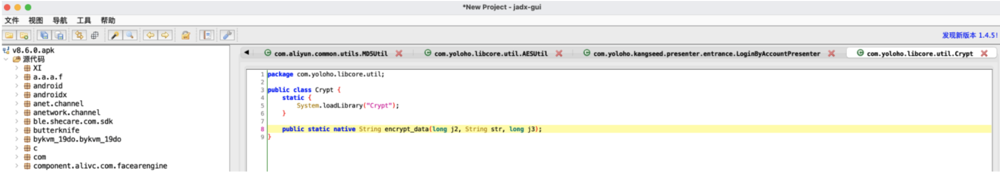

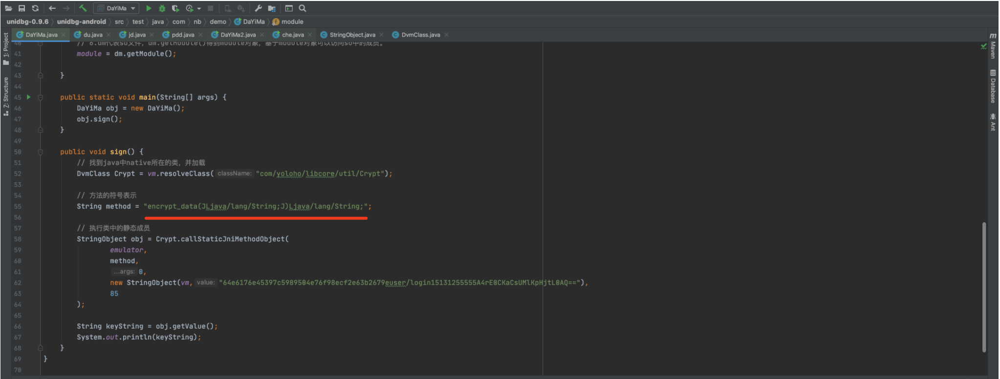

具体执行流程：

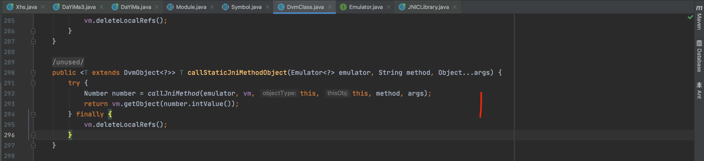

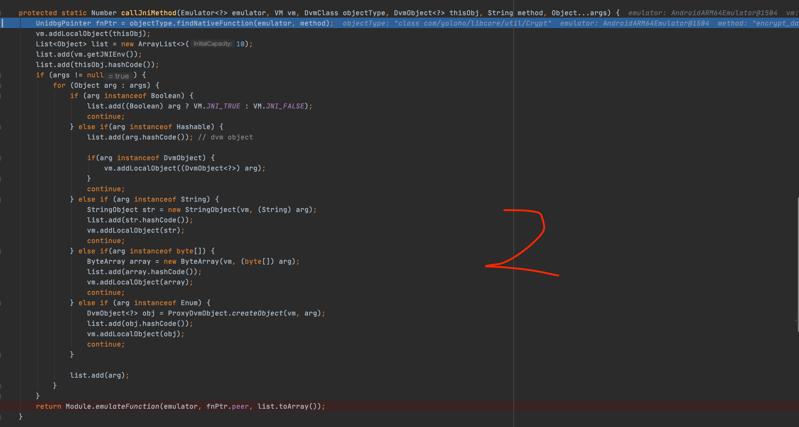

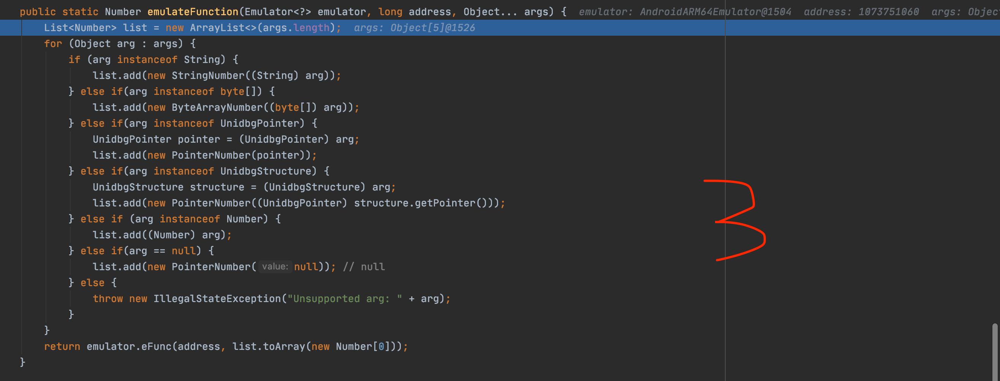

## 1.2 基于callFunction

### 1.2.1 符号

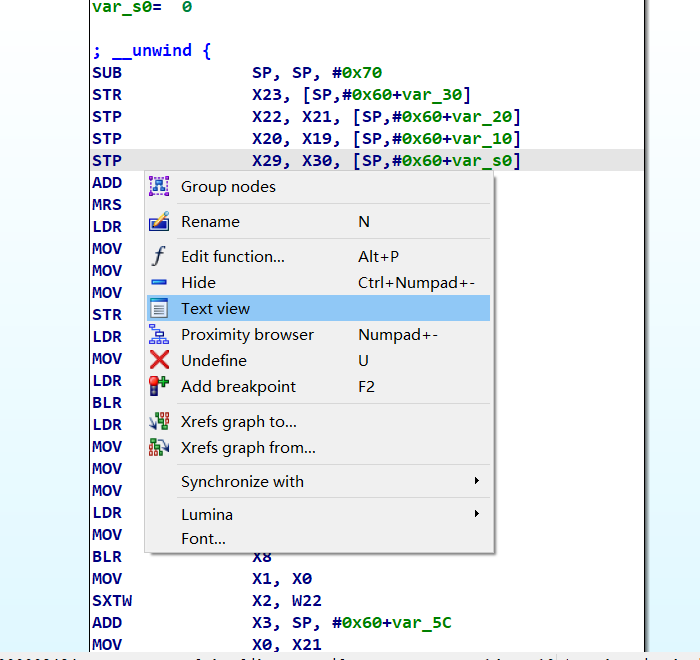

右键text view即可调出

在IDA中寻找函数的符号，可以直接调用。

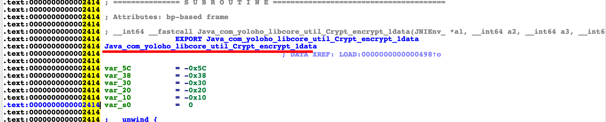

```python
Number number = module.callFunction(
    emulator,
    "Java_com_yoloho_libcore_util_Crypt_encrypt_1data",
    vm.getJNIEnv(),
    vm.addLocalObject(vm.resolveClass("com/yoloho/libcore/util/Crypt")),
    0,
    vm.addLocalObject(new StringObject(vm, "64e6176e4539sUMlKpHjtL0AQ==")),
    85
);
int result = number.intValue();
String v = (String) vm.getObject(result).getValue();
System.out.println(v);
```

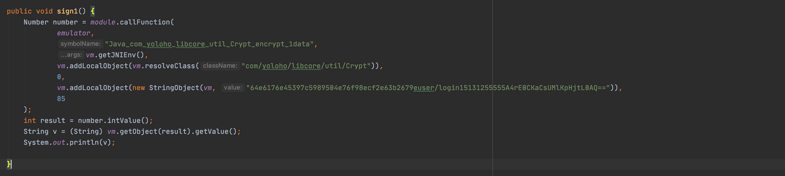

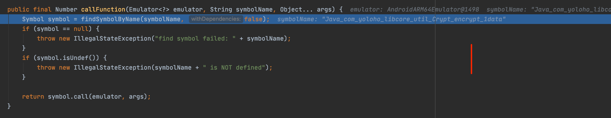

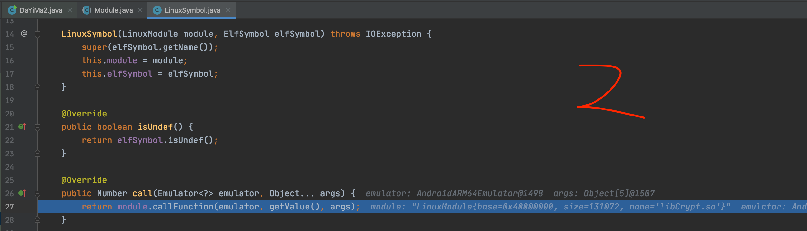


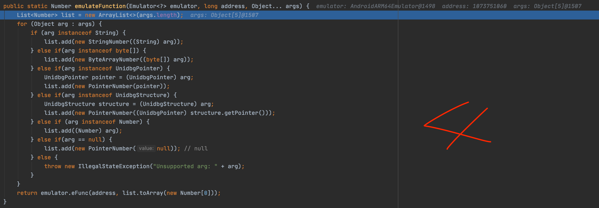

### 1.2.2 偏移量

基于IDA或其他方式，寻找函数的偏移量，可以直接调用。


```python
Number number = module.callFunction(
        emulator,
        0x2414,
        vm.getJNIEnv(),
        vm.addLocalObject(vm.resolveClass("com/yoloho/libcore/util/Crypt")),
        0,
        vm.addLocalObject(new StringObject(vm, "64e6176e45397c5...lKpHjtL0AQ==")),
        85
);
int result = number.intValue();
String v = (String) vm.getObject(result).getValue();
System.out.println(v);
```

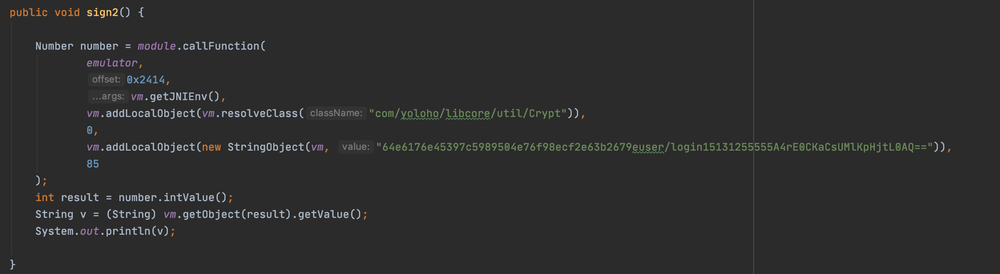

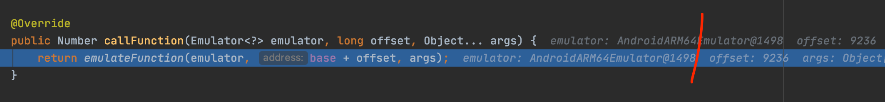

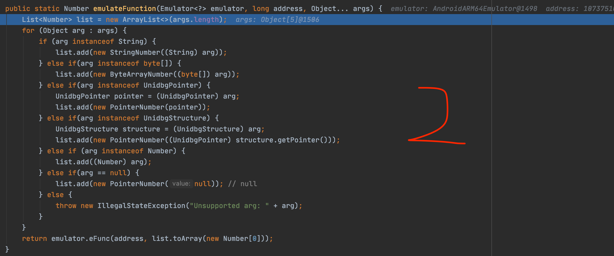

### 1.2.3 优势

如果在逆向过程中，你想要 主动调用so中的某个函数，例如：只想要调用 sub_1DA0，看看他有什么作用。那么你就可以学习本节的内容。

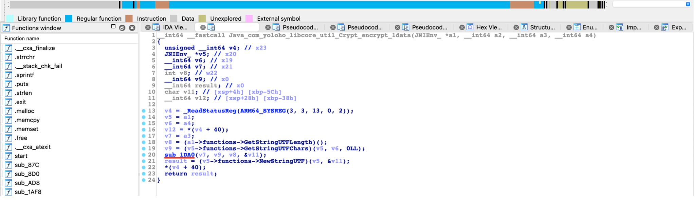

## 1.3 示例代码（DaYiMa5)

```java
package com.nb.demo;

import com.github.unidbg.AndroidEmulator;
import com.github.unidbg.Module;
import com.github.unidbg.Symbol;
import com.github.unidbg.linux.android.AndroidEmulatorBuilder;
import com.github.unidbg.linux.android.AndroidResolver;
import com.github.unidbg.linux.android.dvm.*;
import com.github.unidbg.memory.Memory;
import com.github.unidbg.pointer.UnidbgPointer;
import com.github.unidbg.utils.Inspector;

import java.io.File;
import java.util.ArrayList;
import java.util.List;


public class DaYiMa5 extends AbstractJni {
    public static AndroidEmulator emulator;
    public static Memory memory;
    public static VM vm;
    public static DalvikModule dm;
    public static Module module;

    DaYiMa5() {

        // 1.创建设备（32位或64位模拟器）， 具体看so文件在哪个目录。 在armeabi-v7a就选择32位
        emulator = AndroidEmulatorBuilder.for64Bit().setProcessName("com.che168.autotradercloud").build();

        // 2.获取内存对象（可以操作内存）
        memory = emulator.getMemory();

        // 3.设置安卓sdk版本（只支持19、23）
        memory.setLibraryResolver(new AndroidResolver(23));

        // 4.创建虚拟机（运行安卓代码需要虚拟机，就想运行py代码需要python解释器一样）
        vm = emulator.createDalvikVM(new File("apks/dayima/v8.6.0.apk"));
        vm.setJni(this);
        //vm.setVerbose(true); //是否展示调用过程的细节

        // 5.加载so文件
        DalvikModule dm = vm.loadLibrary(new File("apks/dayima/libCrypt.so"), false);
        //dm.callJNI_OnLoad(emulator);

        // 6.dm代表so文件，dm.getModule()得到module对象，基于module对象可以访问so中的成员。
        module = dm.getModule();

    }

    public static void main(String[] args) {
        DaYiMa5 obj = new DaYiMa5();
        obj.sign();
        obj.sign1();
        obj.sign2();
    }

    /**
     * 签名
     */
    public void sign() {
        // 找到类【代指】
        DvmClass cls = vm.resolveClass("com/yoloho/libcore/util/Crypt");

        StringObject obj = cls.callStaticJniMethodObject(
                emulator,
                "encrypt_data(JLjava/lang/String;J)Ljava/lang/String;",
                0,
                new StringObject(vm, "64e6176e45397c5989504e76f98ecf2e63b2679euser/login15131255555A4rE0CKaCsUMlKpHjtL0AQ=="),
                85

        );
        String dataString = obj.getValue();
        System.out.println(dataString);
    }

    /**
     * callFunction + 符号
     */
    public void sign1() {
        Number number = module.callFunction(
                emulator,
                "Java_com_yoloho_libcore_util_Crypt_encrypt_1data",
                vm.getJNIEnv(),
                vm.addLocalObject(vm.resolveClass("com/yoloho/libcore/util/Crypt")),
                0,
                vm.addLocalObject(new StringObject(vm, "64e6176e45397c5989504e76f98ecf2e63b2679euser/login15131255555A4rE0CKaCsUMlKpHjtL0AQ==")),
                85
        );
        int result = number.intValue();
        String v = (String) vm.getObject(result).getValue();
        System.out.println(v);

    }

    /**
     * callFunction + 偏移地址
     */
    public void sign2() {

        Number number = module.callFunction(
                emulator,
                0x2414,
                vm.getJNIEnv(),
                vm.addLocalObject(vm.resolveClass("com/yoloho/libcore/util/Crypt")),
                0,
                vm.addLocalObject(new StringObject(vm, "64e6176e45397c5989504e76f98ecf2e63b2679euser/login15131255555A4rE0CKaCsUMlKpHjtL0AQ==")),
                85
        );
        int result = number.intValue();
        String v = (String) vm.getObject(result).getValue();
        System.out.println(v);

    }
}
```

# 2.关于参数类型

## 1.1 基于签名（自动转换）

基于签名的形式调用时，传入的是 `DvmObject`类型，例如：

```java
new StringObject(vm, "字符串")
new ByteArray(vm, "字节数组")
vm.resolveClass("android/content/Context").newObject("对象")
ProxyDvmObject.createObject(vm, 对象)
```

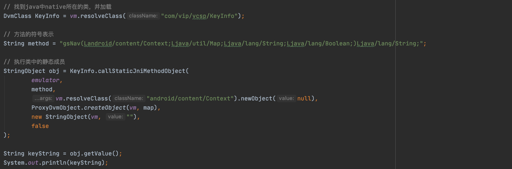

如果再往下继续看，看看参数会做什么处理：


在此处，会做如下处理：

- java对象，转换成DvmObject对象

- 将DvmObject对象的 hashCode() 值添加到 list 中（汇总所有参数）

- 调用 vm.addLocalObject(对象)     

  ```java
  // vm.addLocalObject(对象)的返回值，是对象的hashCode
  
  list.add(arg.hashCode());
  vm.addLocalObject(arg);
  可以简化成：
  list.add(vm.addLocalObject(arg));
  ```

所以，最终所有参数都是一大堆对象的hashCode()值。


## 1.2 基于callFunction（手动处理）

无论是基于符号或基于偏移量，最终执行时，是到此处（没有经过自动转换过程），所以，在使用callFunction时，只能自己处理参数。

其实比较简单，就是把他们加入`vm.addLocalObject`，然后再传参：

```java
Number number = module.callFunction(
        emulator,
        0x2414,
        vm.getJNIEnv(),
        vm.addLocalObject(vm.resolveClass("com/yoloho/libcore/util/Crypt")),
        0,
        vm.addLocalObject(new StringObject(vm, "64e6176e45397c5989504e76f98ejtL0AQ==")),
        85
);
```


# 3.参数形式

无论是基于签名、callFunction ，当调用方法时，如果想要传参数，可以基于两种方式：

- 普通的位置传参

  ```java
  Number number = module.callFunction(
          emulator,
          0x2414,
          vm.getJNIEnv(),
          vm.addLocalObject(vm.resolveClass("com/yoloho/libcore/util/Crypt")),
          0,
          vm.addLocalObject(new StringObject(vm, "64e6176e45397c5..MlKpHjtL0AQ==")),
          85
  );
  int result = number.intValue();
  String v = (String) vm.getObject(result).getValue();
  System.out.println(v);
  ```

- Array形式

  ```java
  List<Object> args = new ArrayList<>();
  args.add(vm.getJNIEnv()); // 第一个参数是env
  args.add(vm.addLocalObject(vm.resolveClass("com/yoloho/libcore/util/Crypt")));
  args.add(0);
  args.add(vm.addLocalObject(new StringObject(vm, "64e6176e4KaCsUMlKpHjtL0AQ==")));
  args.add(85);
  
  Number number = module.callFunction(
          emulator,
          0x2414, // 32位+1
          args.toArray()
  );
  int result = number.intValue();
  String v = (String) vm.getObject(result).getValue();
  System.out.println(v);
  ```

# 4.其他

## 4.1 常见表示

- 符号名称（是汇编中名称，非函数名）

  ```
  Java_com_yoloho_libcore_util_Crypt_encrypt_1data
  ```

  

- 偏移地址（32位需+1）

  ```
  0x2414
  
  与地址不同， 地址 = 基址 + 偏移地址
  ```

- 基址 `module.base`

  ```java
  vm = emulator.createDalvikVM(new File("unidbg-android/apks/dayima/v8.6.0.apk"));
  vm.setJni(this);
  //vm.setVerbose(true); //是否展示调用过程的细节
  
  // 5.加载so文件
  DalvikModule dm = vm.loadLibrary(new File("unidbg-android/apks/dayima/libCrypt.so"), false);
  dm.callJNI_OnLoad(emulator);
  
  module = dm.getModule();
  module.base + 0x100
  ```

## 4.2 Hook

- Hook，基于 **符号（Symbol对象）** 或 **函数地址（基址+偏移地址）**
- 调用，可以基于 **签名** 或 **符号** 或 **偏移地址**

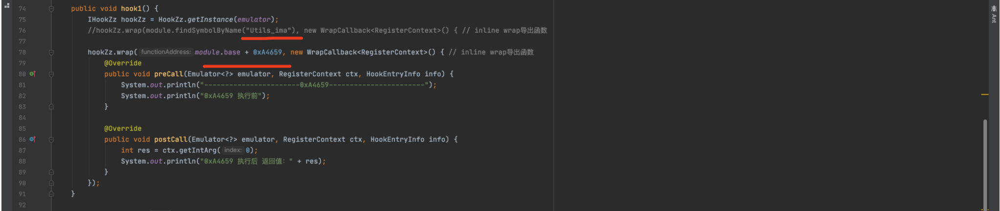

# 5.案例：大姨妈

## 5.1 java层的native方法

```java
package com.nb.demo;

import com.github.unidbg.AndroidEmulator;
import com.github.unidbg.Module;
import com.github.unidbg.Symbol;
import com.github.unidbg.linux.android.AndroidEmulatorBuilder;
import com.github.unidbg.linux.android.AndroidResolver;
import com.github.unidbg.linux.android.dvm.*;
import com.github.unidbg.memory.Memory;
import com.github.unidbg.pointer.UnidbgPointer;
import com.github.unidbg.utils.Inspector;

import java.io.File;
import java.util.ArrayList;
import java.util.List;


public class DaYiMa2 extends AbstractJni {
    public static AndroidEmulator emulator;
    public static Memory memory;
    public static VM vm;
    public static DalvikModule dm;
    public static Module module;

    DaYiMa2() {

        // 1.创建设备（32位或64位模拟器）， 具体看so文件在哪个目录。 在armeabi-v7a就选择32位
        emulator = AndroidEmulatorBuilder.for64Bit().setProcessName("com.che168.autotradercloud").build();

        // 2.获取内存对象（可以操作内存）
        memory = emulator.getMemory();

        // 3.设置安卓sdk版本（只支持19、23）
        memory.setLibraryResolver(new AndroidResolver(23));

        // 4.创建虚拟机（运行安卓代码需要虚拟机，就想运行py代码需要python解释器一样）
        vm = emulator.createDalvikVM(new File("unidbg-android/apks/dayima/v8.6.0.apk"));
        vm.setJni(this);
        //vm.setVerbose(true); //是否展示调用过程的细节

        // 5.加载so文件
        DalvikModule dm = vm.loadLibrary(new File("unidbg-android/apks/dayima/libCrypt.so"), false);
        //dm.callJNI_OnLoad(emulator);

        // 6.dm代表so文件，dm.getModule()得到module对象，基于module对象可以访问so中的成员。
        module = dm.getModule();

    }

    public static void main(String[] args) {
        DaYiMa2 obj = new DaYiMa2();
        obj.sign1();
        obj.sign2();
        obj.sign3();
        obj.sign4();
    }

    public void sign1() {
        Number number = module.callFunction(
                emulator,
                "Java_com_yoloho_libcore_util_Crypt_encrypt_1data",
                vm.getJNIEnv(),
                vm.addLocalObject(vm.resolveClass("com/yoloho/libcore/util/Crypt")),
                0,
                vm.addLocalObject(new StringObject(vm, "64e6176e45397c5989504e76f98ecf2e63b2679euser/login15131255555A4rE0CKaCsUMlKpHjtL0AQ==")),
                85
        );
        int result = number.intValue();
        String v = (String) vm.getObject(result).getValue();
        System.out.println(v);

    }

    public void sign2() {

        Number number = module.callFunction(
                emulator,
                0x2414,
                vm.getJNIEnv(),
                vm.addLocalObject(vm.resolveClass("com/yoloho/libcore/util/Crypt")),
                0,
                vm.addLocalObject(new StringObject(vm, "64e6176e45397c5989504e76f98ecf2e63b2679euser/login15131255555A4rE0CKaCsUMlKpHjtL0AQ==")),
                85
        );
        int result = number.intValue();
        String v = (String) vm.getObject(result).getValue();
        System.out.println(v);

    }

    public void sign3() {
        List<Object> args = new ArrayList<>();
        args.add(vm.getJNIEnv()); // 第一个参数是env
        args.add(vm.addLocalObject(vm.resolveClass("com/yoloho/libcore/util/Crypt")));
        args.add(0);
        args.add(vm.addLocalObject(new StringObject(vm, "64e6176e45397c5989504e76f98ecf2e63b2679euser/login15131255555A4rE0CKaCsUMlKpHjtL0AQ==")));
        args.add(85);

        Number number = module.callFunction(
                emulator,
                "Java_com_yoloho_libcore_util_Crypt_encrypt_1data",
                args.toArray()
        );
        int result = number.intValue();
        String v = (String) vm.getObject(result).getValue();
        System.out.println(v);

    }

    public void sign4() {
        List<Object> args = new ArrayList<>();
        args.add(vm.getJNIEnv()); // 第一个参数是env
        args.add(vm.addLocalObject(vm.resolveClass("com/yoloho/libcore/util/Crypt")));
        args.add(0);
        args.add(vm.addLocalObject(new StringObject(vm, "64e6176e45397c5989504e76f98ecf2e63b2679euser/login15131255555A4rE0CKaCsUMlKpHjtL0AQ==")));
        args.add(85);

        Number number = module.callFunction(
                emulator,
                0x2414, // 32位+1
                args.toArray()
        );
        int result = number.intValue();
        String v = (String) vm.getObject(result).getValue();
        System.out.println(v);

    }
}
```

## 5.2 so中的c方法(调用so里的函数)


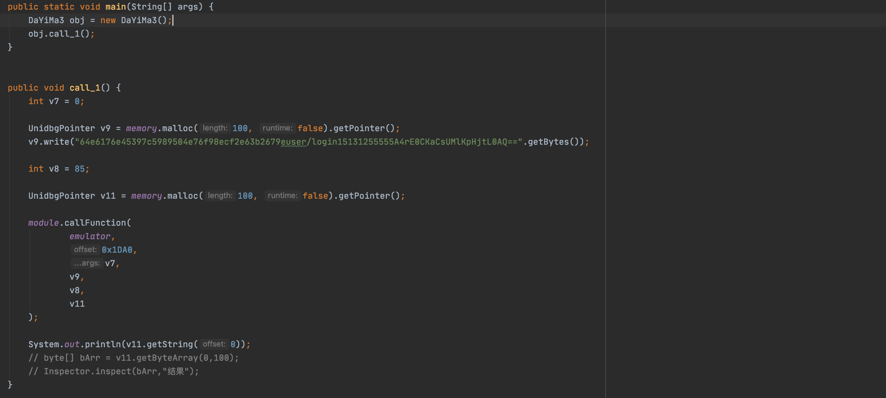

```java
package com.nb.demo;

import com.github.unidbg.AndroidEmulator;
import com.github.unidbg.Emulator;
import com.github.unidbg.Module;
import com.github.unidbg.Symbol;
import com.github.unidbg.arm.context.RegisterContext;
import com.github.unidbg.hook.hookzz.HookEntryInfo;
import com.github.unidbg.hook.hookzz.HookZz;
import com.github.unidbg.hook.hookzz.IHookZz;
import com.github.unidbg.hook.hookzz.WrapCallback;
import com.github.unidbg.linux.android.AndroidEmulatorBuilder;
import com.github.unidbg.linux.android.AndroidResolver;
import com.github.unidbg.linux.android.dvm.AbstractJni;
import com.github.unidbg.linux.android.dvm.DalvikModule;
import com.github.unidbg.linux.android.dvm.StringObject;
import com.github.unidbg.linux.android.dvm.VM;
import com.github.unidbg.memory.Memory;
import com.github.unidbg.pointer.UnidbgPointer;
import com.github.unidbg.utils.Inspector;
import com.sun.jna.Pointer;

import java.io.File;
import java.util.ArrayList;
import java.util.List;


public class DaYiMa3 extends AbstractJni {
    public static AndroidEmulator emulator;
    public static Memory memory;
    public static VM vm;
    public static DalvikModule dm;
    public static Module module;

    DaYiMa3() {

        // 1.创建设备（32位或64位模拟器）， 具体看so文件在哪个目录。 在armeabi-v7a就选择32位
        emulator = AndroidEmulatorBuilder.for64Bit().setProcessName("com.che168.autotradercloud").build();

        // 2.获取内存对象（可以操作内存）
        memory = emulator.getMemory();

        // 3.设置安卓sdk版本（只支持19、23）
        memory.setLibraryResolver(new AndroidResolver(23));

        // 4.创建虚拟机（运行安卓代码需要虚拟机，就想运行py代码需要python解释器一样）
        vm = emulator.createDalvikVM(new File("unidbg-android/apks/dayima/v8.6.0.apk"));
        vm.setJni(this);
        //vm.setVerbose(true); //是否展示调用过程的细节

        // 5.加载so文件
        DalvikModule dm = vm.loadLibrary(new File("unidbg-android/apks/dayima/libCrypt.so"), false);
        //dm.callJNI_OnLoad(emulator);

        // 6.dm代表so文件，dm.getModule()得到module对象，基于module对象可以访问so中的成员。
        module = dm.getModule();
    }

    public static void main(String[] args) {
        DaYiMa3 obj = new DaYiMa3();
        obj.call_1();
    }


    public void call_1() {
        int v7 = 0;

        UnidbgPointer v9 = memory.malloc(100, false).getPointer();
        v9.write("64e6176e45397c5989504e76f98ecf2e63b2679euser/login15131255555A4rE0CKaCsUMlKpHjtL0AQ==".getBytes());

        int v8 = 85;

        UnidbgPointer v11 = memory.malloc(100, false).getPointer();

        module.callFunction(
                emulator,
                0x1DA0,
                v7,
                v9,
                v8,
                v11
        );

        System.out.println(v11.getString(0));
        // byte[] bArr = v11.getByteArray(0,100);
        // Inspector.inspect(bArr,"结果");
    }

}
```

## 5.3 so中的c方法 + HOOK

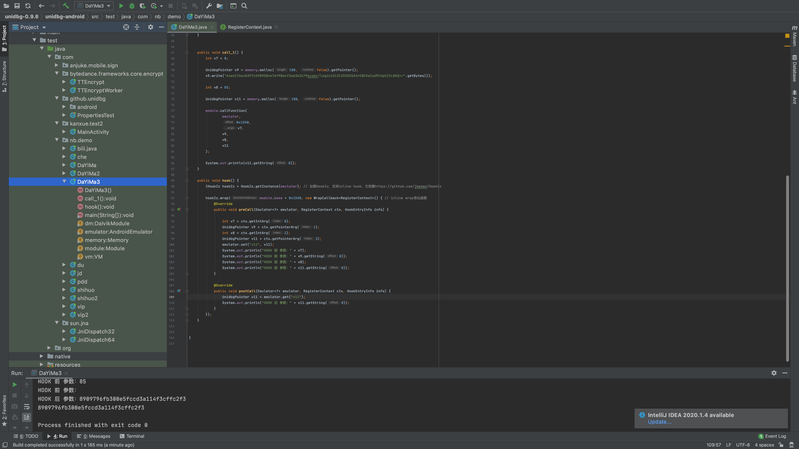

```java
package com.nb.demo;

import com.github.unidbg.AndroidEmulator;
import com.github.unidbg.Emulator;
import com.github.unidbg.Module;
import com.github.unidbg.Symbol;
import com.github.unidbg.arm.context.RegisterContext;
import com.github.unidbg.hook.hookzz.HookEntryInfo;
import com.github.unidbg.hook.hookzz.HookZz;
import com.github.unidbg.hook.hookzz.IHookZz;
import com.github.unidbg.hook.hookzz.WrapCallback;
import com.github.unidbg.linux.android.AndroidEmulatorBuilder;
import com.github.unidbg.linux.android.AndroidResolver;
import com.github.unidbg.linux.android.dvm.AbstractJni;
import com.github.unidbg.linux.android.dvm.DalvikModule;
import com.github.unidbg.linux.android.dvm.StringObject;
import com.github.unidbg.linux.android.dvm.VM;
import com.github.unidbg.memory.Memory;
import com.github.unidbg.pointer.UnidbgPointer;
import com.github.unidbg.utils.Inspector;
import com.sun.jna.Pointer;

import java.io.File;
import java.util.ArrayList;
import java.util.List;


public class DaYiMa3 extends AbstractJni {
    public static AndroidEmulator emulator;
    public static Memory memory;
    public static VM vm;
    public static DalvikModule dm;
    public static Module module;

    DaYiMa3() {

        // 1.创建设备（32位或64位模拟器）， 具体看so文件在哪个目录。 在armeabi-v7a就选择32位
        emulator = AndroidEmulatorBuilder.for64Bit().setProcessName("com.che168.autotradercloud").build();

        // 2.获取内存对象（可以操作内存）
        memory = emulator.getMemory();

        // 3.设置安卓sdk版本（只支持19、23）
        memory.setLibraryResolver(new AndroidResolver(23));

        // 4.创建虚拟机（运行安卓代码需要虚拟机，就想运行py代码需要python解释器一样）
        vm = emulator.createDalvikVM(new File("unidbg-android/apks/dayima/v8.6.0.apk"));
        vm.setJni(this);
        //vm.setVerbose(true); //是否展示调用过程的细节

        // 5.加载so文件
        DalvikModule dm = vm.loadLibrary(new File("unidbg-android/apks/dayima/libCrypt.so"), false);
        //dm.callJNI_OnLoad(emulator);

        // 6.dm代表so文件，dm.getModule()得到module对象，基于module对象可以访问so中的成员。
        module = dm.getModule();

    }

    public static void main(String[] args) {
        DaYiMa3 obj = new DaYiMa3();
        obj.hook();  // hook
        obj.call_1();  // 调用
    }


    public void call_1() {
        int v7 = 0;

        UnidbgPointer v9 = memory.malloc(100, false).getPointer();
        v9.write("64e6176e45397c5989504e76f98ecf2e63b2679euser/login15131255555A4rE0CKaCsUMlKpHjtL0AQ==".getBytes());

        int v8 = 85;

        UnidbgPointer v11 = memory.malloc(100, false).getPointer();

        module.callFunction(
                emulator,
                0x1DA0,
                v7,
                v9,
                v8,
                v11
        );

        System.out.println(v11.getString(0));
    }

    public void hook() {
        IHookZz hookZz = HookZz.getInstance(emulator); // 加载HookZz，支持inline hook，文档看https://github.com/jmpews/HookZz

        hookZz.wrap(module.base + 0x1DA0, new WrapCallback<RegisterContext>() { // inline wrap导出函数
            @Override
            public void preCall(Emulator<?> emulator, RegisterContext ctx, HookEntryInfo info) {

                int v7 = ctx.getIntArg(0);
                UnidbgPointer v9 = ctx.getPointerArg(1);
                int v8 = ctx.getIntArg(2);
                UnidbgPointer v11 = ctx.getPointerArg(3);
                emulator.set("v11", v11);
                System.out.println("HOOK 前 参数：" + v7);
                System.out.println("HOOK 前 参数：" + v9.getString(0));
                System.out.println("HOOK 前 参数：" + v8);
                System.out.println("HOOK 前 参数：" + v11.getString(0));
            }

            @Override
            public void postCall(Emulator<?> emulator, RegisterContext ctx, HookEntryInfo info) {
                UnidbgPointer v11 = emulator.get("v11");
                System.out.println("HOOK 后 参数：" + v11.getString(0));
            }
        });
    }

}
```
