视频教程：https://www.bilibili.com/video/BV17C4y1E7fK/


# 1.一个奇怪的现象

浏览器可以正常访问，但是用requests发送请求失败。

- 无任何加密参数，不是参数原因导致。
- 携带UA等请求头也无效，不是请求头缘故。

那后端是如何监测得呢？为什么浏览器可以返回结果，而requests模块不行呢？


https://cn.investing.com/equities/amazon-com-inc-historical-data

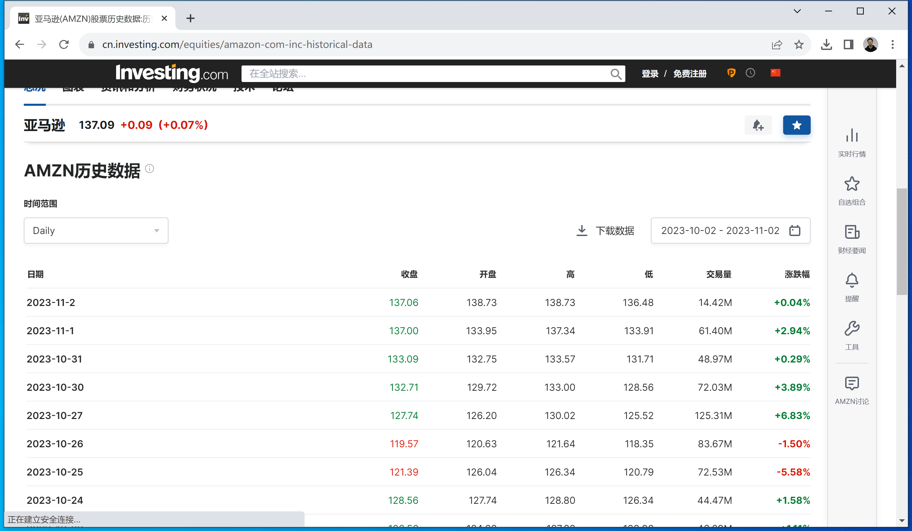


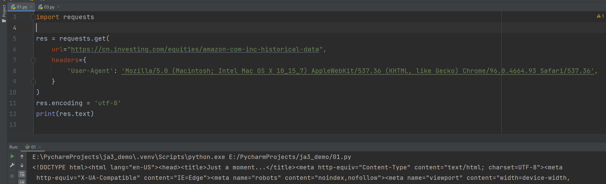


## 1.1 案例：ascii2d

https://ascii2d.net/

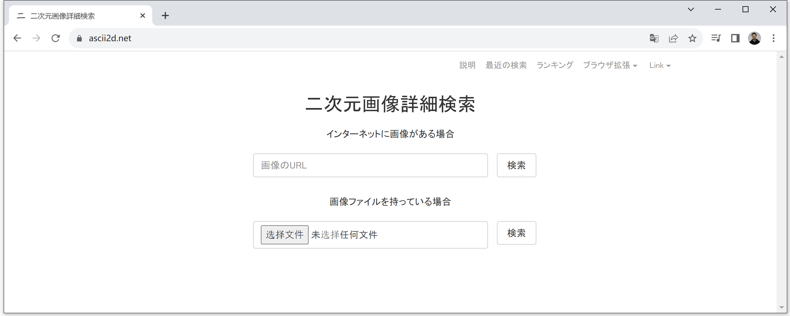

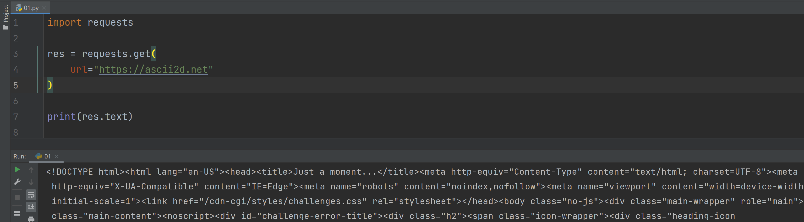

```python
import requests

res = requests.get(
    url="https://ascii2d.net"
)

print(res.text)
```

```html
<!DOCTYPE html>
<html lang="en-US">
  <head>
    <title>Just a moment...</title>
    <meta http-equiv="Content-Type" content="text/html; charset=UTF-8" />
  </head>
   ...
</html>
```


## 1.2 案例：investing


https://cn.investing.com/equities/amazon-com-inc-historical-data


```python
import requests

res = requests.get(
    url="https://cn.investing.com/equities/amazon-com-inc-historical-data",
    headers={
        'User-Agent': 'Mozilla/5.0 (Macintosh; Intel Mac OS X 10_15_7) AppleWebKit/537.36 (KHTML, like Gecko) Chrome/96.0.4664.93 Safari/537.36',
    }
)
res.encoding = 'utf-8'
print(res.text)
```


## 1.3 案例：yuanrenxue


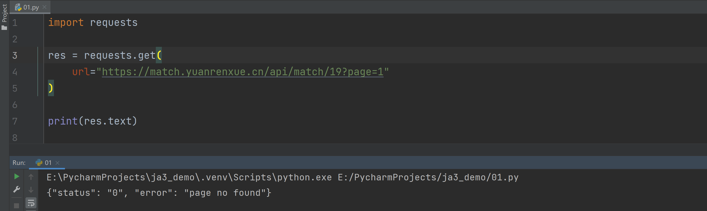

```python
import requests

res = requests.get(
    url="https://match.yuanrenxue.cn/api/match/19?page=1"
)

print(res.text)
```


# 2.TLS指纹

如今几乎所有平台通信都是基于Https的协议，而无论基于什么工具去发送Https请求时，都需要基于TLS/SSL先建立两端安全的通信（握手），建立后再进行数据传输。


TLS的握手阶段，客户端会向服务端发送 Client Hello 数据包，在数据包内的`JA3`就是指纹信息（基于电脑的TLS版本+内置算法等计算出来的字符串），并且该值不会随着请求头修改、代理等发生变化。所以，某个网站的后台就会去读取TLS客户端的`JA3`指纹，如果是非正常指纹，禁止访问。例如：

- requests请求

  ```
  requests==2.31.0
  urllib3==2.0.7
  ```

  ```
  [JA3 Fullstring: 771,4866-4867-4865-49196-49200-159-52393-52392-52394-49195-49199-158-49188-49192-107-49187-49191-103-49162-49172-57-49161-49171-51-157-156-61-60-53-47-255,0-11-10-16-22-23-49-13-43-45-51-21,29-23-30-25-24,0-1-2]
  
  [JA3: bc29aa426fc99c0be1b9be941869f88a]
  
  固定，所以后端API可以禁止此指纹。
  ```

- 浏览器请求

  ```
  [JA3 Fullstring: 771,4865-4866-4867-49195-49199-49196-49200-52393-52392-49171-49172-156-157-47-53,11-18-27-35-16-51-10-23-5-43-65281-65037-0-17513-13-45,29-23-24,0]
  
  [JA3: 5ae2fe79293ec63d585f3f987cf69d01]
  
  谷歌浏览器的JA3会变化。
  ```


扩展：有些网站专门收录ja3黑名单。

```
https://sslbl.abuse.ch/ja3-fingerprints/
https://sslbl.abuse.ch/blacklist/sslblacklist.csv
https://github.com/salesforce/ja3/blob/master/lists/osx-nix-ja3.csv
https://ja3er.com/getAllUasJson
https://ja3er.com/getAllHashesJson

```


## 2.1 查看指纹

想要快速查看自己的TSL指纹信息：https://tls.browserleaks.com/json

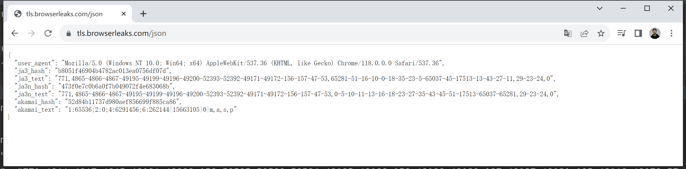

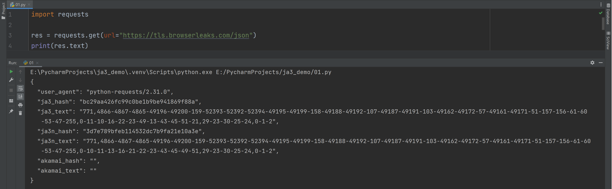

其他网站还有：

```
https://tls.browserleaks.com/json
https://tls.peet.ws/
https://tls.peet.ws/api/all
```


## 2.2 Wireshark

基于Wireshark抓包并筛选出Client Hello数据包，去内部查看：

### 1.下载安装

下载并安装Wireshark  https://www.wireshark.org/download.html

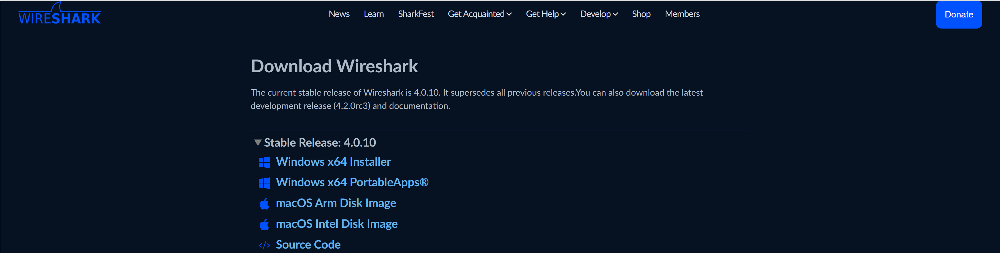


### 2.抓网卡

打开Wireshark，选择要抓包监测的网卡，选择你上网使用的那个网卡。


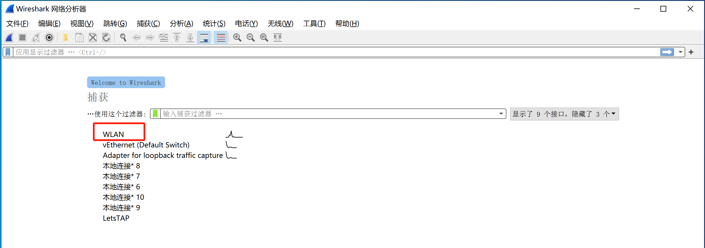


### 3.筛选IP

筛选目标IP `ip.dst_host==146.56.195.149`

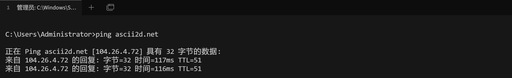


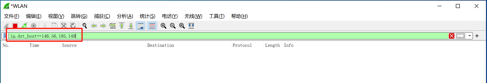


### 4.数据包

用浏览器或用requests发送请求，就可以监测到网络请求，然后找到 `Client Hello`数据包，就可以看到相关指纹信息。

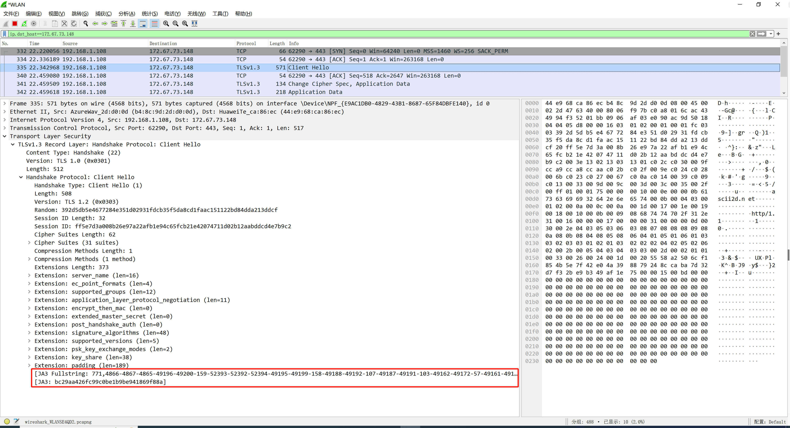


## 2.3 ja3


```
[JA3 Fullstring: 771,4866-4867-4865-49196-49200-159-52393-52392-52394-49195-49199-158-49188-49192-107-49187-49191-103-49162-49172-57-49161-49171-51-157-156-61-60-53-47-255,0-11-10-16-22-23-49-13-43-45-51-21,29-23-30-25-24,0-1-2]

[JA3: bc29aa426fc99c0be1b9be941869f88a]
```

关于加密相关的值：

- `JA3` 是对 `JA3 Fullstring`进行md5加密的结果。

- `JA3 Fullstring`是由五段组成

  ```
  JA3 gathers the decimal values of the bytes for the following fields in the Client Hello packet; 
  	- SSL Version,
  	- Accepted Ciphers
  	- List of Extensions
  	- Elliptic Curves
  	- Elliptic Curve Formats
  It then concatenates those values together in order, using a "," to delimit each field and a "-" to delimit each value in each field.
  
  JA3 为客户端发送的clienthello 数据包中的以下字段收集字节的十进制值: SSL Version, Accepted Ciphers, List of Extensions, Elliptic Curves, and Elliptic Curve Formats(SSL 版本、接受的密码、扩展列表、椭圆曲线和椭圆曲线格式)。然后它将这些值按顺序连接在一起，使用“，”分隔每个字段，使用“-”分隔每个字段中的每个值。
  
  https://github.com/salesforce/ja3
  ```

  ```
  SSLVersion, Cipher, SSLExtension, EllipticCurve, EllipticCurvePointFormat
  ```

  ```
  第1个值：771                                   表示SSL版本，即：TLS 1.2（0x0303），0x0303转换为10进制就是771
  
  第2个值：4866-4867-4865-49196-49200-159-52393-52392-52394-49195-49199-158-49188-49192-107-49187-49191-103-49162-49172-57-49161-49171-51-157-156-61-60-53-47-255        表示TLS客户端支持的加密套件。
  
  第三个值：0-11-10-16-22-23-49-13-43-45-51-21    表示支持的 TLS 扩展
  
  第四个值：29-23-30-25-24                        表示支持的支持的椭圆曲线（ECC加密算法）
  
  第五个值：0-1-2                                 表示支持的椭圆曲线格式
  ```


### 1.SSLVersion

```
771
```

将0x0303转换为10进制就是771


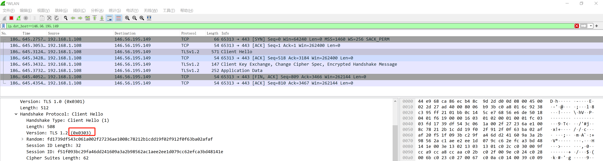


### 2.Cipher

```
4866-4867-4865-49196-49200-159-52393-52392-52394-49195-49199-158-49188-49192-107-49187-49191-103-49162-49172-57-49161-49171-51-157-156-61-60-53-47-255
```

将算法套件的十六进制表示，转换成十进制，然后再凭借起来。


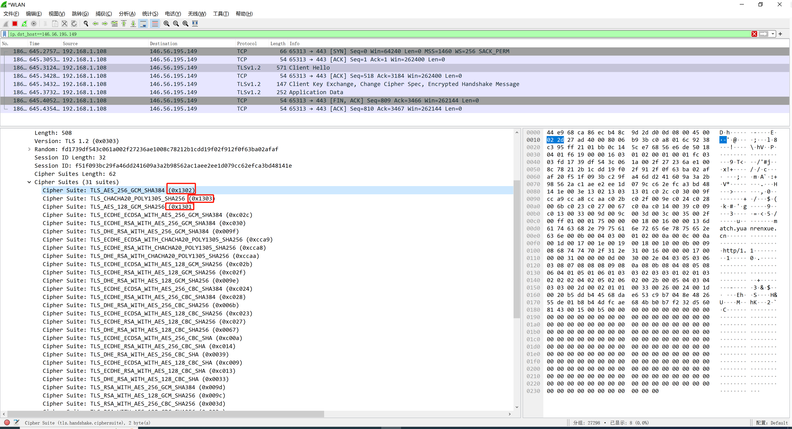


### 3.SSLExtension

```
0-11-10-16-22-23-49-13-43-45-51-21
```

SSL中所有的扩展对应的数字

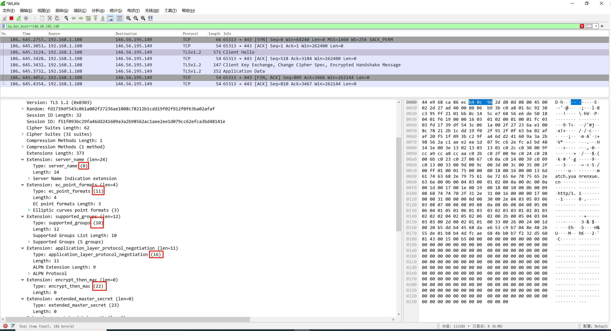


### 4.EllipticCurve

```
29-23-30-25-24
```

将supported_groups对应的十六进制转换成十进制。


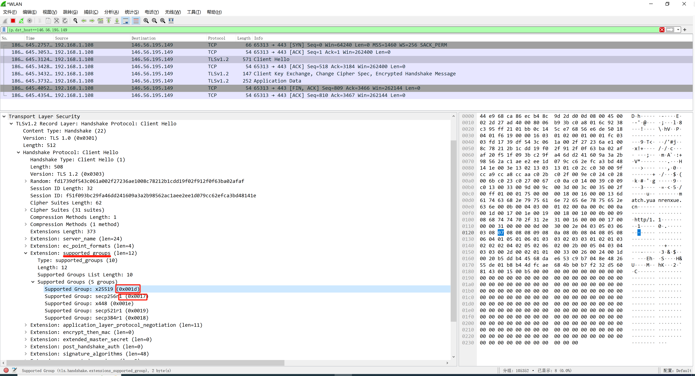


### 5.EllipticCurvePointFormat

```
0-1-2
```

将`ec_point_formats`转换转换十进制。


# 3.突破指纹

理解TLS中ja3生成机制后，绕过的思路也就有了：**requests请求时，改变 `ja3 string`得内容，生成合法的的`ja3`指纹**。


## 3.1 【PY】requests【案例3】

requests在发送请求时，内部依赖urllib3实现。

```
pip install urllib3==1.26.15
pip install urllib3==1.26.16
pip install urllib3==2.0.7
```

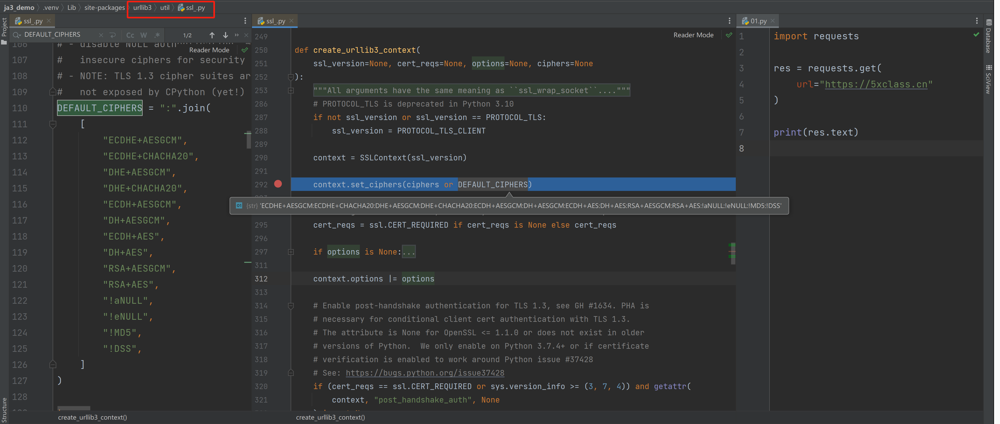


自定义 `ciphers`实现生成非默认`ja3`

方式1：

```python
import requests
import urllib3

urllib3.util.ssl_.DEFAULT_CIPHERS = ":".join([
    # "ECDHE+AESGCM",
    # "ECDHE+CHACHA20",
    # "DHE+AESGCM",
    # "DHE+CHACHA20",
    # "ECDH+AESGCM",
    # "DH+AESGCM",
    # "ECDH+AES",
    "DH+AES",
    "RSA+AESGCM",
    "RSA+AES",
    "!aNULL",
    "!eNULL",
    "!MD5",
    "!DSS",
])

res = requests.get(
    url="https://tls.browserleaks.com/json",
    headers={
        'User-Agent': 'Mozilla/5.0 (Macintosh; Intel Mac OS X 10_15_7) AppleWebKit/537.36 (KHTML, like Gecko) Chrome/96.0.4664.93 Safari/537.36',
    }
)
res.encoding = 'utf-8'
print(res.text)

```


方式2：

```python
import requests
from requests.adapters import HTTPAdapter
from requests.packages.urllib3.util.ssl_ import create_urllib3_context


class MineAdapter(HTTPAdapter):
    CIPHERS = ":".join(
        [
            "ECDHE+AESGCM",
            "ECDHE+CHACHA20",
            "DHE+AESGCM",
            "DHE+CHACHA20",
            "ECDH+AESGCM",
            "DH+AESGCM",
            "ECDH+AES",
            "DH+AES",
            "RSA+AESGCM",
            "RSA+AES",
            "!aNULL",
            "!eNULL",
            "!MD5",
            "!DSS",
        ]
    )

    def init_poolmanager(self, *args, **kwargs):
        context = create_urllib3_context(ciphers=self.CIPHERS)
        kwargs['ssl_context'] = context
        return super().init_poolmanager(*args, **kwargs)

    def proxy_manager_for(self, *args, **kwargs):
        context = create_urllib3_context(ciphers=self.CIPHERS)
        kwargs['ssl_context'] = context
        return super().proxy_manager_for(*args, **kwargs)


session = requests.Session()
session.headers.update({
    'User-Agent': 'Mozilla/5.0 (Macintosh; Intel Mac OS X 10_15_7) AppleWebKit/537.36 (KHTML, like Gecko) Chrome/96.0.4664.93 Safari/537.36',
})
session.mount("https://", MineAdapter())

res = session.get("https://tls.browserleaks.com/json")
res.encoding = 'utf-8'
print(res.text)
```


用此方法，可以过案例3的TLS校验机制，例如：

```python
import requests
import urllib3

urllib3.util.ssl_.DEFAULT_CIPHERS = ":".join([
    # "ECDHE+AESGCM",
    # "ECDHE+CHACHA20",
    # "DHE+AESGCM",
    # "DHE+CHACHA20",
    # "ECDH+AESGCM",
    # "DH+AESGCM",
    # "ECDH+AES",
    "DH+AES",
    "RSA+AESGCM",
    "RSA+AES",
    "!aNULL",
    "!eNULL",
    "!MD5",
    "!DSS",
])

res = requests.get(
    url="https://match.yuanrenxue.cn/api/match/19?page=1",
    headers={
        'User-Agent': 'Mozilla/5.0 (Macintosh; Intel Mac OS X 10_15_7) AppleWebKit/537.36 (KHTML, like Gecko) Chrome/96.0.4664.93 Safari/537.36',
    }
)
res.encoding = 'utf-8'
print(res.text)

```


注意：Python层得TLS是基于底层openssl对外提供的方法，而openssl暴漏给Python只能通过修改 `ciphers` 来修改ja3指纹，无法支持修改 `SSLExtension, EllipticCurve, EllipticCurvePointFormat`。


## 3.2 【PY】curl_cffi【案例1+2+3】

https://pypi.org/project/curl-cffi/#description

- curl是一个可以发送网络请求的工具。
- curl-impersonate是一个基于curl基础上进行开发的一个工具，可以完美的模拟主流的浏览器。
- curl_cffi，是套壳curl-impersonate，让此工具可以更方便的应用在Python中。

```
pip install curl-cffi
```

```python
from curl_cffi import requests

res = requests.get(
    # url="https://ascii2d.net/",
    # url="https://cn.investing.com/equities/amazon-com-inc-historical-data",
    url="https://match.yuanrenxue.cn/api/match/19?page=1",
    headers={
        'User-Agent': 'Mozilla/5.0 (Macintosh; Intel Mac OS X 10_15_7) AppleWebKit/537.36 (KHTML, like Gecko) Chrome/96.0.4664.93 Safari/537.36',
    },
    impersonate="chrome101",
)
print(res.text)
```


## 3.3 【Go】CycleTLS 【案例1+2+3】

关于Golang环境和基础入门教程可以参考：

```
课件：https://www.5xclass.cn/wiki/detail/4/0/
视频：https://www.bilibili.com/video/BV1u5411W79w/
```


github上有一个基于Golang开发的开源模块CycleTLS ，可以更靠近底层去实现定制`ja3`指纹，直接自定义`ja3 fullstring`。

https://github.com/Danny-Dasilva/CycleTLS


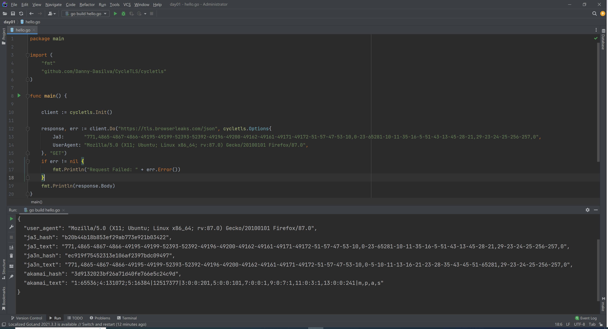


```
go get github.com/Danny-Dasilva/CycleTLS/cycletls 
```

```go
package main

import (
	"github.com/Danny-Dasilva/CycleTLS/cycletls"
	"log"
)

func main() {

	client := cycletls.Init()
	
    // https://ascii2d.net/
    // https://cn.investing.com/equities/amazon-com-inc-historical-data
    // https://match.yuanrenxue.cn/api/match/19?page=1
	response, err := client.Do("https://tls.browserleaks.com/json", cycletls.Options{
		Body:      "",
		Ja3:       "771,4865-4867-4866-49195-49199-52393-52392-49196-49200-49162-49161-49171-49172-51-57-47-53-10,0-23-65281-10-11-35-16-5-51-43-13-45-28-21,29-23-24-25-256-257,0",
		UserAgent: "Mozilla/5.0 (X11; Ubuntu; Linux x86_64; rv:87.0) Gecko/20100101 Firefox/87.0",
	}, "GET")
	if err != nil {
		log.Print("Request Failed: " + err.Error())
	}
	log.Println(response)
}
```


