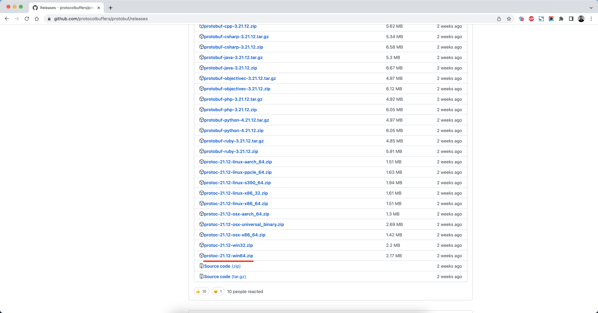
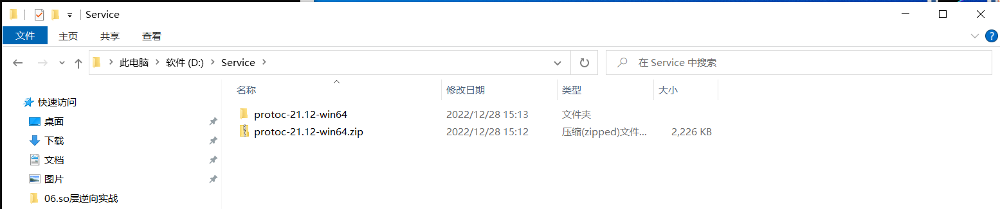
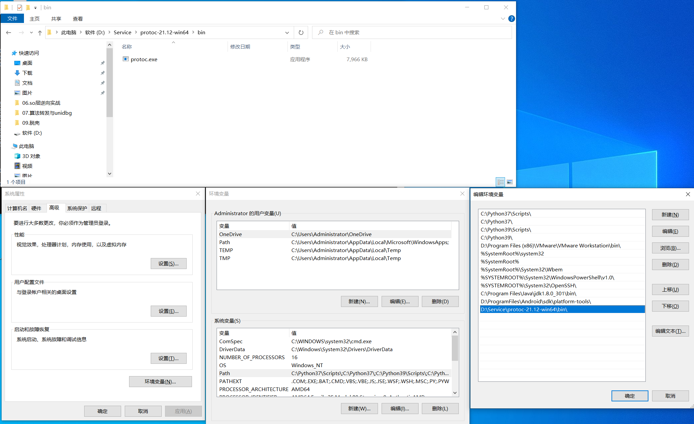
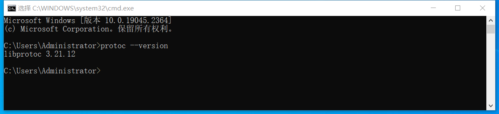
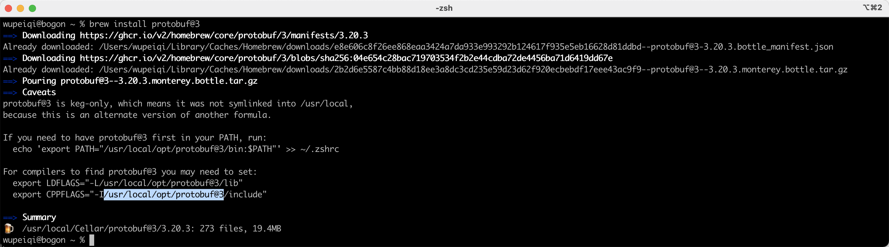
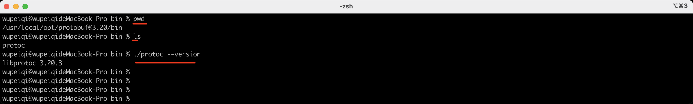
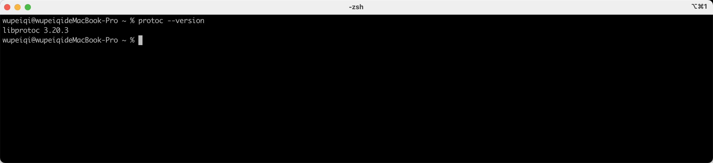
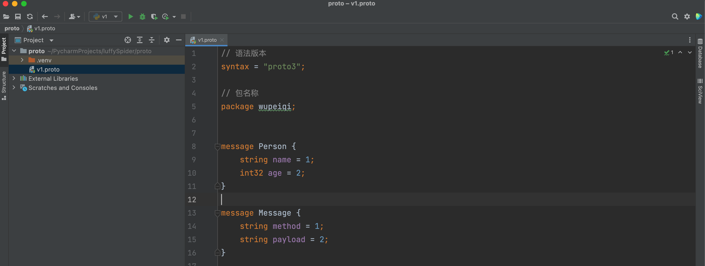
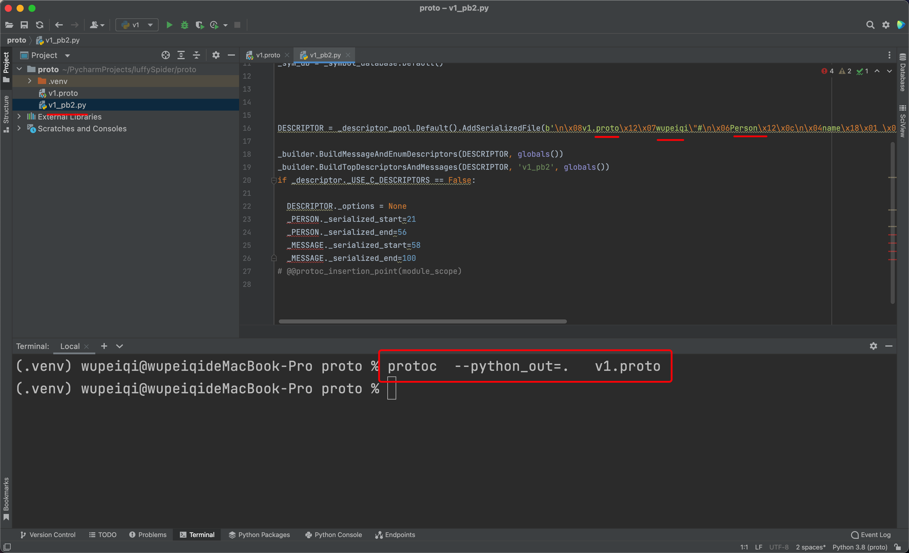
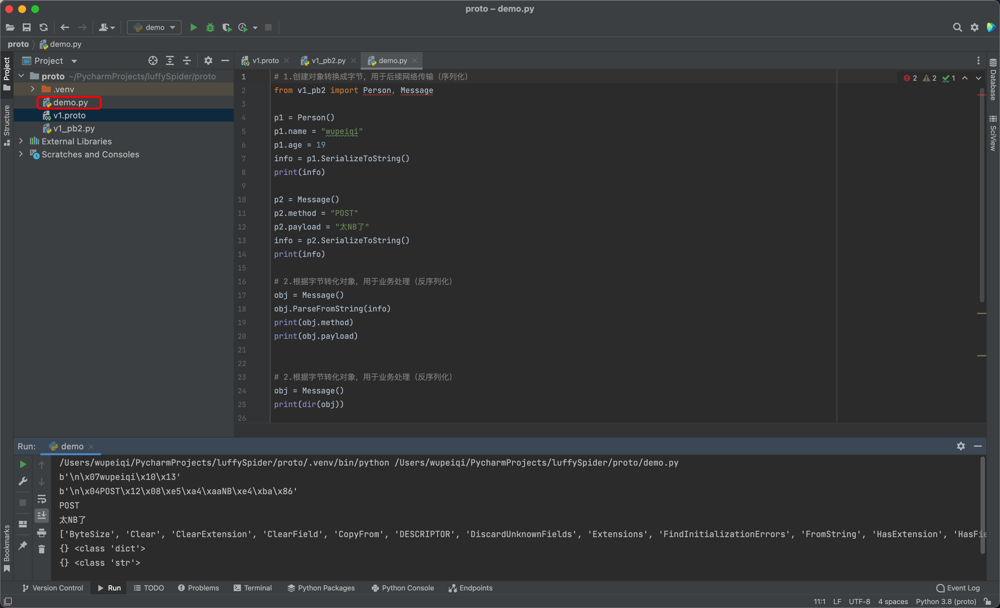

# Protobuf


protobuf是Google公司提出的一种轻便**高效**的结构化数据存储**格式**，常用于结构化数据的序列化，具有语言无关、平台无关、可扩展性特性，常用于通讯协议、服务端数据交换场景。


# 1.下载安装

## 1.1 Windows

https://github.com/protocolbuffers/protobuf/releases










## 1.2 Mac

```
brew install protobuf@3
```

如果电脑未安装brew，则请先去安装：

```
>>>/usr/bin/ruby -e "$(curl -fsSL https://raw.githubusercontent.com/Homebrew/install/master/install)"
>>>brew --version
```







将目录加入环境变量：

```
PATH="/usr/local/opt/protobuf@3.20/bin:${PATH}"
export PATH
```




# 2.Pycharm插件


# 3.定义数据结构

官方文档：https://developers.google.com/protocol-buffers/docs/pythontutorial

```protobuf
syntax = "proto3";

package wupeiqi;

message Person {
    string name = 1;
    int32 age = 2;
}

message Message {
    string method = 1;
    string payload = 2;
}
```




# 6.转换Python版本

在命令行执行：

```
protoc  --python_out=.   v1.proto
```




# 7.Python操作模块

```
pip install protobuf
```




```python
from google.protobuf import json_format

# 1.创建对象转换成字节，用于后续网络传输（序列化）
from v1_pb2 import Person, Message

p1 = Person()
p1.name = "wupeiqi"
p1.age = 19

info = p1.SerializeToString()
print(info)

p2 = Message()
p2.method = "POST"
p2.payload = "太NB了"
info = p2.SerializeToString()
print(info)

# 2.根据字节转化对象，用于业务处理（反序列化）
obj = Message()
obj.ParseFromString(info)
print(obj.method)
print(obj.payload)


# 3.对象转字典
from google.protobuf import json_format

data_dict = json_format.MessageToDict(obj)
print(data_dict, type(data_dict))

data_string = json_format.MessageToJson(obj,ensure_ascii=False)
print(data_string, type(data_string))
```


