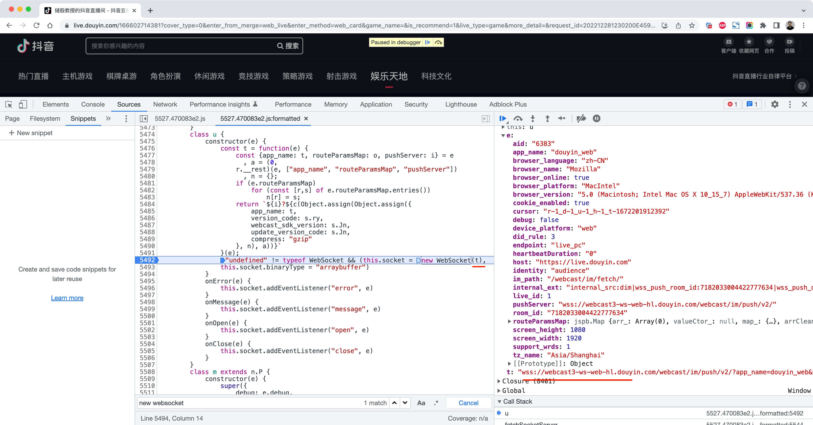
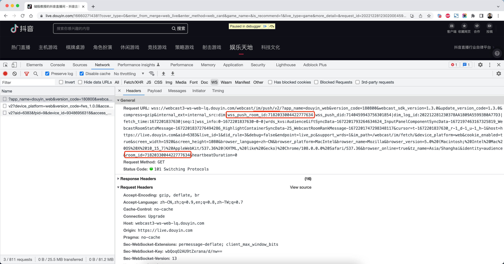
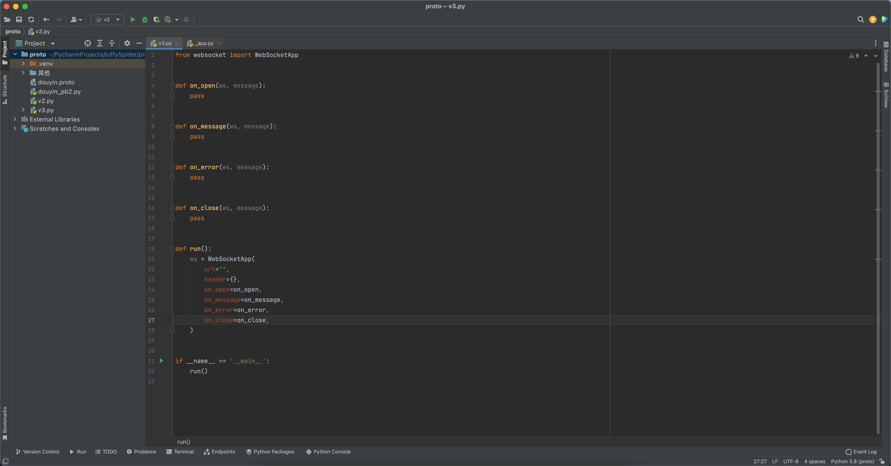
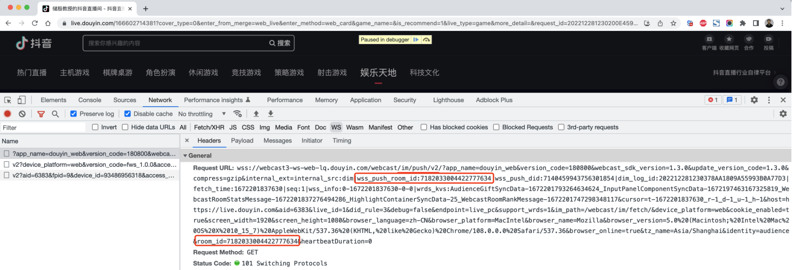
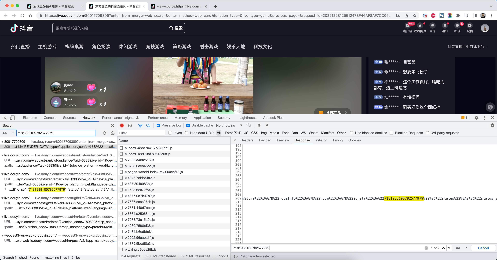
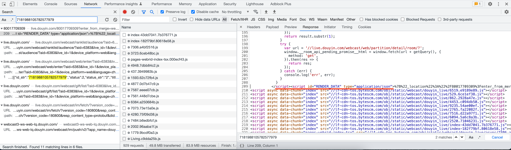
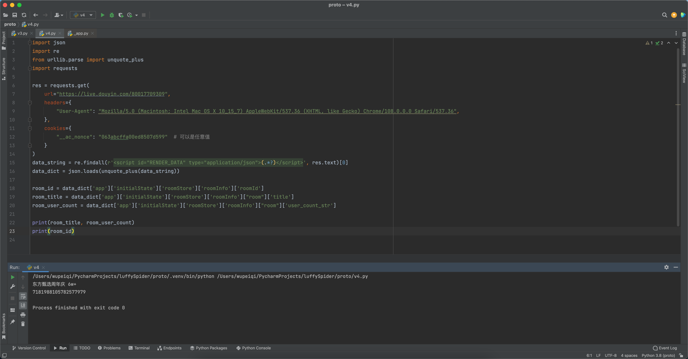
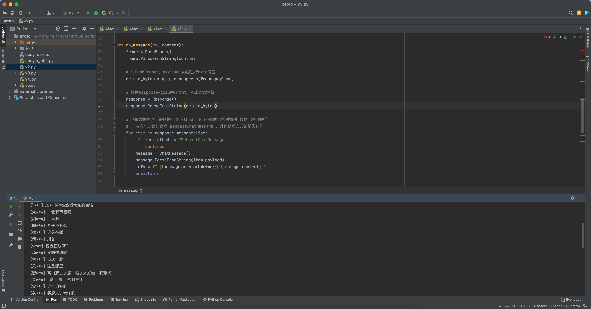
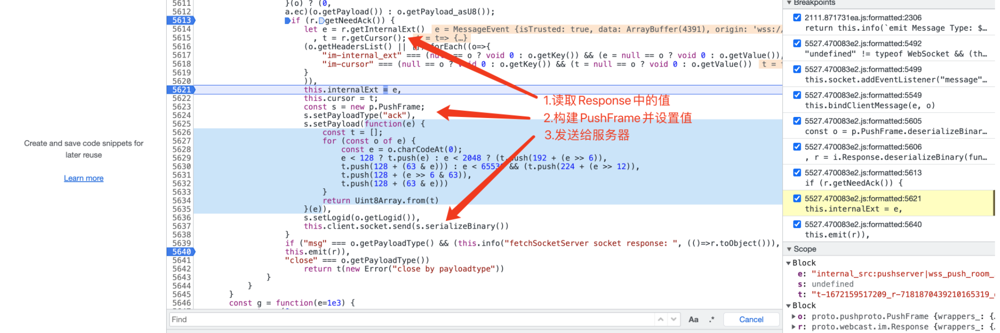
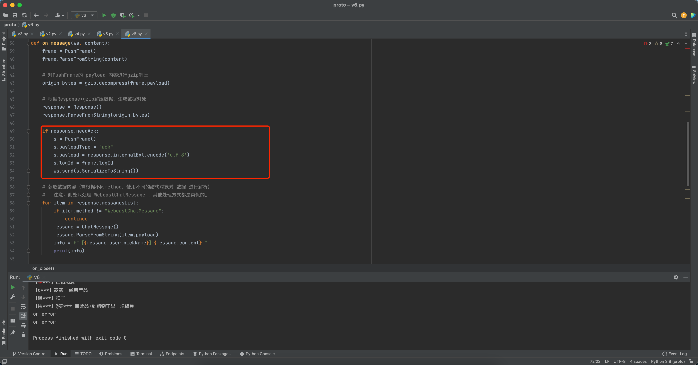

# 1.抖音请求分析

如何基于python模拟浏览器中的WebSocket，实现实时获取弹幕信息。






```
"wss://webcast3-ws-web-hl.douyin.com/webcast/im/push/v2/?app_name=douyin_web&version_code=180800&webcast_sdk_version=1.3.0&update_version_code=1.3.0&compress=gzip&internal_ext=internal_src:dim|wss_push_room_id:7182033004422777634|wss_push_did:7140459943756301854|dim_log_id:20221228123152F91F995F9399B10A6BCE|fetch_time:1672201912392|seq:1|wss_info:0-1672201912392-0-0|wrds_kvs:HighlightContainerSyncData-26_InputPanelComponentSyncData-1672197463167325819_WebcastRoomStatsMessage-1672201909261979591_WebcastRoomRankMessage-1672201891335849188_AudienceGiftSyncData-1672201860106107162&cursor=r-1_d-1_u-1_h-1_t-1672201912392&host=https://live.douyin.com&aid=6383&live_id=1&did_rule=3&debug=false&endpoint=live_pc&support_wrds=1&im_path=/webcast/im/fetch/&device_platform=web&cookie_enabled=true&screen_width=1920&screen_height=1080&browser_language=zh-CN&browser_platform=MacIntel&browser_name=Mozilla&browser_version=5.0 (Macintosh; Intel Mac OS X 10_15_7) AppleWebKit/537.36 (KHTML, like Gecko) Chrome/108.0.0.0 Safari/537.36&browser_online=true&tz_name=Asia/Shanghai&identity=audience&room_id=7182033004422777634&heartbeatDuration=0"
```


# 2.ws模块

安装Python模拟发送websocket请求的模块：

```
pip install websocket-client
```


基于 `websocket-client` 的示例代码：



```python
from websocket import WebSocketApp


def on_open(ws, message):
    pass


def on_message(ws, message):
    pass


def on_error(ws, message):
    pass


def on_close(ws, message):
    pass


def run():
    ws = WebSocketApp(
        url="",
        header={},
        cookie="",
        on_open=on_open,
        on_message=on_message,
        on_error=on_error,
        on_close=on_close,
    )
    ws.run_forever()


if __name__ == '__main__':
    run()
```


# 3.抖音直播


## 3.1 ws地址








ws的地址中 `room_id` 代表直播间的ID，其他的固定就行，关于 `room_id`的获取



```python
import json
import re
from urllib.parse import unquote_plus
import requests

res = requests.get(
    url="https://live.douyin.com/80017709309",
    headers={
        "User-Agent": "Mozilla/5.0 (Macintosh; Intel Mac OS X 10_15_7) AppleWebKit/537.36 (KHTML, like Gecko) Chrome/108.0.0.0 Safari/537.36",
    },
    cookies={
        "__ac_nonce": "063abcffa00ed8507d599"  # 可以是任意值
    }
)
data_string = re.findall(r'<script id="RENDER_DATA" type="application/json">(.*?)</script>', res.text)[0]
data_dict = json.loads(unquote_plus(data_string))

room_id = data_dict['app']['initialState']['roomStore']['roomInfo']['roomId']
room_title = data_dict['app']['initialState']['roomStore']['roomInfo']["room"]['title']
room_user_count = data_dict['app']['initialState']['roomStore']['roomInfo']["room"]['user_count_str']

print(room_title, room_user_count)
print(room_id)
```


所以，wss的最终地址是：

```python
wss_url = f"wss://webcast3-ws-web-lq.douyin.com/webcast/im/push/v2/?app_name=douyin_web&version_code=180800&webcast_sdk_version=1.3.0&update_version_code=1.3.0&compress=gzip&internal_ext=internal_src:dim|wss_push_room_id:{room_id}|wss_push_did:7140459943756301854|dim_log_id:202212281349305A73D850664DB518C21B|fetch_time:1672206570185|seq:1|wss_info:0-1672206570185-0-0|wrds_kvs:WebcastRoomStatsMessage-1672206566915058992_InputPanelComponentSyncData-1672187049066887013_WebcastRoomRankMessage-1672206560973484605&cursor=t-1672206570185_r-1_d-1_u-1_h-1&host=https://live.douyin.com&aid=6383&live_id=1&did_rule=3&debug=false&endpoint=live_pc&support_wrds=1&im_path=/webcast/im/fetch/&device_platform=web&cookie_enabled=true&screen_width=1920&screen_height=1080&browser_language=zh-CN&browser_platform=MacIntel&browser_name=Mozilla&browser_version=5.0%20(Macintosh;%20Intel%20Mac%20OS%20X%2010_15_7)%20AppleWebKit/537.36%20(KHTML,%20like%20Gecko)%20Chrome/108.0.0.0%20Safari/537.36&browser_online=true&tz_name=Asia/Shanghai&identity=audience&room_id={room_id}&heartbeatDuration=0"
print(wss_url)

```


## 3.2 on_message

在 on_message 中接收直播间的数据。

注意：一会就会自动断开（因为没有心跳）




```python
from websocket import WebSocketApp
import json
import re
import gzip
from urllib.parse import unquote_plus
import requests
from douyin_pb2 import PushFrame, Response, ChatMessage

def fetch_live_room_info(url):
    res = requests.get(
        url=url,
        headers={
            "User-Agent": "Mozilla/5.0 (Macintosh; Intel Mac OS X 10_15_7) AppleWebKit/537.36 (KHTML, like Gecko) Chrome/108.0.0.0 Safari/537.36",
        },
        cookies={
            "__ac_nonce": "063abcffa00ed8507d599"  # 可以是任意值
        }
    )
    data_string = re.findall(r'<script id="RENDER_DATA" type="application/json">(.*?)</script>', res.text)[0]
    data_dict = json.loads(unquote_plus(data_string))

    room_id = data_dict['app']['initialState']['roomStore']['roomInfo']['roomId']
    room_title = data_dict['app']['initialState']['roomStore']['roomInfo']["room"]['title']
    room_user_count = data_dict['app']['initialState']['roomStore']['roomInfo']["room"]['user_count_str']

    wss_url = f"wss://webcast3-ws-web-lq.douyin.com/webcast/im/push/v2/?app_name=douyin_web&version_code=180800&webcast_sdk_version=1.3.0&update_version_code=1.3.0&compress=gzip&internal_ext=internal_src:dim|wss_push_room_id:{room_id}|wss_push_did:7140459943756301854|dim_log_id:202212281349305A73D850664DB518C21B|fetch_time:1672206570185|seq:1|wss_info:0-1672206570185-0-0|wrds_kvs:WebcastRoomStatsMessage-1672206566915058992_InputPanelComponentSyncData-1672187049066887013_WebcastRoomRankMessage-1672206560973484605&cursor=t-1672206570185_r-1_d-1_u-1_h-1&host=https://live.douyin.com&aid=6383&live_id=1&did_rule=3&debug=false&endpoint=live_pc&support_wrds=1&im_path=/webcast/im/fetch/&device_platform=web&cookie_enabled=true&screen_width=1920&screen_height=1080&browser_language=zh-CN&browser_platform=MacIntel&browser_name=Mozilla&browser_version=5.0%20(Macintosh;%20Intel%20Mac%20OS%20X%2010_15_7)%20AppleWebKit/537.36%20(KHTML,%20like%20Gecko)%20Chrome/108.0.0.0%20Safari/537.36&browser_online=true&tz_name=Asia/Shanghai&identity=audience&room_id={room_id}&heartbeatDuration=0"
    # print(wss_url)

    ttwid = res.cookies.get_dict()['ttwid']
    return room_id, room_title, room_user_count, wss_url, ttwid


def on_open(ws, content):
    print('on_open')


def on_message(ws, content):
    frame = PushFrame()
    frame.ParseFromString(content)

    # 对PushFrame的 payload 内容进行gzip解压
    origin_bytes = gzip.decompress(frame.payload)

    # 根据Response+gzip解压数据，生成数据对象
    response = Response()
    response.ParseFromString(origin_bytes)

    # 获取数据内容（需根据不同method，使用不同的结构对象对 数据 进行解析）
    #   注意：此处只处理 WebcastChatMessage ，其他处理方式都是类似的。
    for item in response.messagesList:
        if item.method != "WebcastChatMessage":
            continue
        message = ChatMessage()
        message.ParseFromString(item.payload)
        info = f"【{message.user.nickName}】{message.content} "
        print(info)


def on_error(ws, content):
    print("on_error")


def on_close(ws, content):
    print("on_close")


def run():
    web_url = "https://live.douyin.com/80017709309"

    room_id, room_title, room_user_count, wss_url, ttwid = fetch_live_room_info(web_url)
    ws = WebSocketApp(
        url=wss_url,
        header={},
        cookie=f"ttwid={ttwid}",
        on_open=on_open,
        on_message=on_message,
        on_error=on_error,
        on_close=on_close,
    )
    ws.run_forever()


if __name__ == '__main__':
    run()
```


## 3.3 心跳相关







# 4.最终实现

## 4.1 douyin.proto

```protobuf
syntax = "proto3";

package douyin;

message HeadersList {
    string key = 1;
    string value = 2;
}

message PushFrame {
    uint64 seqId = 1;
    uint64 logId = 2;
    uint64 service = 3;
    uint64 method = 4;
    repeated HeadersList headersList = 5;
    string payloadEncoding = 6;
    string payloadType = 7;
    bytes payload = 8;
}


message Message {
    string method = 1;
    bytes payload = 2;
    int64 msgId = 3;
    int32 msgType = 4;
    int64 offset = 5;
    bool needWrdsStore = 6;
    int64 wrdsVersion = 7;
    string wrdsSubKey = 8;
}

message Response {
    repeated Message messagesList = 1;
    string cursor = 2;
    uint64 fetchInterval = 3;
    uint64 now = 4;
    string internalExt = 5;
    uint32 fetchType = 6;
    map<string, string> routeParams = 7;
    uint64 heartbeatDuration = 8;
    bool needAck = 9;
    string pushServer = 10;
    string liveCursor = 11;
    bool historyNoMore = 12;
}


message ChatMessage {
    User user = 2;
    string content = 3;
    bool visibleToSender = 4;
}


message User {
    uint64 id = 1;
    uint64 shortId = 2;
    string nickName = 3;
    uint32 gender = 4;
    string Signature = 5;
    uint32 Level = 6;
    uint64 Birthday = 7;
    string Telephone = 8;
    string city = 14;
}
```


## 4.2 demo.py

```python
from websocket import WebSocketApp
import json
import re
import gzip
from urllib.parse import unquote_plus
import requests
from douyin_pb2 import PushFrame, Response, ChatMessage


def fetch_live_room_info(url):
    res = requests.get(
        url=url,
        headers={
            "User-Agent": "Mozilla/5.0 (Macintosh; Intel Mac OS X 10_15_7) AppleWebKit/537.36 (KHTML, like Gecko) Chrome/108.0.0.0 Safari/537.36",
        },
        cookies={
            "__ac_nonce": "063abcffa00ed8507d599"  # 可以是任意值
        }
    )
    data_string = re.findall(r'<script id="RENDER_DATA" type="application/json">(.*?)</script>', res.text)[0]
    data_dict = json.loads(unquote_plus(data_string))

    room_id = data_dict['app']['initialState']['roomStore']['roomInfo']['roomId']
    room_title = data_dict['app']['initialState']['roomStore']['roomInfo']["room"]['title']
    room_user_count = data_dict['app']['initialState']['roomStore']['roomInfo']["room"]['user_count_str']

    wss_url = f"wss://webcast3-ws-web-lq.douyin.com/webcast/im/push/v2/?app_name=douyin_web&version_code=180800&webcast_sdk_version=1.3.0&update_version_code=1.3.0&compress=gzip&internal_ext=internal_src:dim|wss_push_room_id:{room_id}|wss_push_did:7140459943756301854|dim_log_id:202212281349305A73D850664DB518C21B|fetch_time:1672206570185|seq:1|wss_info:0-1672206570185-0-0|wrds_kvs:WebcastRoomStatsMessage-1672206566915058992_InputPanelComponentSyncData-1672187049066887013_WebcastRoomRankMessage-1672206560973484605&cursor=t-1672206570185_r-1_d-1_u-1_h-1&host=https://live.douyin.com&aid=6383&live_id=1&did_rule=3&debug=false&endpoint=live_pc&support_wrds=1&im_path=/webcast/im/fetch/&device_platform=web&cookie_enabled=true&screen_width=1920&screen_height=1080&browser_language=zh-CN&browser_platform=MacIntel&browser_name=Mozilla&browser_version=5.0%20(Macintosh;%20Intel%20Mac%20OS%20X%2010_15_7)%20AppleWebKit/537.36%20(KHTML,%20like%20Gecko)%20Chrome/108.0.0.0%20Safari/537.36&browser_online=true&tz_name=Asia/Shanghai&identity=audience&room_id={room_id}&heartbeatDuration=0"
    # print(wss_url)

    ttwid = res.cookies.get_dict()['ttwid']
    return room_id, room_title, room_user_count, wss_url, ttwid


def on_open(ws, content):
    print('on_open')


def on_message(ws, content):
    frame = PushFrame()
    frame.ParseFromString(content)

    # 对PushFrame的 payload 内容进行gzip解压
    origin_bytes = gzip.decompress(frame.payload)

    # 根据Response+gzip解压数据，生成数据对象
    response = Response()
    response.ParseFromString(origin_bytes)

    if response.needAck:
        s = PushFrame()
        s.payloadType = "ack"
        s.payload = response.internalExt.encode('utf-8')
        s.logId = frame.logId
        ws.send(s.SerializeToString())

    # 获取数据内容（需根据不同method，使用不同的结构对象对 数据 进行解析）
    #   注意：此处只处理 WebcastChatMessage ，其他处理方式都是类似的。
    for item in response.messagesList:
        if item.method != "WebcastChatMessage":
            continue
        message = ChatMessage()
        message.ParseFromString(item.payload)
        info = f"【{message.user.nickName}】{message.content} "
        print(info)


def on_error(ws, content):
    print("on_error")


def on_close(ws, content):
    print("on_close")


def run():
    web_url = "https://live.douyin.com/80017709309"

    room_id, room_title, room_user_count, wss_url, ttwid = fetch_live_room_info(web_url)
    ws = WebSocketApp(
        url=wss_url,
        header={},
        cookie=f"ttwid={ttwid}",
        on_open=on_open,
        on_message=on_message,
        on_error=on_error,
        on_close=on_close,
    )
    ws.run_forever()


if __name__ == '__main__':
    run()
```


