# 1.请求的本质

平时开发使用的http或https均属于应用层的协议，其本质都会调用TCP发送请求。

例如：你在Python中使用requests模块发送一个http请求，其底层就是使用socket模块+TCP实现发送的请求。

```python
import requests

res = requests.get("http://wiki.mikecrm.com/index?ajax=1&page=2")
print(res.text)
```


如果基于底层的socket模块+TCP协议实现如下：

```python
import socket

client = socket.socket()
client.connect(('wiki.mikecrm.com', 80))

content_list = []
content_list.append("GET /index?ajax=1&page=2 HTTP/1.1\r\n")
content_list.append("host: wiki.mikecrm.com\r\n")
content_list.append("user-Agent: test\r\n")
content_list.append("\r\n")
content_string = "".join(content_list)

client.sendall(content_string.encode('utf-8'))

response = b""
while True:
    chunk = client.recv(1024)
    if not chunk:
        break
    response += chunk

print(response.decode('utf-8'))

client.close()
```

# 2.安卓-Http请求

## 2.1 http请求

**详见示例**：SSLDemo1


```java
private void doRequest() {
    new Thread() {
        @Override
        public void run() {
            try {
                // http://wiki.mikecrm.com/index?ajax=1&page=2
                Socket socket = new Socket("wiki.mikecrm.com", 80);

                // 1.构造请求头
                StringBuilder sb = new StringBuilder();
                sb.append("GET /index?ajax=1&page=2 HTTP/1.1\r\n");
                sb.append("host: wiki.mikecrm.com\r\n");
                sb.append("user-Agent: test\r\n");
                sb.append("\r\n");

                // 2.写入数据（发送数据）
                // java.net.SocketOutputStream
                OutputStream outputStream = socket.getOutputStream();
                outputStream.write(sb.toString().getBytes());
                Log.e("outputStream的类 => ", outputStream.getClass().getName());

                // 3.读取数据（获取数据）
                // java.net.SocketInputStream
                InputStream inputStream = socket.getInputStream();
                Log.e("inputStream的类 => ", inputStream.getClass().getName());

                while (true) {
                    byte[] buffer = new byte[1024];
                    int len = inputStream.read(buffer, 0, buffer.length);
                    if (len == -1) {
                        break;
                    }
                    Log.e("读取相应内容 =>", new String(Arrays.copyOf(buffer, len)));
                }

                socket.close();

            } catch (Exception ex) {
                Log.e("Main", "网络请求异常" + ex);
            }
        }
    }.start();
}
```

## 2.2 请求写入

请求数据的写入是调用的`SocketOutputStream`的`write`方法。

```java
// java.net.SocketOutputStream
OutputStream outputStream = socket.getOutputStream();
outputStream.write(sb.toString().getBytes());
```

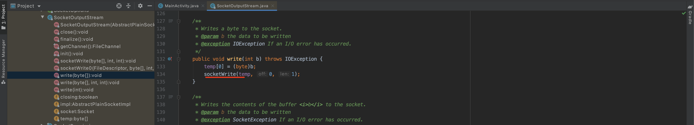


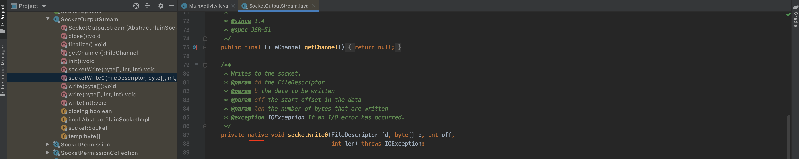

所以，底层发送的http请求的数据就是执行 `java.net.SocketOutputStream` 中的 `socketWrite0`方法。

那么，如果我们对这个方法进行Hook，是不是就可以获取到所有http请求的数据了。

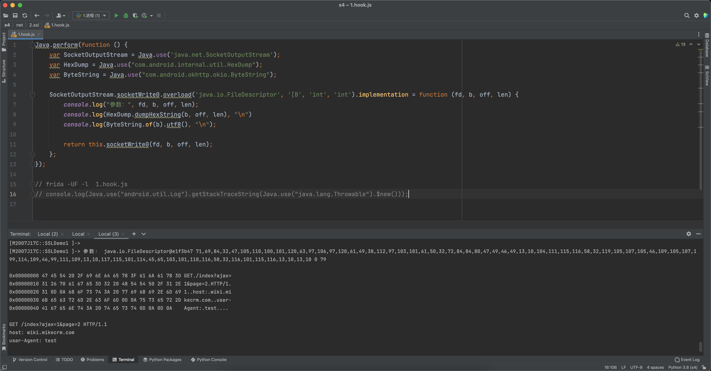

```javascript
Java.perform(function () {
    var SocketOutputStream = Java.use('java.net.SocketOutputStream');
    var HexDump = Java.use("com.android.internal.util.HexDump");
    var ByteString = Java.use("com.android.okhttp.okio.ByteString");

    SocketOutputStream.socketWrite0.overload('java.io.FileDescriptor', '[B', 'int', 'int').implementation = function (fd, b, off, len) {
        console.log("参数：", fd, b, off, len);
        console.log(HexDump.dumpHexString(b, off, len), "\n")
        console.log(ByteString.of(b).utf8(), "\n");

        return this.socketWrite0(fd, b, off, len);
    };
});

// frida -UF -l  1.hook.js
// console.log(Java.use("android.util.Log").getStackTraceString(Java.use("java.lang.Throwable").$new()));
```

## 2.3 响应获取

```java
// java.net.SocketInputStream
InputStream inputStream = socket.getInputStream();
Log.e("inputStream的类 => ", inputStream.getClass().getName());
while (true) {
    byte[] buffer = new byte[1024];
    int len = inputStream.read(buffer, 0, buffer.length);
    if (len == -1) {
        break;
    }
    Log.e("读取相应内容 =>", new String(Arrays.copyOf(buffer, len)));
}
```


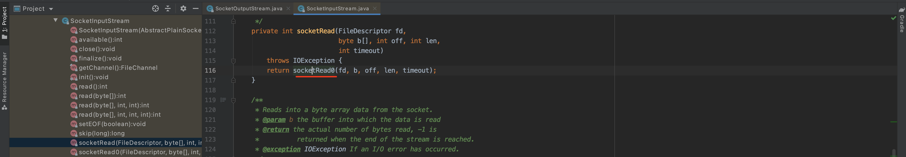

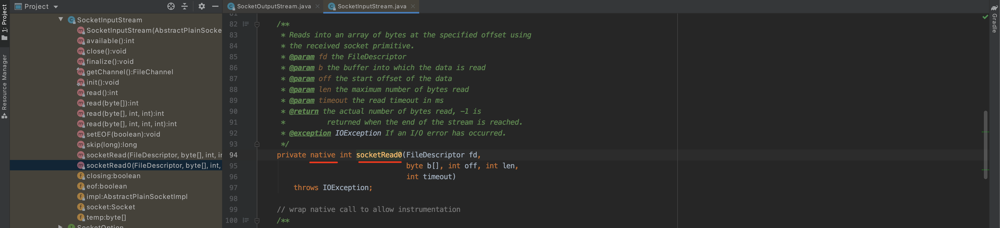

所以，底层发送的http响应的的数据就是执行 `java.net.SocketInputStream` 中的 `socketRead0`方法。

那么，如果我们对这个方法进行Hook，是不是就可以获取到所有http请求的数据了。

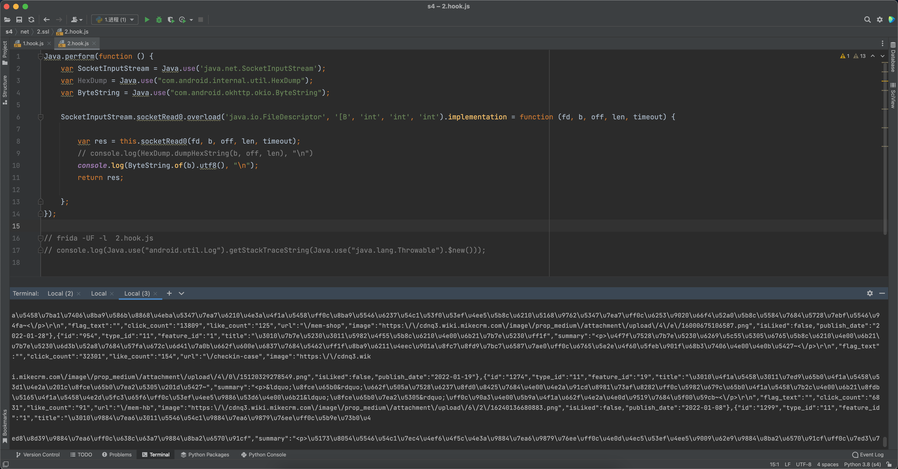

```javascript
Java.perform(function () {
    var SocketInputStream = Java.use('java.net.SocketInputStream');
    var HexDump = Java.use("com.android.internal.util.HexDump");
    var ByteString = Java.use("com.android.okhttp.okio.ByteString");

    SocketInputStream.socketRead0.overload('java.io.FileDescriptor', '[B', 'int', 'int', 'int').implementation = function (fd, b, off, len, timeout) {

        var res = this.socketRead0(fd, b, off, len, timeout);
        // console.log(HexDump.dumpHexString(b, off, len), "\n")
        console.log(ByteString.of(b).utf8(), "\n");
        return res;

    };
});

// frida -UF -l  2.hook.js
// console.log(Java.use("android.util.Log").getStackTraceString(Java.use("java.lang.Throwable").$new()));
```

## 2.4 so级别

上述的请求和写入，都是在java层面进行hook的获取，实际上真正的请求会调用so层的代码，最终将请求发送过去。


### 2.4.1 libopenjdk.so

寻找`socketRead0`和`socketWrite0`的hook的脚本：

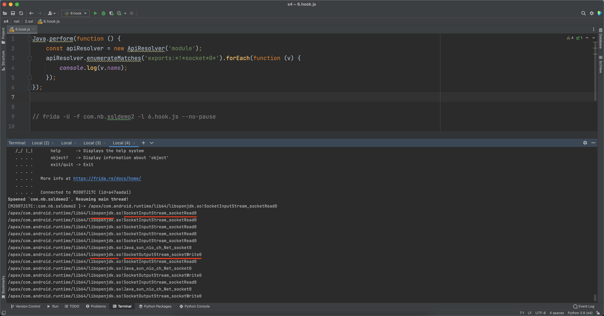 

```
/apex/com.android.runtime/lib64/libopenjdk.so!SocketInputStream_socketRead0
/apex/com.android.runtime/lib64/libopenjdk.so!SocketOutputStream_socketWrite0
```

### 2.4.2 hook请求和响应

> /apex/com.android.runtime/lib64/libopenjdk.so

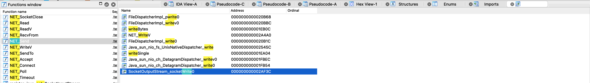

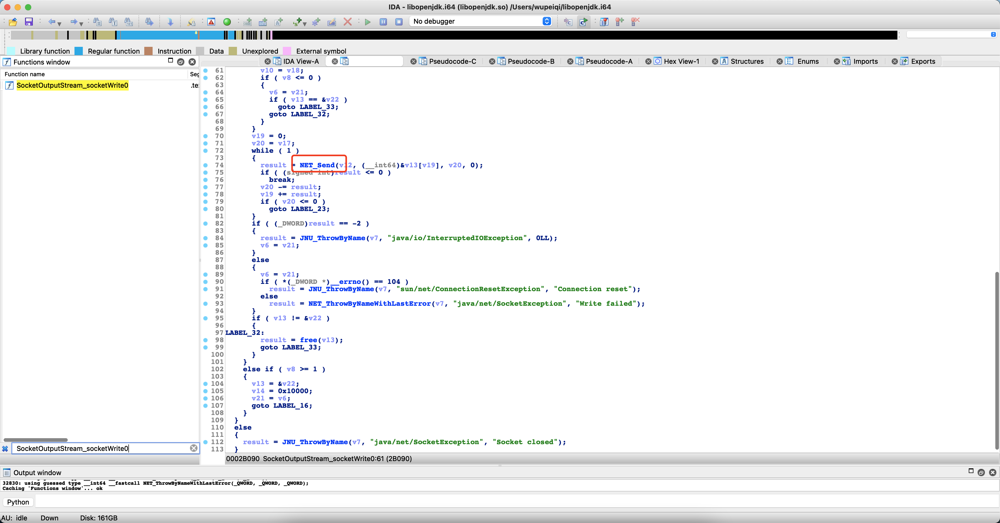


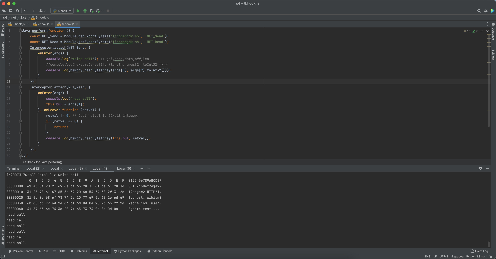

```javascript
Java.perform(function () {
    const NET_Send = Module.getExportByName('libopenjdk.so', 'NET_Send');
    const NET_Read = Module.getExportByName('libopenjdk.so', 'NET_Read');


    Interceptor.attach(NET_Send, {
        onEnter(args) {
            console.log('write call'); // jni,jobj,data,off,len
            //console.log(hexdump(args[1], {length: args[2].toInt32()}));
            console.log(Memory.readByteArray(args[1], args[2].toInt32()));
        }
    });

    Interceptor.attach(NET_Read, {
        onEnter(args) {
            console.log('read call');
            this.buf = args[1];
        }, onLeave: function (retval) {
            retval |= 0; // Cast retval to 32-bit integer.
            if (retval <= 0) {
                return;
            }
            console.log(Memory.readByteArray(this.buf, retval));
        }
    });
});

// frida -UF -l  9.hook.js
```

# 3.安卓-Https请求

## 3.1 https请求

**详见示例**：SSLDemo2

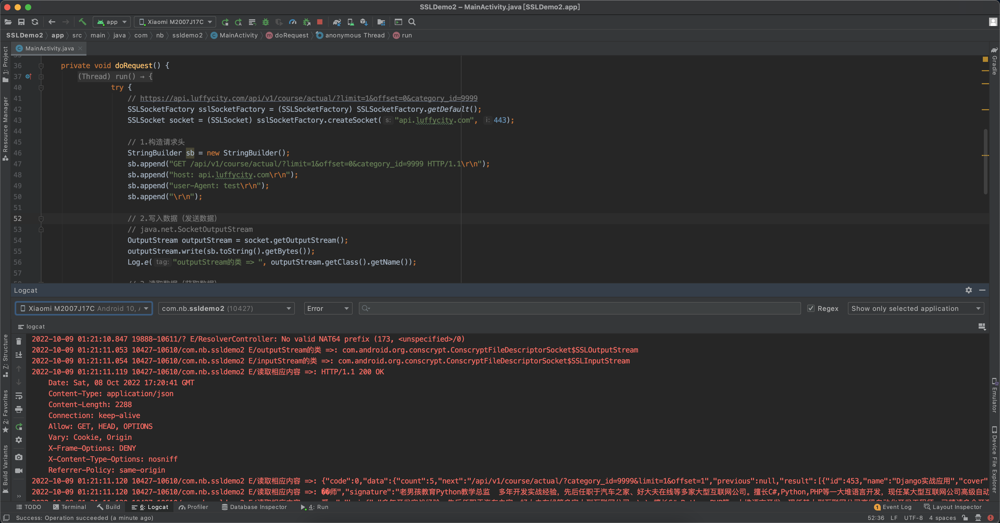

```java
private void doRequest() {
    new Thread() {
        @Override
        public void run() {
            try {
                // https://api.luffycity.com/api/v1/course/actual/?limit=1&offset=0&category_id=9999
                SSLSocketFactory sslSocketFactory = (SSLSocketFactory) SSLSocketFactory.getDefault();
                SSLSocket socket = (SSLSocket) sslSocketFactory.createSocket("api.luffycity.com", 443);

                // 1.构造请求头
                StringBuilder sb = new StringBuilder();
                sb.append("GET /api/v1/course/actual/?limit=1&offset=0&category_id=9999 HTTP/1.1\r\n");
                sb.append("host: api.luffycity.com\r\n");
                sb.append("user-Agent: test\r\n");
                sb.append("\r\n");

                // 2.写入数据（发送数据）
                // com.android.org.conscrypt.ConscryptFileDescriptorSocket$SSLOutputStream
                OutputStream outputStream = socket.getOutputStream();
                outputStream.write(sb.toString().getBytes());
                Log.e("outputStream的类 => ", outputStream.getClass().getName());

                // 3.读取数据（获取数据）
                // com.android.org.conscrypt.ConscryptFileDescriptorSocket$SSLInputStream
                InputStream inputStream = socket.getInputStream();
                Log.e("inputStream的类 => ", inputStream.getClass().getName());

                while (true) {
                    byte[] buffer = new byte[1024];
                    int len = inputStream.read(buffer, 0, buffer.length);
                    if (len == -1) {
                        break;
                    }
                    Log.e("读取相应内容 =>", new String(Arrays.copyOf(buffer, len)));
                }

                socket.close();

            } catch (Exception ex) {
                Log.e("Main", "网络请求异常" + ex);
            }
        }
    }.start();
}
```

## 3.2 请求写入

```
// com.android.org.conscrypt.ConscryptFileDescriptorSocket$SSLOutputStream
OutputStream outputStream = socket.getOutputStream();
outputStream.write(sb.toString().getBytes());
Log.e("outputStream的类 => ", outputStream.getClass().getName());
```

安卓源码地址：

```
http://aospxref.com/android-10.0.0_r47/xref/external/conscrypt/common/src/main/java/org/conscrypt/ConscryptFileDescriptorSocket.java
```

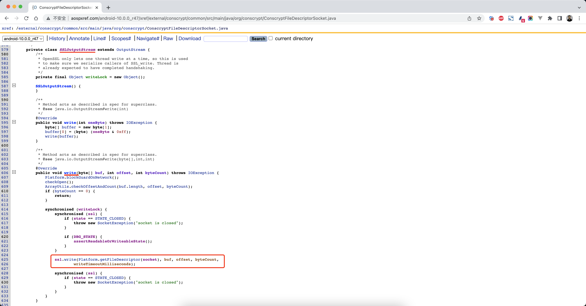


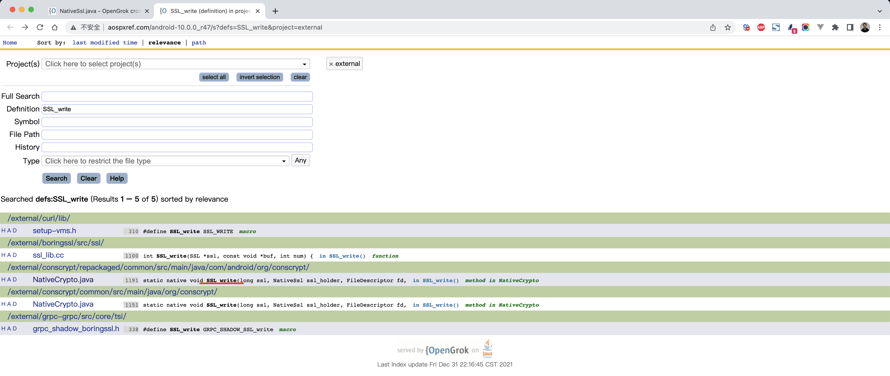

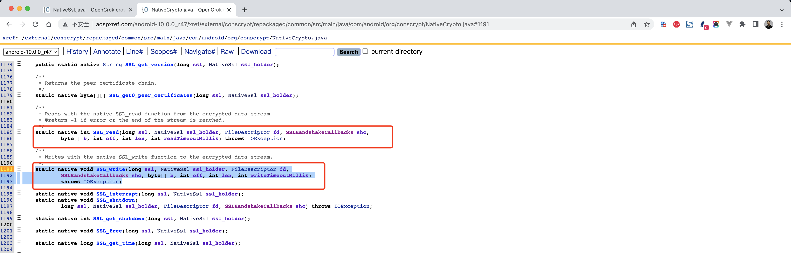

http://aospxref.com/android-10.0.0_r47/xref/external/conscrypt/repackaged/common/src/main/java/com/android/org/conscrypt/NativeCrypto.java#1185

```
java.lang.Throwable
        at com.android.org.conscrypt.NativeCrypto.SSL_write(Native Method)
        at com.android.org.conscrypt.NativeSsl.write(NativeSsl.java:426)
        at com.android.org.conscrypt.ConscryptFileDescriptorSocket$SSLOutputStream.write(ConscryptFileDescriptorSocket.java:626)
        at java.io.OutputStream.write(OutputStream.java:75)
        at com.nb.ssldemo2.MainActivity$2.run(MainActivity.java:55)

```

直接hook来进行抓包：


```javascript
Java.perform(function () {
    var NativeCrypto = Java.use('com.android.org.conscrypt.NativeCrypto');
    var HexDump = Java.use("com.android.internal.util.HexDump");
    var ByteString = Java.use("com.android.okhttp.okio.ByteString");

    NativeCrypto.SSL_write.implementation = function (ssl, ssl_holder, fd, shc, b, off, len, timeout) {
        //console.log(HexDump.dumpHexString(b, off, len), "\n")
        console.log(ByteString.of(b).utf8(), "\n");

        return this.SSL_write(ssl, ssl_holder, fd, shc, b, off, len, timeout);
    };
});

// frida -UF -l  3.hook.js
// console.log(Java.use("android.util.Log").getStackTraceString(Java.use("java.lang.Throwable").$new()));
```

## 3.3 响应获取

```java
// com.android.org.conscrypt.ConscryptFileDescriptorSocket$SSLInputStream
InputStream inputStream = socket.getInputStream();
Log.e("inputStream的类 => ", inputStream.getClass().getName());

while (true) {
    byte[] buffer = new byte[1024];
    int len = inputStream.read(buffer, 0, buffer.length);
    if (len == -1) {
        break;
    }
    Log.e("读取相应内容 =>", new String(Arrays.copyOf(buffer, len)));
}
```

安卓源码地址：

```
http://aospxref.com/android-10.0.0_r47/xref/external/conscrypt/common/src/main/java/org/conscrypt/ConscryptFileDescriptorSocket.java
```

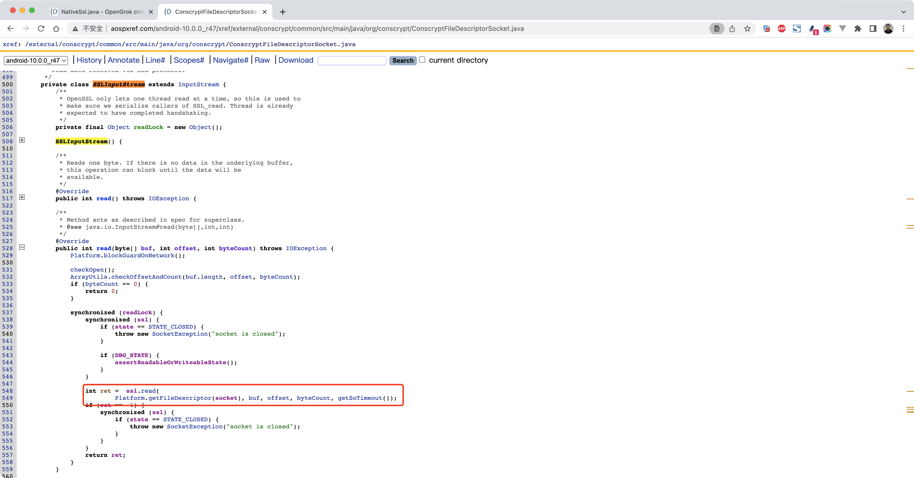


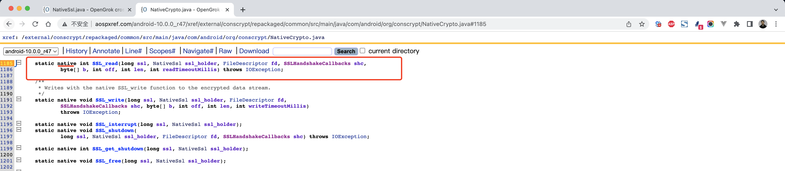

http://aospxref.com/android-10.0.0_r47/xref/external/conscrypt/repackaged/common/src/main/java/com/android/org/conscrypt/NativeCrypto.java#1185

```
java.lang.Throwable
        at com.android.org.conscrypt.NativeCrypto.SSL_read(Native Method)
        at com.android.org.conscrypt.NativeSsl.read(NativeSsl.java:411)
        at com.android.org.conscrypt.ConscryptFileDescriptorSocket$SSLInputStream.read(ConscryptFileDescriptorSocket.java:549)
        at com.nb.ssldemo2.MainActivity$2.run(MainActivity.java:65)

```


直接hook来进行抓包：

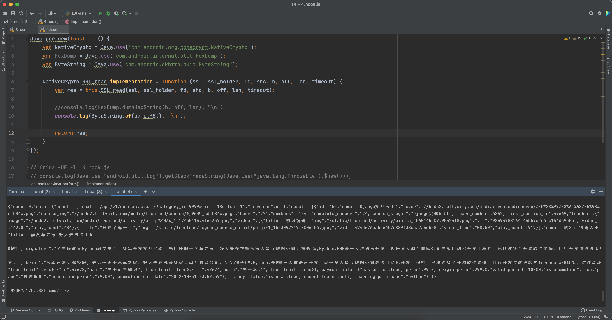

```javascript
Java.perform(function () {
    var NativeCrypto = Java.use('com.android.org.conscrypt.NativeCrypto');
    var HexDump = Java.use("com.android.internal.util.HexDump");
    var ByteString = Java.use("com.android.okhttp.okio.ByteString");

    NativeCrypto.SSL_read.implementation = function (ssl, ssl_holder, fd, shc, b, off, len, timeout) {
        var res = this.SSL_read(ssl, ssl_holder, fd, shc, b, off, len, timeout);

        //console.log(HexDump.dumpHexString(b, off, len), "\n")
        console.log(ByteString.of(b).utf8(), "\n");

        return res;
    };
});

// frida -UF -l  4.hook.js
// console.log(Java.use("android.util.Log").getStackTraceString(Java.use("java.lang.Throwable").$new()));
```

## 3.4 so级别

上述的请求和写入，都是在java层面进行hook的获取，实际上真正的请求会调用so层的代码，最终将请求发送过去。


### 3.4.1 libssl.so

一般情况下底层是基于openssl将https请求发送出去，而openssl基于的是libssl.so的文件。

寻找`SSL_write`和`SSL_read`的hook的脚本：

```javascript
Java.perform(function () {
    const apiResolver = new ApiResolver('module');
    // 包含：libttboringssl.so 或 libssl.so
    // 'exports:*lib*ssl*!SSL_*'
    apiResolver.enumerateMatches('exports:*lib*ssl*!SSL_*').forEach(function (v) {
        if (v.name.indexOf('SSL_write') > 0) {
            // SSL_write = v.address;
            console.log(v.name);
        } else if (v.name.indexOf('SSL_read') > 0) {
            // SSL_read = v.address;
            console.log(v.name);
        }
    });
});
```

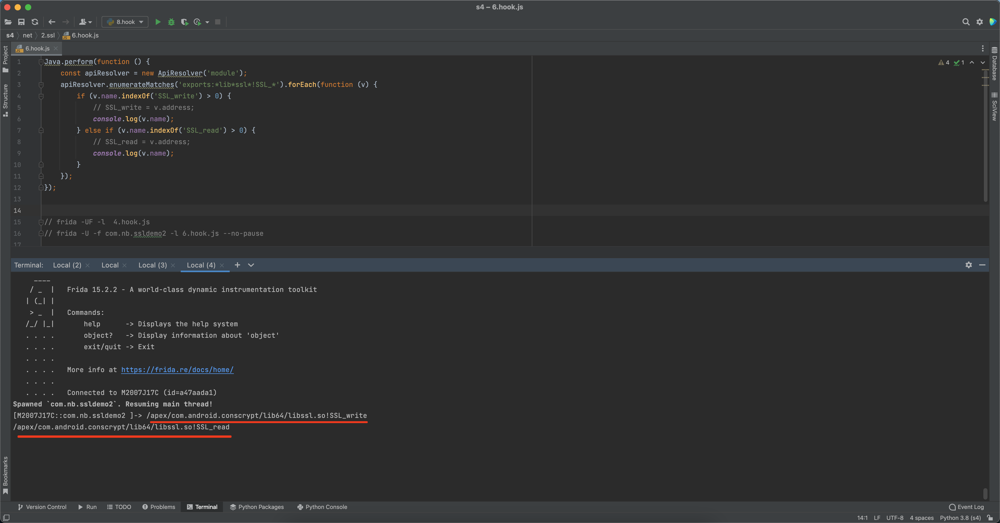

### 3.4.2 hook请求和响应

```javascript
Java.perform(function () {
    const SSL_write = Module.getExportByName('libssl.so', 'SSL_write');
    const SSL_read = Module.getExportByName('libssl.so', 'SSL_read');

    Interceptor.attach(SSL_write, {
        onEnter(args) {
            console.log('write call');
            //console.log(args[0]); // ssl
            //console.log(args[1]); // buffer
            //console.log(args[2]); // len
            //console.log(hexdump(args[1], {length: args[2].toInt32()}));
            console.log(Memory.readByteArray(args[1], parseInt(args[2])));
        }
    });

    Interceptor.attach(SSL_read, {
        onEnter(args) {
            console.log('read call');
            this.buf = args[1];
        }, onLeave: function (retval) {
            retval |= 0; // Cast retval to 32-bit integer.
            if (retval <= 0) {
                return;
            }
            console.log(Memory.readByteArray(this.buf, retval));
        }
    });
});

// frida -UF -l  7.hook.js
// frida -U -f com.nb.ssldemo2 -l 7.hook.js --no-pause
```

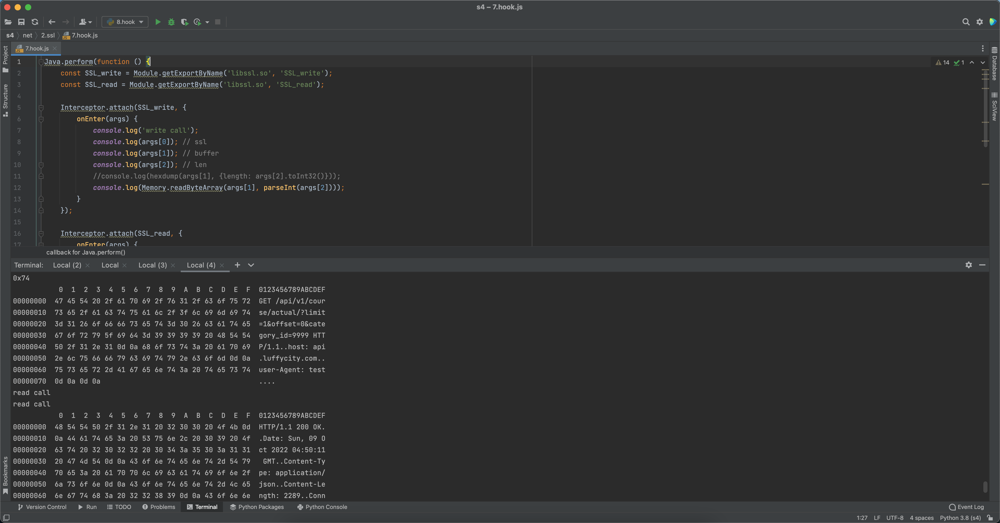

# 4.其他

## 4.1 HttpCanary

在手机上可以直接使用HttpCanary进行抓包【v9.2.8.1激活版apk文件，见本节课件】

- 运行，安装证书，默认是 用户证书

- 重启，magisk中的move cert会自动将证书转移成  系统证书

- 然后就可以抓包了...

  ```
  案例：
  	- 直接可抓包：油联、B站、得物、识货
  	- 客户端证书：安居客（需配合JustTrustMe绕过）
  	- 服务端证书：美之图（需安装p12证书）  【此版本目前有问题，建议用charles】
  ```

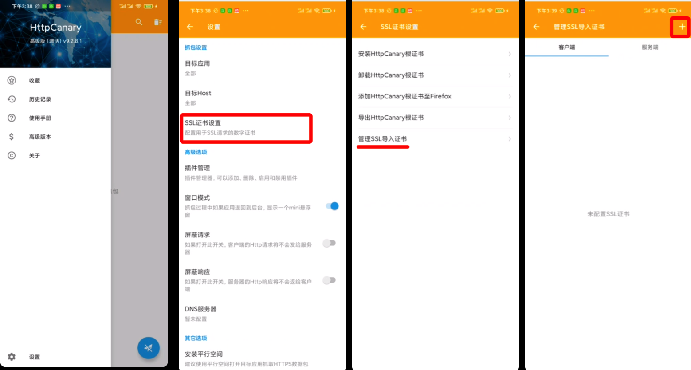

## 4.2 flutter

- 案例：大件运输APP（见课件）
- 版本：v2.5.1

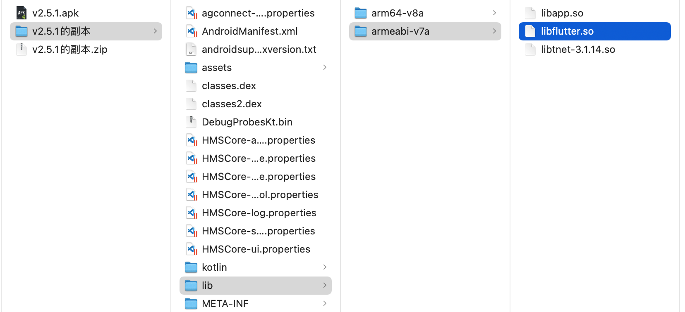


抓包实现方式：

- 使用SocksDroid进行socket5转发

- 利用此frida脚本

  ```javascript
  function hook_ssl_verify_result(address)
  {
   Interceptor.attach(address, {
    onEnter: function(args) {
     console.log("Disabling SSL validation")
    },
    onLeave: function(retval)
    {
     console.log("Retval: " + retval)
     retval.replace(0x1);
    }
   });
  }
  function disablePinning(){
    // Change the offset on the line below with the binwalk result
    // If you are on 32 bit, add 1 to the offset to indicate it is a THUMB function: .add(0x1)
    // Otherwise, you will get 'Error: unable to intercept function at ......; please file a bug'
    // 0x393DA4 换成你找到的函数地址
    var address = Module.findBaseAddress('libflutter.so').add(0x393DA4)
    hook_ssl_verify_result(address);
  }
  setTimeout(disablePinning, 1000)
  
  // frida -UF -l flutter.js
  // frida -U -f com.ehuoyun.dajian -l flutter.js
  ```

- 利于IDA反编译 libflutter.os【一定区分好32位和64位】，找到函数地址


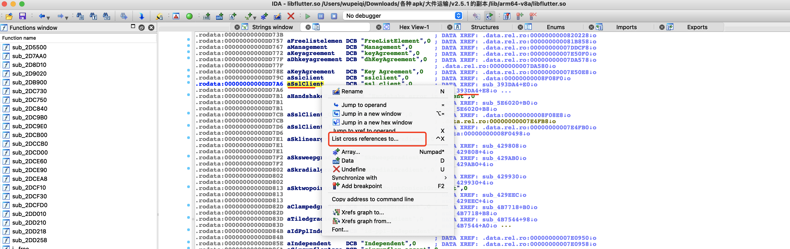


接下来，Hook抓包即可：


```
https://api.ehuoyun.com/rest/v1/dajians/search/0/20?startCitys=null&endCitys=null
https://api.ehuoyun.com/rest/v1/dajians/search/40/20?startCitys=null&endCitys=null
https://api.ehuoyun.com/rest/v1/dajians/search/0/20?startCitys=110000&endCitys=null
```

相关文档：

```
- https://github.com/G123N1NJ4/c2hack/blob/master/Mobile/flutter-ssl-bypass.md
- https://github.com/horangi-cyops/flutter-ssl-pinning-bypass
- https://github.com/minhgalaxy/flutter
```

## 4.2 quic-抖音

抖音系使用的QUIC协议，想要抓包，可以基于此Hook脚本实现。

本质：强制降级不要走QUIC协议，只能走HTTP协议。

例如：抖音v23.6.0   或 番茄免费小说v5.6.7.32 （可自行去豌豆荚下载）

```javascript
function hookso_ssl(){
    Java.perform(function(){
        var class_ = Java.use("org.chromium.CronetClient");
        console.log(class_);
        class_.tryCreateCronetEngine.implementation = function(a,b,c,d,e,f,g,h){
            console.log(a,b,c,d,e,f,g,h);
            //var result = this.tryCreateCronetEngine(a,b,c,d,e,f,g,h);
            var result;
            console.log("result==>",result);
            return result;
        }
    })
}

setImmediate(hookso_ssl)


//frida -U -f com.dragon.read -l dy.js
//frida -U -f com.ss.android.ugc.aweme -l dy.js
```

## 4.3 mitmproxy

用来抓包的，和Charles类似，可配置代理抓国外包。可写脚本。
